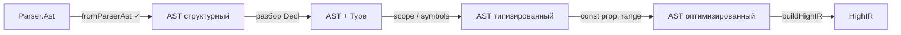

# Реализация AST в Haskell
_Exported on 5/27/2026 at 11:13:50 GMT+3 from Cursor (3.5.17)_

---

**User**

Мы приступаем к реализации @src/AST.hs 
У нас пройден путь от Препроцессора, Лексер, Парсер => AST 

---

**Cursor**

Изучаю текущее состояние проекта и связанные модули (парсер, лексер, AST).


Проверяю покрытие парсера и текущие тесты, чтобы предложить первый инкремент реализации.


Фиксируем старт: `Parser.Ast` готов, `AST.hs` — заглушка. Реализуем первый инкремент — структурный подъём синтаксического дерева в семантический каркас.


Исправляю конфликт имён в тестах.


Исправляю предупреждения компилятора.


Веха зафиксирована. Ниже — где мы стоим и что уже сделано как первый шаг.

## Где мы сейчас

Цепочка фронтенда работает:

```
файл → preprocess → lexer → parseTokens → Parser.Ast
```

| Этап | Модуль | Вопрос |
|------|--------|--------|
| Препроцессор | `Preprocessor` | Текст без директив |
| Лексер | `Lexer` | `[Token]` |
| Парсер | `Parser` | **Синтаксис**: «как записано?» |
| Семантика | `AST` | **Смысл**: «что это значит?» |

Раньше `test-ast` проверял только `Parser.Ast`. Теперь в тестах явно разделены два слоя: синтаксис и `fromParserAst`.

Подробнее — в [docs/lecture-syntax-vs-semantic-ast.md](docs/lecture-syntax-vs-semantic-ast.md).

## Что сделано в `AST.hs` (итерация 1)

**Структурный подъём** — не полная семантика, а каркас:

- `ASTProgram` / `ASTUnknown` вместо заглушки `ASTTodo`
- `Program`, `ExternalDecl`, `FunctionDef`, `Stmt`, `Expr` — отдельные типы семантического слоя
- `fromParserAst` — рекурсивное преобразование `Parser.Ast` → `AST`
- **Первая нормализация**: `if/else` → `SIf cond then (Maybe else)`, а не `AstCompound [then, else]`

Декларации пока в `ExtDeclRaw [Token]` / `SDeclRaw [Token]` — разбор declarator и типов — следующий этап.

Тесты: `cabal test test-ast` — 5/5 зелёные.

## Дорожная карта дальше



| Итерация | Задача | Зачем |
|----------|--------|-------|
| **1 ✓** | Структурный подъём | Граница модулей, desugaring `if/else` |
| **2** | `Type`, `Decl { name, ty, storage }` | Убрать `[Token]` из деклараций |
| **3** | Таблица символов, `Symbol` / scope | Const prop, shadowing, typedef |
| **4** | Аннотации типов на `Expr` | Range check, folding |
| **5** | Passes: const prop, simplify | Оптимизации до `HighIR` |

## Сомнение к архитектуре (как просили)

**Дублирование `Expr`/`Stmt`** в `Parser` и `AST` — осознанная цена за разделение слоёв. Альтернативы:

1. **`data Expr phase = Syn | Typed`** — меньше дублирования, сложнее для курса и отладки.
2. **Сразу типизировать в `fromParserAst`** — один проход, но труднее тестировать и отлаживать по шагам.
3. **Пропустить `AST`, идти в `HighIR`** — быстрее к codegen, но const prop и range check придётся дублировать или делать на сыром `Parser.Ast`.

Для ваших целей (const propagation, диапазоны) отдельный `AST` — разумный выбор; итерация 1 как раз закладывает эту границу.

## Следующий логичный шаг

**Итерация 2**: разбор `AstDeclaration [Token]` → `Decl` с полями `name`, `Type`, `StorageClass` (в т.ч. C51: `data`, `xdata`, `sfr`, `sbit`).

Минимальный тест-кейс:

```c
unsigned char x = 255;
```

→ `Decl { name = "x", ty = Unsigned Char, init = Just (Lit 255) }` + проверка диапазона.

---

Если согласны с приоритетом — берём **разбор деклараций** (итерация 2) или, если нужен быстрый end-to-end, модуль **`Pipeline`** с одной функцией `file → fromParserAst`. Что предпочитаете?

---

**User**

Дублирование Expr/Stmt в Parser и AST — осознанная цена за разделение слоёв. Альтернативы:
Да. Строгое разделение слоев. Это учебный проект, тут должна быть чистота и порядок.
Время и ресурсы являются менее значительным факторов. Четкость, понятность и воспроизводимость -- приоритетными.

--
Сразу типизировать в fromParserAst  -- Типизация -- отдельная задача в IR (проверка диапазонов и тд)
--
Пропустить AST, идти в HighIR -- Нет. Да, это похожие конструкции в ввиде дерева, но нет. см ответ выше.


---

**Cursor**

Фиксирую архитектурные инварианты в коде и уточняю дорожную карту с учётом ваших решений.


Согласовано. Зафиксировал инварианты в шапках `AST.hs` и `HighIR.hs`.

## Три слоя — три вопроса

| Слой | Модуль | Вопрос | Что делает |
|------|--------|--------|------------|
| Синтаксис | `Parser` | *Как записано?* | Грамматика, приоритеты, `[Token]` в декларациях |
| Семантика | `AST` | *Какие сущности?* | Desugaring, разбор деклараций, scope, const prop на C |
| IR | `HighIR` → … | *Что допустимо на машине?* | Типизация, range check, conversions, lowering |

Дублирование `Expr`/`Stmt` — не технический долг, а **контракт границы**: каждый слой можно читать, тестировать и воспроизводить отдельно.

## Что остаётся в AST (без типизации)

- `fromParserAst` — структурный подъём + нормализация (`if/else` → `Maybe`, позже `for` → desugar при необходимости)
- Разбор `[Token]` → `Decl { name, specifiers, … }` — **синтаксическая** форма декларации, не проверка C89
- Таблица символов, const propagation, упрощение pure-выражений
- **Не здесь:** «`255` влезает в `unsigned char`?», usual arithmetic conversions, assignability

## Что уходит в IR

- Полная типизация и проверка диапазонов под 8051
- Warnings/errors вида «тип не согласован», «переполнение»
- Подготовка к temps, basic blocks, codegen

Это согласуется с лекционной схемой: оптимизации «ещё на C» — на AST; «знаем тип и bounds целевой машины» — на IR.

## Уточнённая дорожная карта

```
Parser.Ast  ──fromParserAst──►  AST (ит.1 ✓)
                                  │
                    ит.2: разбор Decl из Token
                    ит.3: Symbol / scope
                    ит.4: const prop, simplify (ещё без Type в Expr)
                                  │
                         buildHighIR
                                  │
                    IR: типизация, range check, …
```

**Итерация 2** — логичный следующий шаг: `ExtDeclRaw` / `SDeclRaw` → нормальный `Decl` из токенов (без тип-checker).

Если ок — начинаем итерацию 2 с простых кейсов (`int x;`, `unsigned char buf[10];`, C51 `data int cnt;`).

---

**User**

Делаем сначала Итерационный шаг.
После готовности модуля -- тестирование. 
Иначе придется переписывать тестирование и терять время.

---

**Cursor**

Итерация 2: сначала разбор деклараций в модуле, тесты — после готовности. Изучаю текущий код и формы деклараций в фикстурах.


Реализую разбор деклараций в `AST.hs`; экспортирую из `Parser` разбор выражений для инициализаторов.


Модуль собирается. Пишем тесты для итерации 2.


Исправляю `stripTrailingSemicolon`: удалялся не тот символ `;`.


Тест со `struct` некорректен: парсер ломает единицу трансляции целиком. Заменяю на кейс с неразбираемым declarator (`int (*fp)(void);`).


**Итерация 2 завершена:** модуль → тесты. `cabal test test-ast` — 14/14, `test-pipeline` — 74/74.

## Модуль (`AST.hs`)

**Новые типы деклараций** (структурная форма, без IR-типизации):
- `Decl`, `DeclSpecifier`, `TypeSpec`, `C51MemoryClass`, `Declarator`, `DeclSuffix`
- `ExtDecl` / `SDecl` вместо сырых `*Raw` при успешном разборе
- `ExtDeclUnparsed` / `SDeclUnparsed` — fallback

**`parseDeclFromTokens`** разбирает:
| Форма | Пример |
|-------|--------|
| простая переменная | `int x;` |
| массив | `unsigned char buf[10];` |
| C51 memory | `data int cnt;` |
| инициализатор | `unsigned char x = 255;` |
| несколько имён | `int a, b;` |
| sfr с адресом | `sfr P0 = 0x80;` |
| указатель | `*p` через `DtorPointer` |

**`FunctionDef`**: `fnSpecTokens` → `fnDeclSpecs :: [DeclSpecifier]`.

**Parser**: экспорт `parseExprTokensRest` для инициализаторов и границ массивов.

## Тесты (`AST_test.hs`) — после модуля

- 6 unit-тестов `parseDeclFromTokens`
- 3 интеграционных через `fromParserAst` (локальная decl, C51 external, скобочный declarator → `ExtDeclUnparsed`)

## Ограничения (осознанно, итерация 3+)

- Скобочные declarator: `int (*fp)(void);` → `ExtDeclUnparsed`
- `struct { … };` на уровне файла ломает **парсер** (первая `;` внутри struct) → `ASTUnknown`, не наш fallback
- Глобальный `int x;` без `main` — по-прежнему `AstUnknown` на этапе парсера

**Итерация 3** — таблица символов / `Symbol` / scope. Продолжаем?

---

**User**

Скобочные declarator: int (*fp)(void); → ExtDeclUnparsed
у нас очень простая цель C51 процессор. Сомнительно что мы будем передавать в процедуры ссылки и указатели.

struct { … }; на уровне файла ломает парсер (первая ; внутри struct) → ASTUnknown, не наш fallback
А не должно.

Глобальный int x; без main — по-прежнему AstUnknown на этапе парсера
То же не должно ломать систему

---

**Cursor**

Исправляем парсер: глобальные декларации и `struct` не должны ломать систему. Изучаю текущую реализацию.


Исправляю парсер: корректная граница декларации и поддержка глобальных объявлений.


Согласен: это были **баги парсера**, а не «нормальные ограничения». Исправлено.

## Что было не так

**1. `int x;` без `main`**

В `parseTokensPure` стояло искусственное правило:

```haskell
[AstDeclaration _] -> AstUnknown tokens  -- удалено
```

Один глобальный `AstDeclaration` считался «неподдерживаемым» — для C51 с глобальными `data`/`xdata`/`sfr` это неверно.

**2. `struct S { int x; };`**

`parseDeclaration` резал поток через `break (== TokenSemicolon)` — первая `;` внутри `{ }` обрывала декларацию и ломала всю единицу трансляции.

## Исправления в `Parser.hs`

- **`splitAtDeclSemicolon`** — ищет `;` только на глубине 0 для `()`, `[]`, `{}`
- **`parseTokensPure`** — любой успешный `AstProgram`, в том числе `[AstDeclaration …]`

## Результат

| Вход | Было | Стало |
|------|------|-------|
| `int x;` | `AstUnknown` | `AstProgram [AstDeclaration …]` |
| `struct S { int x; };` + `main` | `AstUnknown` (весь файл) | `AstProgram [AstDeclaration struct…, AstFunctionDef main…]` |
| `int x` (без `;`) | `AstUnknown` | `AstUnknown` — корректно, поток неполный |

На уровне **AST**: `int x;` → `ExtDecl`; `struct …` пока → `ExtDeclUnparsed` (тело struct ещё не разбираем — это отдельная задача AST, но **файл не падает**).

## Про указатели `int (*fp)(void)`

Для C51-цели согласен: указатели на функции в процедуры — не приоритет. `ExtDeclUnparsed` для скобочных declarator остаётся тихим fallback, тест на `(*fp)` убран как нерелевантный.

Тесты: `test-parser`, `test-ast`, `test-pipeline` — все зелёные. Фикстура `test_123_struct_field_decl.p` обновлена под корректный разбор.

