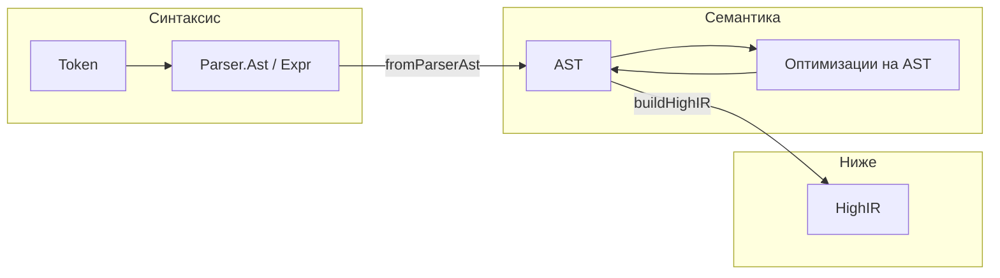
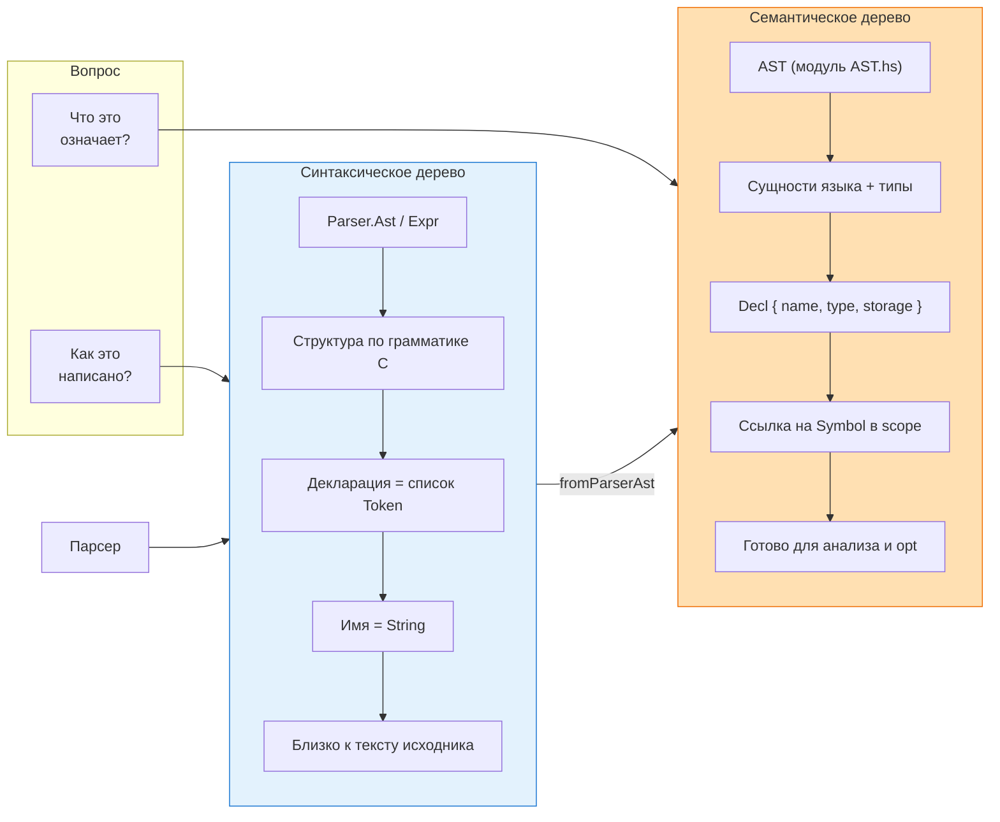

# Языковые конструкции в Haskell
_Exported on 5/20/2026 at 12:43:50 GMT+3 from Cursor (3.4.20)_

---

**User**

Идем в разбор языковых конструкций.
По алфавитному порядку файлов.
@src/AST.hs 
Какие языковые конструкции Haskell здесь представляют интерес?

---

**Cursor**

Разбираем `AST.hs` — сначала прочитаю файл и контекст проекта.


`AST.hs` — первый файл по алфавиту в `src/`. Сейчас это **каркас** семантического AST, а не полноценное дерево C. Ниже — конструкции Haskell, которые здесь уже есть и которые почти наверняка понадобятся, когда модуль вырастет.

## Что уже есть в файле

### 1. Экспортный список модуля

```1:5:d:\Work\2026\HCC_C89toC51\src\AST.hs
module AST
  ( AST (..),
    fromParserAst,
  )
where
```

`AST (..)` экспортирует **тип и все его конструкторы** (`ASTRoot`, `ASTTodo`). Без `(..)` наружу ушёл бы только имя типа, а конструкторы остались бы приватными модуля.

**Зачем в компиляторе:** явный публичный API — downstream-модули (`HighIR`, passes) видят только то, что вы решили открыть.

**Альтернатива:** скрыть конструкторы и экспортировать только smart constructors / pattern synonyms — когда AST станет сложным, это защитит инварианты (например, «в `If` всегда есть `then`»).

---

### 2. `import qualified … as P`

```7:7:d:\Work\2026\HCC_C89toC51\src\AST.hs
import qualified Parser as P
```

Квалифицированный импорт: `P.Ast` однозначно из парсера, без коллизии с будущим `AST.Expr`, `AST.Stmt` и т.д.

**Альтернатива:** `import Parser (Ast)` — короче, но при росте обоих модулей имена начнут пересекаться. Для моста parser → semantic AST qualified import — разумный выбор.

---

### 3. Алгебраический тип данных (`data`)

```10:13:d:\Work\2026\HCC_C89toC51\src\AST.hs
data AST
  = ASTRoot
  | ASTTodo
  deriving (Eq, Show)
```

Это **суммарный тип** (discriminated union): значение — ровно один из вариантов. В компиляторах так же моделируют узлы дерева: `Stmt`, `Expr`, `Decl` — отдельные конструкторы одного `data`.

Сейчас конструкторы **нульарные** (без полей) — заглушки. В `Parser.Ast` уже богаче:

```147:161:d:\Work\2026\HCC_C89toC51\src\Parser.hs
data Ast
  = AstProgram [Ast]
  | AstFunctionDef String [Token] [Token] Ast
  ...
  | AstFor (Maybe Expr) (Maybe Expr) (Maybe Expr) Ast
```

Типичная эволюция: синтаксическое дерево (`Parser.Ast`) → семантическое (`AST`) с типами, символами, разобранными декларациями — не копия токенов `[Token]`.

---

### 4. `deriving (Eq, Show)`

Автогенерация сравнения и печати для тестов и отладки.

**Ограничение:** для больших рекурсивных AST `Show` может быть огромным; иногда делают свой `prettyAST` или `deriving via` с кастомным инстансом.

**Альтернатива для production:** `Eq` оставить, `Show` заменить на Prettyprinter (например, `prettyprinter`) — читаемый вывод ближе к исходному C.

---

### 5. Сигнатура типа и преобразование

```16:17:d:\Work\2026\HCC_C89toC51\src\AST.hs
fromParserAst :: P.Ast -> AST
fromParserAst _ = ASTTodo
```

Явная сигнатура фиксирует контракт фазы **desugar / semantic build**. Сейчас реализация — константа: любой `P.Ast` → `ASTTodo`.

**Интересные конструкции, которых здесь ещё нет, но они появятся в этом же модуле:**

| Конструкция | Роль в AST |
|-------------|------------|
| **Pattern matching** по конструкторам `P.Ast` | Рекурсивный обход и построение `AST` |
| **Рекурсивный `data`** | `Stmt` содержит `[Stmt]`, `Expr` содержит `Expr` |
| **`Maybe`, `Either`** | Опциональный `else`, ошибки семантики |
| **Параметризация** `data Expr ty` | Типизированное AST (PHASE) |
| **`newtype`** | Тонкие обёртки (`Ident`, `Label`) без runtime-cost |
| **Record syntax** | `data Decl = Decl { name :: …, ty :: … }` |
| **Pattern guards / `case`** | Разбор сложных форм C |

---

## Связь с «языковыми конструкциями» C

Сейчас **ни одна конструкция C в `AST` не отражена** — только заготовка. Смысл модуля в архитектуре:

```
Lexer → Parser (синтаксис, Ast) → AST (семантика) → IR…
```

`fromParserAst` — граница, где исчезают `[Token]` в декларациях и появляются нормальные типы, scope, возможно desugaring (`for` → `while` и т.д.).

**Сомнение к вашему плану (как просили):** дублировать всю иерархию `Parser.Ast` в `AST` один в один — дорого и хрупко. Часто делают:

1. **Тонкий AST** — только то, что нужно для анализа и codegen; остальное схлопывается при `fromParserAst`.
2. **Один AST с аннотациями** — `data Ann a = …` и `type SynAst = Ann SourceSpan` / `type SemAst = Ann TypeInfo`.
3. **Прямой переход Parser → HighIR** без отдельного `AST`, если семантика минимальна (для C51 иногда так).

Отдельный `AST.hs` оправдан, если планируются scope checking, const folding, нормализация типов C89.

---

## Итог по «интересным» конструкциям Haskell в этом файле

**Уже представлены и важны для компилятора:**

1. Модуль с явным export list  
2. Qualified import как граница подсистем  
3. `data` как модель узлов дерева  
4. `deriving` для тестируемости  
5. Функция-преобразователь с явным типом `P.Ast -> AST`  

**Пока отсутствуют, но это ядро будущего `AST.hs`:**

- рекурсивные ADT с полями;  
- исчерпывающий pattern matching (компилятор проверит полноту);  
- `Maybe` / отдельный тип ошибок вместо «молчаливого» `ASTTodo`.

Когда дойдёте до следующего файла по алфавиту (`HighIR.hs` или уточните порядок — после `AST` логично `HighIR`, `Lexer`, `Logger`…), могу разобрать его в том же формате: что в Haskell и что это значит для конструкций C/пайплайна.

---

**User**

1. Уточни про Parser.AST синтаксис и AST семантика. Как будто тонкость ясна, но все же.
2. Отдельный AST планируется тк планируются оптимизации в ввиде распространения констант, проверка диапазонов и тд.

---

**Cursor**

Уточню на примерах из вашего `Parser` и типичной схемы компилятора.


## 1. `Parser.Ast` — синтаксис, `AST` — семантика: в чём разница

Кратко: **синтаксическое дерево отвечает на вопрос «как это написано в исходнике?»**, **семантическое — «что это значит в языке и можно ли с этим работать дальше?»**. Оба — деревья, но **инварианты и полезная информация** разные.

### Синтаксис (`Parser.Ast`, `Parser.Expr`)

Парсер строит дерево **по грамматике C**: структура операторов, скобки, порядок разбора, «кусок декларации — список токенов».

Примеры из вашего кода:

| В синтаксическом дереве | Что это значит |
|-------------------------|----------------|
| `AstDeclaration [Token]` | «Здесь декларация», но **тип и имя ещё не разобраны** — только последовательность лексем |
| `ExprVar "x"` | Идентификатор как **строка**; неизвестно: переменная, typedef, enum-константа |
| `ExprLitInt 42` | Литерал есть; **тип** (`int` / `long` / `unsigned`) и переполнение при вычислении — ещё нет |
| `ExprBinary OpAdd e1 e2` | Форма «сложение»; **результирующий тип**, usual arithmetic conversions — не зафиксированы |
| `AstFor (Maybe Expr) …` | Синтаксическая форма `for`; семантически это часто desugar в `while` + init |
| `AstUnknown [Token]` | Синтаксис не сошёлся — дерево честно говорит «не разобрали» |

Синтаксическое дерево **привязано к поверхности текста**: лишние скобки, запятые в `for`, цепочки `a = b = c` (у вас `ExprAssign` с правой рекурсией) — всё это **нормально и нужно** для парсера, но для оптимизатора часто **шум**.

**Свойства синтаксического AST (типичные):**

- Строится **сразу после лексера**, без таблицы символов.
- Может содержать **неразрешённые** имена и **сырые** токены.
- Сохраняет **структуру, близкую к исходнику** (удобно для ошибок «строка 12, столбец 5»).
- Не обязано удовлетворять правилам C89 (например, `int x;` и `void f()` в одной единице трансляции — синтаксически ок, семантически может быть ошибка).

### Семантика (`AST` в `AST.hs` — целевое представление)

Семантическое дерево отвечает: **«что это за сущность в программе и какие у неё типы/связи?»** Оно появляется после (или в процессе) **анализа**: разбор деклараторов, typedef, scope, приведения типов, maybe desugaring.

**Типичные отличия от `Parser.Ast`:**

| Синтаксис | Семантика |
|-----------|-----------|
| `[Token]` в декларации | `Decl { name, ty :: Type, storage, … }` |
| `ExprVar "buf"` | `Ref (Symbol buf, ty)` с записью в scope |
| `ExprBinary …` | Узел с **известным типом** результата и правилами C89 |
| `AstFor …` | Может стать `While` + `Assign`/init или остаться `For`, но с **проверенными** типами init/cond/step |
| Неизвестный идентификатор | Либо **ошибка анализа**, либо узла нет в дереве |

Семантическое AST **не обязано** один-в-один повторять форму парсера. Часто на этапе `fromParserAst` делают:

- разбор `AstDeclaration [Token]` → нормальные узлы типов;
- схлопывание лишних скобок и «пустых» узлов;
- замена `a = b = c` на цепочку присваиваний с явными типами;
- введение **констант** / **литералов с типом** (`TypedLit IntType 42`).

**Аналогия:** синтаксис — разобранное предложение по частям речи; семантика — «кто кого съел» с ролями агента/пациенса и проверкой, что съедобное.

### Граница у вас в коде

```16:17:d:\Work\2026\HCC_C89toC51\src\AST.hs
fromParserAst :: P.Ast -> AST
fromParserAst _ = ASTTodo
```

Именно здесь: **«дерево грамматики» → «дерево программы с смыслом»**. Пока вторая сторона заглушка; `Parser` уже несёт богатый синтаксис (`Expr`, `Ast` с десятками конструкторов).



---

## 2. Отдельный `AST` под константы, диапазоны и т.д. — обоснован

С вашими планами (**распространение констант, проверка диапазонов**) отдельный семантический слой — **правильное место**, а не «лишний этап».

### Почему не оптимизировать прямо `Parser.Ast`

1. **`AstDeclaration [Token]`** — оптимизатору нужны типы и размеры; без семантики вы будете дублировать разбор деклараций в каждом pass.
2. **Имена как `String`** — без scope нельзя надёжно знать, константа это (`#define`, `enum`) или переменная; constant propagation на строках ломается на shadowing и typedef.
3. **Синтаксическая форма ≠ вычислимость** — `i++ + i` или побочные эффекты: на синтаксическом дереве легко «сложить не то».
4. **Диапазоны** — это про **тип и операцию** (`unsigned char`, сдвиг на 32 для C51, переполнение `int`). Это семантика + target (8051), не парсер.

### Что логично делать на семантическом `AST`

| Задача | Зачем отдельный AST |
|--------|---------------------|
| Constant folding / propagation | Узлы `Lit n` с типом; `Var` только если не mutated; замена поддеревьев на `Const` |
| Range / overflow checks | После типизации: «`a + b` в `int8` на 8051» — известны bounds |
| Упрощение условий | `if (1)` → убрать ветку; нужен анализ побочных эффектов |
| Dead code (осторожно) | Нужен control flow и знание, что выражение pure |
| Desugaring | `for`, `switch`, составные литералы — проще для HighIR |

Оптимизации **меняют дерево**, но оставляют его **в пространстве «программа C»** — удобно для отладки (dump AST до/после pass) и для повторных проходов.

### Где заканчивается AST и начинается `HighIR`

У вас цепочка уже заложена: `AST → buildHighIR → HighIR`.

- **AST**: оптимизации на уровне **выражений и операторов C** (const prop, simplify, range warnings).
- **HighIR**: уже ближе к **машине / IR** (блоки, временные, явные присваивания, возможно SSA позже).

Правило: если преобразование всё ещё естественно описать как «в исходном C, но проще» — AST; если нужны temps, labels, отсутствие `?:` — HighIR.

### Практическая рекомендация по форме `AST`

Чтобы const prop и range check не переделывать дважды:

1. **Разделить `Expr` и `Stmt`** (как в `Parser`, но с полями семантики).
2. **Аннотации** — один обёрточный тип, например `data Ann e = Ann { span :: …, ty :: Type, node :: e }` или type family; range checker читает `ty`, optimizer — `node`.
3. **Не копировать токены** в финальном AST — хранить `SourceSpan` для сообщений об ошибках.
4. **Отдельный тип ошибок** `Either SemanticError AST` на выходе `fromParserAst`, а не `ASTTodo` в проде.

**Альтернатива (на будущее):** один AST с фазами `Syn` / `Typed` через type parameter `data Expr phase` — меньше дублирования типов, сложнее для новичка в кодовой базе. Для учебного/инженерного компилятора C51 отдельный модуль `AST` + явный `fromParserAst` — нормальный компромисс.

---

**Итог:** `Parser.Ast` — «как распарсили текст»; планируемый `AST` — «что это за программа с типами и символами», на котором безопасно делать const propagation и проверки диапазонов. Ваше решение держать отдельный `AST` под эти оптимизации согласуется с архитектурой `… → AST → HighIR → …` и с тем, что в парсере декларации и имена ещё не доведены до семантической формы.

---

**User**

Будем считать что понял хотя ... нарисуй мне отдельную диаграмму чтобы можно было использовать в лекциях. 

---

**Cursor**

Создам отдельный файл с диаграммами для лекций — проверю структуру репозитория.


Отдельный лекционный материал лежит в репозитории:

**[docs/lecture-syntax-vs-semantic-ast.md](d:\Work\2026\HCC_C89toC51\docs\lecture-syntax-vs-semantic-ast.md)**

Там **5 рисунков** (Mermaid) + таблица-шпаргалка + подсказки по экспорту в слайды ([mermaid.live](https://mermaid.live)).

---

### Главная схема для лекции (Рис. 2)

Скопируйте в слайд или в Mermaid Live:



---

### Что ещё в файле

| Рисунок | Содержание |
|--------|------------|
| **1** | Полный конвейер: препроцессор → … → AST + opt → IR → код |
| **3** | Пример `unsigned char x = 255;` — токены vs `Decl` + range check |
| **4** | Где уместны задачи (парсер / AST / IR) |
| **5** | «Стек» представлений сверху вниз |

Цвета: **синий** = синтаксис, **оранжевый** = семантика — на всех рисунках одинаково, чтобы на лекции не путали слои.

Если нужен один слайд в **PNG/SVG** без Mermaid — напишите, сгенерирую статичную картинку под тот же Рис. 2.

---

**User**

Идем дальше.
Lexer.hs Мы вроде разбирали но все же.
Какие здесь есть интересные haskell конструкции?

---

**Cursor**

По алфавиту после `AST.hs` идёт `Lexer.hs` — здесь Haskell-конструкций заметно больше: это типичный **ручной рекурсивный лексер** на строке. Ниже — что учебно интересно и как это связано с ролью модуля в пайплайне.

## Место в конвейере

```text
String (исходник)  →  lexerPure / lexer  →  [Token]  →  Parser
```

Лексер отвечает только на вопрос «**какие лексемы идут подряд?**» — без типов и без дерева.

---

## 1. Документация и интерфейс модуля

**`{-| … |}`** — модульный Haddock-комментарий (строки 1–11).

**Экспорт** `IntSuffix (..), Token (..), lexer, lexerPure` — наружу отдаются оба ADT целиком и две точки входа: чистая и с `IO`/логом.

**Альтернатива:** скрыть `keywordToToken`, `lexNumber` и т.д. внутри модуля (сейчас они и так не экспортируются — хорошая инкапсуляция).

---

## 2. Алгебраические типы — модель лексем

### `data Token` — большая сумма

~100 конструкторов: отдельный конструктор на **ключевое слово** и **оператор** + узлы с данными:

```115:121:d:\Work\2026\HCC_C89toC51\src\Lexer.hs
  | TokenIdentifier String -- идентификатор
  | TokenNumber Int -- число
  | TokenNumberWithSuffix Int IntSuffix -- целое число с суффиксом C
  | TokenStringLiteral String -- строковый литерал
  | TokenCharLiteral Char -- символьный литерал
  | TokenLexError String -- ошибка лексического анализа
  | TokenSymbol Char -- символ
```

**Идея для лекций:** в Haskell токен — не `enum` с кодами, а **типобезопасная сумма**: парсер матчит `TokenIf`, а не «код 42».

**`deriving (Eq, Show)`** — тесты и отладочный вывод.

**Сомнение / альтернатива:** один гигантский `Token` vs группы (`Kw Int`, `Punct PunctKind`). У вас выбран **явный список** — удобно для `Parser`, но модуль раздувается. Компромисс: `TokenKw Keyword | TokenOp OpKind | …` — меньше конструкторов, чуть больше вложенности при pattern match.

### `data IntSuffix`

Отдельный маленький ADT для `U` / `L` / `UL` — **разделение понятий** (лексема vs суффикс литерала).

---

## 3. Синонимы типов (`type`)

```131:135:d:\Work\2026\HCC_C89toC51\src\Lexer.hs
type InputRest = String
type LexStepResult = (Token, InputRest)
type SuffixError = (String, InputRest)
type SuffixParseResult = (Maybe IntSuffix, InputRest)
```

Это **не новые типы**, а документация в сигнатурах: «остаток входа», «пара токен+хвост».

**Альтернатива:** `newtype Input = Input String` или `ByteString` — если нужна защита от перепутать два `String` в разных ролях.

---

## 4. `Maybe` — опциональный результат

```138:188:d:\Work\2026\HCC_C89toC51\src\Lexer.hs
keywordToToken :: String -> Maybe Token
...
keywordToToken _ = Nothing
```

```419:422:d:\Work\2026\HCC_C89toC51\src\Lexer.hs
classifyWord word
  | Just token <- keywordToToken word = token
  | otherwise = TokenIdentifier word
```

**Паттерн:** ключевое слово — `Just`, иначе идентификатор. Без исключений.

**Интересная конструкция:** guard **`Just token <- …`** — pattern guard: привязка из `Maybe` прямо в условии `|`.

---

## 5. `Either` — ошибка или успех (не исключения)

```285:294:d:\Work\2026\HCC_C89toC51\src\Lexer.hs
parseIntegerSuffix :: InputRest -> Either SuffixError SuffixParseResult
...
            Nothing -> Left ("Invalid integer suffix: " ++ rawSuffix, tailRest)
```

То же в литералах:

```336:346:d:\Work\2026\HCC_C89toC51\src\Lexer.hs
parseQuotedContent delimiter = go []
  where
    go _ [] = Left ("Unterminated literal", [])
    ...
            Left err -> Left (err, rest)
            Right (decoded, tailRest) -> go (decoded : acc) tailRest
```

**Для лекций:** `Left` = «сообщение + где остановились», `Right` = значение + остаток строки. Это **монадическая идея** без явной монады: композиция через `case`.

**Альтернатива:** свой `data LexError = …` вместо `(String, String)` — богаче для диагностики (позиция, kind).

---

## 6. Рекурсия и разбор «голова + хвост»

Ядро — **`lexerPure :: String -> [Token]`**:

```193:211:d:\Work\2026\HCC_C89toC51\src\Lexer.hs
lexerPure [] = []
lexerPure (c : cs)
  | isSpace c = lexerPure cs
  | c == '"' = ...
  | isAlpha c || c == '_' = ...
  | isDigit c = ...
  | otherwise = ...
```

Классический **structural recursion** по списку символов:

| Конструкция | Где |
|-------------|-----|
| `(c : cs)` | разбор одного символа |
| Guards `\|` | ветвление без вложенного `if` |
| `let (x, rest) = … in` | локальный результат шага |
| `:` для списка токенов | `token : lexerPure rest` |

**Модель состояния:** не `State`-монада, а **остаток строки** в хвосте — функциональный стиль лексера «из учебника».

---

## 7. Pattern matching на строках

**Префиксы литералов:**

```226:238:d:\Work\2026\HCC_C89toC51\src\Lexer.hs
lexNumber ('0' : 'x' : rest) = lexHexNumber rest
lexNumber ('0' : 'X' : rest) = lexHexNumber rest
lexNumber ('0' : rest@(d : _))
  | isDigit d = ...
```

`rest@(d : _)` — **as-pattern**: и весь хвост `rest`, и первую цифру `d`.

**Операторы — матч по «строке-списку»:**

```370:417:d:\Work\2026\HCC_C89toC51\src\Lexer.hs
  case c : cs of
    '<' : '<' : '=' : rest -> (TokenLessLessEqual, rest)
    ...
    _ : rest -> (TokenSymbol c, rest)
```

**Педагогический момент:** порядок веток = **maximal munch** (сначала `<<=`, потом `<<`) — то же, что в грамматике C для `lexer`/`lexOperator`.

---

## 8. Стандартные комбинаторы списков

| Функция | Роль |
|---------|------|
| `span` | съесть подряд идущие символы (цифры, hex, суффикс) |
| `break` | до закрывающей кавычки при ошибке |
| `foldl` | `readHex`, `readOctal` — накопление значения |
| `any` | проверка 8/9 в «восьмеричном» литерале |
| `map` | нормализация суффикса в lower case |
| `reverse` | в `parseQuotedContent` — символы копятся в обратном порядке |

**`where` во вложенных функциях** — локальная область (`step`, `go`, `lowerHex`):

```267:272:d:\Work\2026\HCC_C89toC51\src\Lexer.hs
readOctal = foldl step 0
  where
    step acc ch
      | ch >= '0' && ch <= '7' = acc * 8 + ...
```

**Альтернатива:** `foldl'` (строгий аккумулятор) — для огромных файлов; для учебного компилятора разница мала.

---

## 9. Работа с символами без `Data.Char.toLower`

```247:265:d:\Work\2026\HCC_C89toC51\src\Lexer.hs
isHexDigit ch = isDigit ch || lowerHex >= 'a' && lowerHex <= 'f'
  where
    lowerHex
      | ch >= 'A' && ch <= 'F' = toEnum (fromEnum ch + 32)
```

**`fromEnum` / `toEnum`** — арифметика кодов Unicode/BMP для ASCII.

**Зачем показывать на лекции:** лексер часто **сам** нормализует регистр суффиксов `UL`/`ul`; это не «магия» библиотеки, а явная политика.

**Сомнение:** `read digits` и `readHex` на невалидном вводе теоретически могут удивить; у вас вход уже отфильтрован `span` — ок для курса, в проде чаще `readMaybe` + явная ошибка.

---

## 10. `IO`, `do`, `traverse_` — слой с логированием

```214:222:d:\Work\2026\HCC_C89toC51\src\Lexer.hs
lexer lg input = do
  let toks = lexerPure input
  logMsg lg LogDebug $ ...
  traverse_ logLexErr toks
  pure toks
  where
    logLexErr (TokenLexError msg) = logMsg lg LogWarn ...
    logLexErr _ = pure ()
```

| Конструкция | Смысл |
|-------------|--------|
| **`do`** | императивная запись последовательности `IO` |
| **`let` в `do`** | чистый блок без `<-` |
| **`traverse_`** | пройти по `[Token]`, для каждого `TokenLexError` вызвать `logMsg`, результат списка отбросить |
| **`pure toks`** | вернуть токены (аппликативный стиль вместо `return`) |
| **`where` в `lexer`** | локальный `logLexErr` |

**Разделение `lexerPure` / `lexer`** — важный **инженерный приём**:

- свойства и пайплайн: только `lexerPure` (детерминизм, без `IO`);
- CLI/отладка: `lexer` + `Logger`.

**Альтернатива:** `Writer [LogEntry]` или `Except` поверх чистого лексера — если логи нужны в тестах без `IO`.

---

## 11. Восстановление после ошибки

```330:334:d:\Work\2026\HCC_C89toC51\src\Lexer.hs
recoverAfterLiteralError delimiter input =
  case break (== delimiter) input of
    (_, []) -> []
    (_, _ : rest) -> rest
```

Лексер **не останавливается** на первой ошибке в литерале: эмитит `TokenLexError`, **синхронизируется** до закрывающей кавычки — как «error recovery» в компиляторах.

---

## 12. Связь с конструкциями C (не Haskell, но для лекции)

| C / препроцессор | Haskell в лексере |
|------------------|-------------------|
| Ключевые слова C89 + C51 | отдельные конструкторы `Token*` |
| `0x`, восьмеричные `0…` | pattern match + `readHex` / `readOctal` |
| Суффиксы `U`, `L`, `UL` | `IntSuffix`, `Either` |
| Строки/символы, `\n`, `\x`… | `parseQuotedContent`, `decodeEscape` |
| `<<=` vs `<<` | упорядоченный `case` в `lexOperator` |
| `TokenLexError` | продолжение разбора, предупреждения в `lexer` |

---

## Сводная таблица «конструкция Haskell → зачем в Lexer»

| Конструкция | Пример в файле | Зачем |
|-------------|----------------|-------|
| Большой `data` | `Token` | одна лексема = один конструктор |
| `type` | `LexStepResult` | читаемые сигнатуры |
| `Maybe` | `keywordToToken` | ключевое слово или нет |
| `Either` | `parseIntegerSuffix`, литералы | ошибка без `error` |
| Guards + pattern guards | `lexerPure`, `classifyWord` | ветвление по символу / `Maybe` |
| Рекурсия + `(:) ` | `lexerPure` | поток токенов |
| `case` на списке | `lexOperator` | многосимвольные операторы |
| `let` / `where` | везде | локальные шаги разбора |
| `span`, `break`, `foldl` | числа, строки | идиомы list-based lexer |
| `traverse_`, `do`, `IO` | `lexer` | побочные эффекты отдельно от ядра |
| `Data.Char` | `isSpace`, `isDigit` | классы символов |

---

## Чего в файле пока нет (и это нормально)

- **Монады** `Parsec` / `Megaparsec` — ручной лексер учебно прозрачен;
- **GADT, TypeFamilies, lenses** — не нужны;
- **`ByteString` / позиции (line/col)** — следующий шаг для диагностик;
- **Alex/regex-generated lexer** — альтернатива при росте грамматики.

---

**Итог:** `Lexer.hs` — хороший учебный образец **чистого ядра** (`lexerPure` + ADT + `Maybe`/`Either` + list patterns) и **тонкой оболочки** (`IO` + `traverse_`). Для курса Haskell это сильнее, чем `AST.hs`: здесь видны почти все базовые приёмы, которые потом повторятся в `Parser.hs`, только уже на `[Token]`.

Дальше по алфавиту — `Logger.hs`. Разобрать его в том же формате?

---

**User**

1. ADT -- это ?
2. "Компромисс: TokenKw Keyword | TokenOp OpKind | … — меньше конструкторов, чуть больше вложенности при pattern match" -- Поясни.
3. Синонимы типов (type) -- тоже пока не выкупил.
4. Альтернатива: свой data LexError = … вместо (String, String) — богаче для диагностики (позиция, kind). -- подробности


---

**Cursor**

## 1. ADT — это что?

**ADT** = **Algebraic Data Type** = **алгебраический тип данных** (в Haskell это просто `data` / `newtype`).

Идея в двух частях:

**Сумма (sum)** — значение — **один из нескольких вариантов**, записанных через `|`:

```haskell
data IntSuffix = SufU | SufL | SufUL
--               ^^^^   ^^^^   ^^^^^  — ровно один из трёх
```

**Произведение (product)** — у варианта есть **поля** (несколько значений сразу):

```haskell
| TokenNumberWithSuffix Int IntSuffix
--                      ^^^  ^^^^^^^^^  — число И суффикс вместе
```

Ваш `Token` — **большая сумма**: либо `TokenIf`, либо `TokenPlus`, либо `TokenIdentifier String`, и т.д. Компилятор Haskell заставляет при `case`/`case of` учитывать варианты (если включены предупреждения о неполном разборе).

«Алгебраический» — потому что типы комбинируются как в алгебре: «A или B», «A и B» (кортежи, поля конструктора). Для лекции: **ADT = способ описать все допустимые формы значения без «дыр» вроде магических int-кодов**.

---

## 2. Компромисс: один огромный `Token` vs вложенные группы

### Как сейчас (плоский ADT)

```haskell
data Token
  = TokenIf
  | TokenWhile
  | TokenPlus
  | TokenLessLess
  | TokenIdentifier String
  | ...
```

**Плюсы:** в парсере пишете прямо `TokenIf`, `TokenPlus` — без лишних уровней.

**Минусы:** ~100 конструкторов в одном типе; добавить ключевое слово = ещё одна строка в `data` и в `keywordToToken`.

### Вариант с группировкой (вложенный ADT)

```haskell
data Keyword = KwIf | KwWhile | KwInt | ...
data OpKind  = OpPlus | OpLessLess | OpAssign | ...

data Token
  = TokenKw Keyword
  | TokenOp OpKind
  | TokenIdent String
  | TokenNumber Int
  | ...
```

Тогда `keywordToToken` возвращает не `Token`, а `Keyword`, а `classifyWord` делает `TokenKw kw`.

**«Меньше конструкторов»** — у `Token` не 80 вариантов «ключевое слово», а один `TokenKw` + отдельный тип `Keyword` с десятками вариантов. Сам тип `Token` компактнее.

**«Больше вложенности при pattern match»** — чтобы понять «это `if`?», матчите **два уровня**:

```haskell
-- Плоско (сейчас):
case tok of
  TokenIf -> ...
  TokenPlus -> ...

-- С группировкой:
case tok of
  TokenKw KwIf -> ...
  TokenOp OpPlus -> ...
  TokenIdent name -> ...
```

В парсере везде, где было `TokenIf`, станет `TokenKw KwIf`. Это не сложнее логически, но **шумнее в коде** и легче ошибиться (`TokenKw KwPlus` не существует — плюс в `OpKind`).

**Когда группировка выгодна:** общая обработка всех ключевых слов (`mapM_ checkKw`), генерация таблицы из списка, сериализация. **Когда плоский список выгоден:** парсер C с сотней точечных правил «увидел `if` — пошёл в ветку if».

Для вашего HCC плоский `Token` — разумный выбор на этапе обучения и парсера.

---

## 3. Синоним типа (`type`) — не новый тип

```haskell
type InputRest = String
type LexStepResult = (Token, InputRest)
```

Это **другое имя для того же типа**. Для компилятора Haskell:

```haskell
InputRest  ≡  String
LexStepResult  ≡  (Token, String)
```

**Зачем:**

- в сигнатуре `lexNumber :: String -> LexStepResult` видно смысл: «вернули токен и **остаток входа**», а не просто пару строк;
- проще менять представление позже (например, `type InputRest = ByteString`) — правите одну строку `type`, сигнатуры с `InputRest` остаются читаемыми.

**Чего `type` не даёт:**

```haskell
f :: String -> Int
g :: InputRest -> Int
-- f и g — ОДИН И ТОТ ЖЕ тип аргумента; можно передать f туда, где ждут g, без ошибки
```

Компилятор **не различает** `String` и `InputRest` — это только подсказка человеку.

### Сравнение с `newtype` (на будущее)

```haskell
newtype InputRest = InputRest String
```

Это **новый тип**: `InputRest` и `String` **нельзя** путать без явного преобразования (`unInputRest`). Безопаснее, если критично не перепутать «остаток лексера» с «именем файла».

| | `type A = B` | `newtype A = B` |
|---|--------------|-----------------|
| Новый тип? | Нет | Да |
| Защита от путаницы | Нет | Да |
| Стоимость в runtime | Ноль | Ноль (обёртка снимается) |
| У вас в Lexer | Да | Нет |

**Итог:** `type` — **именованные комментарии в системе типов**, не отдельная сущность.

---

## 4. `data LexError` вместо `(String, String)` — подробности

### Как сейчас

```haskell
type SuffixError = (String, InputRest)
-- фактически: (сообщение, хвост строки)

Left ("Invalid integer suffix: ULZ", tailRest)
Left ("Unterminated literal", [])
```

Кортеж **не говорит**, что в первом поле — текст ошибки, во втором — остаток; порядок легко перепутать при рефакторинге. Позиции в файле (строка/столбец) некуда положить без третьего элемента и новой путаницы.

### Вариант с именованным ADT

```haskell
data LexErrorKind
  = InvalidSuffix String      -- сырой суффикс "ULZ"
  | UnterminatedLiteral LiteralKind
  | InvalidOctal String
  | InvalidEscape Char
  | InvalidHexAfter0x
  deriving (Eq, Show)

data LiteralKind = CharLit | StringLit
  deriving (Eq, Show)

data SourcePos = SourcePos
  { posLine   :: !Int
  , posColumn :: !Int
  , posOffset :: !Int   -- байт/символ от начала файла
  }
  deriving (Eq, Show)

data LexError = LexError
  { lexErrKind :: LexErrorKind
  , lexErrMsg  :: String          -- человекочитаемое (можно генерировать из kind)
  , lexErrPos  :: Maybe SourcePos -- Nothing, пока лексер без позиций
  , lexErrRest :: InputRest       -- где продолжили разбор
  }
  deriving (Eq, Show)
```

Функции возвращают не `Either (String, String) …`, а:

```haskell
parseIntegerSuffix :: InputRest -> Either LexError SuffixParseResult
```

### Что это даёт на практике

**1. Структурированная диагностика**

```haskell
formatLexError :: LexError -> String
formatLexError e =
  case lexErrKind e of
    InvalidSuffix raw ->
      "недопустимый суффикс целого: " ++ raw
    UnterminatedLiteral StringLit ->
      "строка не закрыта"
    ...
  ++ maybe "" (\p -> " at " ++ show p) (lexErrPos e)
```

Сообщение можно **собирать** из `kind`, а не дублировать строки в каждом `Left`.

**2. Разная реакция в `lexer` / IDE**

```haskell
logLexErr e = case lexErrKind e of
  InvalidSuffix _ -> logMsg lg LogWarn ...
  UnterminatedLiteral _ -> logMsg lg LogError ...
  _ -> logMsg lg LogWarn ...
```

С кортежем `(String, String)` приходится парсить текст или сравнивать префиксы `"Invalid integer suffix:"`.

**3. Позиции (когда добавите счётчик в `lexerPure`)**

Лексер ведёт `(line, col, rest)` и при `Left` заполняет `posLine`, `posColumn`. Препроцессор и парсер показывают **одинаковый** формат:

```text
file.c:12:5: error: invalid integer suffix 'ULZ'
```

Сейчас без позиций в `TokenLexError String` остаётся только текст.

**4. Токен ошибки в потоке**

Сейчас: `TokenLexError String` — одна строка.

Лучше (позже):

```haskell
| TokenLexError LexError
```

Парсер может решить: при `InvalidSuffix` продолжать, при `UnterminatedLiteral` — нет.

**5. Тесты**

```haskell
case parseIntegerSuffix "42ULZ" of
  Left e -> lexErrKind e `shouldBe` InvalidSuffix "ULZ"
```

С кортежем — `Left (msg, rest)` и хрупкое `msg `shouldStartWith` "Invalid"`.

### Минимальный пошаговый план (без переписывания всего)

1. Ввести `data LexErrorKind` + `data LexError { kind, msg, rest }`.
2. Заменить `type SuffixError = (String, String)` на `LexError` только в `parseIntegerSuffix` / `attachIntegerSuffix`.
3. В `TokenLexError` пока класть `show err` или хранить `LexError` целиком.
4. Когда появится счётчик строк — поле `pos :: Maybe SourcePos`.

### Почему не обязательно делать сейчас

Пока лексер учебный и тесты смотрят на `Token`/`Show`, `(String, String)` **достаточно**. Имеет смысл переходить на `LexError`, когда:

- нужны **строка:столбец** в отчётах;
- препроцессор и парсер должны **одинаково** форматировать ошибки;
- появятся политики «warn vs error» по виду ошибки.

---

**Кратко:**

| Вопрос | Ответ |
|--------|--------|
| ADT | `data` с вариантами `\|` и полями — модель «одно из многих» |
| TokenKw / TokenOp | Меньше конструкторов у `Token`, но матч `TokenKw KwIf` вместо `TokenIf` |
| `type` | Псевдоним, тот же тип; удобство чтения, не безопасность |
| `LexError` | Именованные поля, kind, позиция, разное логирование и тесты |

Если нужно — могу набросать в `docs/` маленькую схему «плоский Token vs TokenKw/TokenOp» и «кортеж ошибки vs LexError» в том же стиле, что лекция про AST.

---

**User**

«Меньше конструкторов» — у Token не 80 вариантов «ключевое слово», а один TokenKw + отдельный тип Keyword с десятками вариантов. Сам тип Token компактнее.
----
заманчиво. Но.
Но сокращение сущностей с одной стороны приведет к кратному росту набора исключений. ИХМО.

---

**Cursor**

Ваше **ИХМО в целом верное** — но важно уточнить, *где* именно растёт «кратность», а где она только кажется неизбежной.

## Что на самом деле не сокращается

В языке C по-прежнему существует **~N лексических классов** (ключевые слова, операторы, литералы…). Перекладывание их из `Token` в `Keyword` / `OpKind` **не убирает N из мира** — вы просто переносите варианты на уровень ниже.

Закон сохранения сложности:  
**плоский `Token`** ≈ «много конструкторов в одном типе»;  
**`TokenKw Keyword`** ≈ «мало конструкторов у `Token`, но те же N вариантов в `Keyword`».

Поэтому ощущение «сократили сущности — выросли исключения» часто означает: **выросло число уровней `case`**, а не число реальных ситуаций в грамматике.

## Где действительно бывает «кратный рост»

Взрыв появляется не от ADT сам по себе, а от **стиля разбора**:

```haskell
-- Плохой стиль с группировкой (именно это вы интуитивно боитесь):
case tok of
  TokenKw kw -> case kw of
    KwIf -> ...
    KwWhile -> ...
    KwFor -> ...
    -- ... ещё 40 веток
  TokenOp op -> case op of
    OpPlus -> ...
    -- ... ещё 30 веток
  ...
```

Если так писать **в каждой** функции парсера, получаете  
`число функций × (ветки Keyword + ветки OpKind)` — это и есть **мультипликативный рост** ветвлений в коде.

При **плоском** `TokenIf` вы в той же функции пишете только:

```haskell
case tok of
  TokenIf -> parseIf ...
  TokenWhile -> parseWhile ...
  _ -> parseError ...
```

То есть **локально** — столько веток, сколько нужно этой функции, а не всему алфавиту ключевых слов.

Для парсера C это типично: правило `if` ждёт **конкретно** `if`, а не «любое ключевое слово». Плоский токен этому соответствует естественно.

## Где группировка не раздувает исключения

Рост **не обязателен**, если:

1. **Узкие матчи** — `TokenKw KwIf`, а не полный `case kw of`.
2. **Предикаты-хелперы** — один раз: `isTypeQualifier :: Token -> Bool`, внутри — один `case` на 5 kw.
3. **Таблица / Map** — `keywordToToken` у вас уже по сути таблица; при `TokenKw` то же, только `Keyword -> ...`.

Тогда «исключения» (редкие ветки, ошибки) живут **в одном месте**, а не размножаются по парсеру.

## Про «исключения» в смысле ошибок (`LexError` и т.п.)

Группировка `Token` **сама по себе** не умножает типы ошибок. Умножение бывает, если смешать:

- **лексическую** ошибку (`invalid suffix`),
- **синтаксическую** (`expected ';'`),
- **ожидание конкретного kw** (`expected 'while'`),

и кодировать всё как «после `TokenKw kw` что-то пошло не так» с отдельным `case kw` для сообщения.

Но это решается **одним** `ParseError` с полем `Expected Token` / `Expected Keyword`, а не N×M вариантами `ExpectedKwButGotOp`.

## Сравнение в одной таблице

| Критерий | Плоский `Token` | `TokenKw` + `Keyword` |
|----------|-----------------|------------------------|
| Конструкторов у `Token` | Много | Мало |
| Веток в типичном правиле парсера | Мало, конкретные | Мало, если `TokenKw KwIf` |
| Риск «вложенного мега-case» | Ниже | Выше, если дисциплина слабая |
| Общая обработка «все kw» | Неудобно (длинный список) | Удобно (`TokenKw _`) |
| Exhaustiveness (GHC) | На `Token` | На `Token`, иногда на `Keyword` |

**Итог по вашему ИХМО:** для **descent-парсера C**, где почти везде нужны **конкретные** лексемы, плоский `Token` чаще **дешевле по когнитивной и ветвевой сложности**. Группировка выигрывает там, где много кода вида «любое ключевое слово / любой оператор уровня X» — у вас такого меньше, чем «увидел `switch` — пошёл в `parseSwitch`».

## Компромиссы без полной перегруппировки

Если «заманчиво», но страшно за взрыв:

1. **Оставить плоский `Token` для парсера** — как сейчас.
2. **Внутри лексера** держать `Keyword` только для `keywordToToken` → потом сразу разворачивать в `TokenIf` и т.д. (два уровня, наружу один).
3. **Pattern synonyms** (GHC):  
   `pattern IfT = TokenIf` — сахар без смены представления.
4. **Генерация** списка kw из одного файла/таблицы — меньше дублирования в `data`, без `TokenKw` в парсере.

## Вывод

Вы правы: **сжатие числа конструкторов у `Token` не даёт бесплатного выигрыша** — оно переносит варианты в `Keyword`/`OpKind` и **наказывает**, если везде писать полный вложенный `case`. Для вашего проекта **плоский ADT — рациональный выбор**; группировку имеет смысл вводить точечно (например, только `TokenOp OpKind` для длинного `lexOperator`), а не сворачивать все 80 kw в `TokenKw`.

Если полезно для лекции — могу добавить в `docs/lecture-syntax-vs-semantic-ast.md` или отдельный слайд: «плоский Token vs TokenKw: где умножаются ветки».

---

**User**

Баланс. Баланс пока показывает что текущее положение дел выгодней. Лексер создает поток токенов. В его задачи не входят задачи Парсера и "думать" за него или оптимизировать для него.

---

**Cursor**

Да — это как раз тот аргумент, который и должен перевешивать «заманчивую» группировку.

## Граница ответственности

| Слой | Вопрос | Не его дело |
|------|--------|-------------|
| **Лексер** | «Какая это лексема в потоке символов?» | Грамматика, приоритеты, «ожидали `if` после `else`» |
| **Парсер** | «Как эти лексемы складываются в конструкцию C?» | Решать, `unsigned` + `long` — одна сущность или два токена |

Лексер выдаёт **максимально близкий к тексту** поток: `TokenUnsigned`, `TokenLong`, а не «спецификатор типа». Схлопывать и «думать» — на парсере и дальше на семантике.

Плоский `Token` с отдельным конструктором на каждую лексему — это не раздувание ради красоты ADT, а **честная проекция лексера на ленту**: одна распознанная единица → один тег в потоке.

## Почему это согласуется с вашим балансом

- **`TokenKw Keyword`** выглядит компактнее в определении типа, но уже намекает на **классификацию для грамматики** («все ключевые слова — один класс»). Это удобно парсеру, не лексеру.
- Лексер не обязан минимизировать число конструкторов `Token` — он обязан **стабильно и однозначно** маркировать вход.
- Оптимизации «для парсера» (объединить операторы, сгруппировать kw) — смещение фазы влево; потом парсер всё равно разберёт `case`, только по другому типу.

## Короткая формулировка для лекции

> Лексер — **сканер лексем**; парсер — **строитель синтаксиса**. Чем меньше лексер знает о грамматике, тем проще тестировать его отдельно (`lexerPure "if (" → [TokenIf, TokenLeftParen, …]`) и тем чище граница с `Parser.Ast`.

Текущее положение дел с этой границей **согласовано**. Группировку имеет смысл рассматривать только если появится реальная боль **внутри лексера** (дублирование таблицы kw), а не желание упростить парсер за его счёт.

Дальше по алфавиту — `Logger.hs`, если продолжаем обход `src/`.

---

**User**

@src/Logger.hs давай.
Помним -- мы смотрим и стараемся понять код на Haskell чтобы если вдруг, понимать его и поправить самостоятельно

---

**Cursor**

`Logger.hs` — небольшой модуль (~60 строк), но в нём собраны приёмы, которые встречаются по всему компилятору: **ADT, запись с полями-функциями, `IO`, строгость, `Ord`**. Ниже — разбор «чтобы самому читать и править».

---

## Зачем модуль в проекте

Лексер, парсер и препроцессор иногда должны **что-то сказать человеку** (отладка, предупреждение), но:

- в **`cabal test`** шум не нужен → `silentLogger`;
- в **CLI** нужен stderr с уровнем → `stderrLoggerInfo` / `stderrLoggerWarn`.

Логгер **не знает** про токены и AST — только: «уровень + строка → возможно напечатать». Та же граница, что у лексера: не думать за парсер.

Использование:

```haskell
-- Lexer.hs
lexer :: Logger -> String -> IO [Token]

-- Parser.hs  
parseTokens :: Logger -> [Token] -> IO Ast

-- Preprocessor: Logger в конфиге, вызов через liftIO
ppLog lvl msg = liftIO $ logMsg lg lvl msg
```

---

## 1. `data LogLevel` — ADT + `deriving Ord`

```20:25:d:\Work\2026\HCC_C89toC51\src\Logger.hs
data LogLevel
  = LogDebug
  | LogInfo
  | LogWarn
  | LogError
  deriving (Eq, Ord, Show)
```

| deriving | Зачем |
|----------|--------|
| `Eq` | сравнение уровней |
| `Show` | `"[LogWarn] сообщение"` в выводе |
| **`Ord`** | сравнения `lvl >= minLvl` |

**Важно для правок:** порядок конструкторов сверху вниз задаёт порядок `Ord` (как `enum` с 0,1,2,3):

```text
LogDebug < LogInfo < LogWarn < LogError
```

Комментарий в файле это фиксирует. Если вставить новый уровень **между** существующими — пересмотрите все пороги (`stderrLogger LogWarn` и т.д.).

**Самостоятельная правка:** добавить, say, `LogTrace` — поставить **выше** `LogDebug` в списке, чтобы `Trace < Debug < …`.

---

## 2. `data Logger` — запись + поле-функция

```29:32:d:\Work\2026\HCC_C89toC51\src\Logger.hs
data Logger = Logger
  { loggerMin :: !LogLevel,
    loggerEmit :: !(LogLevel -> String -> IO ())
  }
```

Это не «объект ООП», а **две настройки в одной структуре**:

| Поле | Смысл |
|------|--------|
| `loggerMin` | порог: что ещё имеет смысл обрабатывать |
| `loggerEmit` | **как** доставить сообщение (stderr, файл, никуда) |

### Знак `!` (строгие поля)

`!LogLevel` и `!(… -> IO ())` — при создании `Logger` поля вычисляются сразу, а не «отложенно». Для маленького логгера почти не заметно; привычка на будущее, если в поля положат тяжёлое вычисление.

### Поле типа `LogLevel -> String -> IO ()`

**Функция внутри данных** — ключевая идея модуля:

- порог и доставка **разделены**;
- тесты могут подставить `emit`, который пишет в `IORef` или список, без stderr;
- `silentLogger` подставляет «пустую» доставку.

Тип читается так: «получи уровень и текст → сделай побочное действие в `IO`».

---

## 3. `silentLogger` — ничего не печатать

```35:36:d:\Work\2026\HCC_C89toC51\src\Logger.hs
silentLogger :: Logger
silentLogger = Logger LogError (\_ _ -> pure ())
```

| Кусок | Смысл |
|-------|--------|
| `LogError` | порог высокий: в `logMsg` почти ничего не дойдёт до `emit` |
| `\_ _ -> pure ()` | если дошло — **ничего не делать** |
| `pure ()` | «успешный `IO` без эффекта» (то же, что `return ()`) |

Почему не `LogDebug` как порог? При `LogDebug` `logMsg` вызывал бы `emit` на каждое debug-сообщение — лишние вызовы. С `LogError` отсекается раньше в `when (lvl >= minLvl)`.

**Правка:** если тестам нужны логи — не меняйте глобально `silentLogger`, подставьте в конфиг `stderrLogger` или свой `Logger` с записью в список.

---

## 4. `stderrLogger` — `where`, `when`, `do`

```39:45:d:\Work\2026\HCC_C89toC51\src\Logger.hs
stderrLogger minLvl h = Logger minLvl emit
  where
    emit lvl msg =
      when (lvl >= minLvl) $ do
        hPutStrLn h $ "[" ++ show lvl ++ "] " ++ msg
        hFlush h
```

| Конструкция | Роль |
|-------------|------|
| `where emit = …` | локальная функция доставки |
| `when условие $ do …` | если условие ложно — `IO` не выполняется |
| `do` … `hFlush` | две `IO`-операции подряд |
| `Handle` | поток (здесь `stderr`) |

Готовые логгеры:

```48:53:d:\Work\2026\HCC_C89toC51\src\Logger.hs
stderrLoggerWarn = stderrLogger LogWarn stderr
stderrLoggerInfo = stderrLogger LogInfo stderr
```

**Нюанс при отладке:** фильтр `lvl >= minLvl` есть и в `logMsg`, и внутри `emit` у `stderrLogger` — **дважды**. На поведение не влияет; если упростите код, достаточно одного места (обычно в `logMsg`).

---

## 5. `logMsg` — разбор записи в голове функции

```56:58:d:\Work\2026\HCC_C89toC51\src\Logger.hs
logMsg :: Logger -> LogLevel -> String -> IO ()
logMsg (Logger minLvl emit) lvl msg =
  when (lvl >= minLvl) $ emit lvl msg
```

`(Logger minLvl emit)` — **pattern match на запись**: из `Logger` сразу достаём поля.

Вызов из лексера:

```haskell
logMsg lg LogWarn $ "Lexer: " ++ msg
```

- `logMsg lg LogWarn` — частичное применение: функция `String -> IO ()`;
- `$` — низкий приоритет: справа собирается строка, потом передаётся в `logMsg`.

**Чтобы добавить префикс фазы** — меняйте строку в вызывающем модуле (`"Lexer: …"`) или оберните `emit` в новом `Logger`.

---

## 6. Схема потока (для головы)

```text
logMsg lg lvl msg
       │
       ├─ lvl < loggerMin ? ──► ничего (cheap, без emit)
       │
       └─ иначе ──► loggerEmit lvl msg
                      │
                      ├─ silentLogger: pure ()
                      └─ stderrLogger: println + flush
```

---

## 7. Как это стыкуется с препроцессором

В `Preprocessor` логгер лежит в конфиге:

```haskell
pcLogger :: !Logger   -- в PreprocessConfig

ppLog lvl msg = do
  lg <- pcLogger . stConfig <$> get   -- достать из State
  liftIO $ logMsg lg lvl msg          -- IO из StateT
```

| Идея | Значение |
|------|----------|
| `StateT PPState IO` | чистое состояние + `IO` для логов |
| `liftIO` | поднять `IO ()` в монаду `PPM` |
| `(.)` и `<$>` | `stConfig` из state, потом `pcLogger` |

Лексер/парсер проще: `Logger` передаётся **аргументом** в `lexer` / `parseTokens`, без `StateT`.

---

## 8. Шпаргалка: что править в типичных ситуациях

| Задача | Где |
|--------|-----|
| Тише в тестах | `defaultPreprocessConfig`, `silentLogger`; в тестах не передавать `stderrLoggerInfo` |
| Больше отладки в CLI | `stderrLogger LogDebug stderr` или понизить порог в `stderrLoggerInfo` |
| Писать в файл | `stderrLogger minLvl handle` с `openFile`, или свой `loggerEmit` |
| Новый уровень | добавить конструктор в `LogLevel` **в нужном месте списка** |
| Лог без `IO` в чистом коде | нельзя вызвать `logMsg` из `lexerPure` — только из `lexer` / `IO` |

---

## 9. Конструкции Haskell в одном файле

| Конструкция | Где |
|-------------|-----|
| ADT | `LogLevel`, `Logger` |
| Record syntax `{ }` | поля `loggerMin`, `loggerEmit` |
| Strict fields `!` | оба поля `Logger` |
| Тип функции в поле | `loggerEmit :: … -> IO ()` |
| `deriving (Eq, Ord, Show)` | `LogLevel` |
| Lambda `\_ _ ->` | `silentLogger` |
| `where` | `stderrLogger` |
| `when` | условный `IO` |
| `do` | последовательность `IO` |
| Pattern match на record | `logMsg (Logger minLvl emit) …` |
| `IO`, `Handle` | stderr |
| `pure ()` | пустое действие |

**Чего нет** (и не нужно искать): монад-трансформеры внутри `Logger.hs`, type classes для логирования, шаблоны — модуль намеренно минимальный.

---

## 10. Альтернатива (только чтобы понимать границы)

| Подход | Плюс | Минус для HCC |
|--------|------|----------------|
| Текущий `Logger` + `emit` | просто, тестируемо | ручная передача `lg` |
| `mtl` / `MonadLogger` | не таскать `Logger` | тяжелее для учебного кода |
| `Debug.Trace` | быстро | нет уровней, засоряет |

Ваш выбор согласован с «лексер не думает за парсер»: и логгер **не тянет** фазы компилятора внутрь — только строку и уровень.

---

**Итог:** `Logger.hs` — образец **инъекции побочного эффекта**: конфиг хранит «как писать», фазы вызывают `logMsg`. Чтобы поправить самому: смотрите порядок `LogLevel`, порог в `stderrLogger*`, и строки в `Lexer`/`Parser`/`ppLog` — не обязательно трогать ядро `logMsg`, если меняется только болтливость.

Дальше по алфавиту — `LowIR.hs` или `MediumIR.hs` (между Logger и Parser по алфавиту идут `LowIR`, `MediumIR`, `HighIR`, `Parser`, `Peephole`, `Preprocessor`…). Продолжаем?

---

**User**

Итог: Logger.hs — образец инъекции побочного эффекта: конфиг хранит «как писать», фазы вызывают logMsg. Чтобы поправить самому: смотрите порядок LogLevel, порог в stderrLogger*, и строки в Lexer/Parser/ppLog — не обязательно трогать ядро logMsg, если меняется только болтливость.
----
Поясни. Логгер он на то и логгер чтобы мы в него отправляли сообщения и нам за это ничего не было.Соотв регулируется степень болтливости. Что не так?

---

**Cursor**

С вашей моделью **всё так** — ничего «не так» с логгером как идеей. Формулировка в итоге была не про «логгер не для сообщений», а про **какой ручкой крутить**, когда меняете только болтливость.

## Как это задумано (вы описали верно)

1. Фазы **шлют** сообщения: `logMsg lg LogDebug "…"`, `logMsg lg LogWarn "…"`.
2. В логгере зашит **порог** `loggerMin` (через `stderrLogger LogWarn`, `silentLogger`, `stderrLoggerInfo` и т.д.).
3. Если уровень сообщения **ниже порога** — в `logMsg` срабатывает `when (lvl >= minLvl)` и **дальше ничего не делается** (для `silentLogger` почти всё отсекается ещё до `emit`).

То есть: **пишем сколько нужно в коде**, «платим» выводом только за то, что прошло порог. Регулируется **степень болтливости**, а не «надо ли вообще вызывать logMsg».

## Что я имел в виду фразой «не обязательно трогать ядро logMsg»

Это не «сообщения не в логгер», а **где править при настройке**:

| Хотите | Обычно меняете | Не обязательно |
|--------|----------------|----------------|
| Меньше шума в CLI | `stderrLoggerWarn` вместо `stderrLoggerInfo` | переписывать `logMsg` |
| Тишина в тестах | `silentLogger` в конфиге / не передавать болтливый логгер | убирать все `logMsg` из Lexer |
| Другое сообщение | строку в `Lexer`/`Parser`/`ppLog` | логику фильтра в `Logger.hs` |
| Новый способ вывода (файл, JSON) | `loggerEmit` / новый `stderrLogger`-подобный конструктор | размазывать `hPutStrLn` по фазам |

**Ядро** `logMsg` — одно правило: «уровень ≥ порога → вызвать `emit`». Оно уже делает то, что вы ожидаете от логгера. Менять его имеет смысл, если меняется **механизм** (двойной фильтр, формат, третье поле в `Logger`), а не «хочу меньше Debug в консоли».

## Мелкий нюанс (не ломает вашу картину)

Сообщение как **строка** в Haskell часто **собирается до** `logMsg`:

```haskell
logMsg lg LogDebug $ "Lexer: токенов: " ++ show (length toks)
```

Если `LogDebug` ниже порога, **в stderr не пойдёт**, но `++ show …` уже выполнится в вызывающем коде. Для компилятора это обычно дёшево; «за логирование ничего не было» в смысле I/O — да; в смысле нулевого CPU — только если позже обернуть в ленивость (`logMsg` с функцией-отложением), сейчас так не сделано и для учебного проекта нормально.

## Одной фразой

**Логгер для того, чтобы в него слали сообщения; болтливость регулируется порогом и выбором `silent` / `stderrLoggerInfo` / `stderrLoggerWarn`.** Совет был только: при смене болтливости крутите **порог и экземпляр логгера**, а не переписывайте без нужды `logMsg` — не потому что модель неверная, а чтобы не лезть в ядро там, где достаточно конфигурации.

Если хотите, в следующем сообщении могу набросать табличку «симптом → что крутить» (тесты шумят / CLI молчит / нет Warn от лексера).

---

**User**

Самое простое -- крутить ручку болтливости во время старта тулчейна компилятора считав его из конфига.
Надо ли передавать (подкручивать) параметр "Болтливость" из модуля (Лексер, Парсер, подставить нужное), и обрамлять разные блоки кода разной подробностью -- думаю. Наверное да, тк захочу подкручу, захочу -- оставлю как есть.
----
По поводу сборки строки до LogMsg 
у меня возникает дилемма что все  конструкции "++ show " будут выполнены в независимости от уровня логгирования? И вопрос -- а надо ли? Так?


---

**Cursor**

Да, вы правильно чувствуете обе темы. Разделю: **ручка при старте** и **строка до `logMsg`**.

## 1. Болтливость при старте тулчейна

**Самое простое и достаточное** для HCC:

```text
конфиг / флаг CLI  →  один Logger { loggerMin = … }  →  передаётся в preprocess / lexer / parse
```

Одна «ручка» на весь прогон: `silent` / `warn` / `info` / `debug` → `silentLogger` / `stderrLoggerWarn` / `stderrLoggerInfo` / `stderrLogger LogDebug stderr`.

**В модулях (Lexer, Parser, …)** — не вторая ручка «болтливости лексера», а **уровень конкретного сообщения**:

| В коде | Смысл |
|--------|--------|
| `LogDebug` | «шумно, только при -v» |
| `LogInfo` | этапы, include, сводки |
| `LogWarn` | лекс/parse ошибки, подозрительное |
| `LogError` | фатальное (когда дойдёте) |

Глобальный порог из конфига **отфильтрует** всё ниже: при `stderrLoggerWarn` Debug и Info не печатаются, **вызовы `logMsg` в коде можно не трогать**.

**«Обрамлять блоки разной подробностью»** — да, имеет смысл **оставить разные `LogLevel` в разных местах**, а не дублировать `if verbose`. Захотите тише — крутите конфиг при старте; захотите убрать один шумный Debug в лексере — меняете одну строку или уровень с `LogDebug` на `LogInfo`.

**Отдельный параметр «болтливость лексера»** обычно не нужен, пока не понадобится «парсер молчит, препроцессор болтает» — тогда два `Logger` или поле в конфиге по фазам. Для начала одного логгера хватает.

---

## 2. `++ show` до `logMsg` — выполняется всегда?

**С текущей сигнатурой — да, почти всегда.**

```haskell
logMsg lg LogDebug $ "Lexer: токенов: " ++ show (length toks)
```

Из-за приоритетов `$` это то же самое, что:

```haskell
logMsg lg LogDebug ("Lexer: токенов: " ++ show (length toks))
```

Сначала строится **готовая `String`**, потом вызывается `logMsg`. Внутри `when (lvl >= minLvl)` решает только **печатать или нет** — строка уже посчитана.

Так что дилемма верная: **при `silentLogger` / пороге `LogWarn` вы всё равно платите за `show (length toks)`**, если эта строка в аргументе.

**Надо ли оптимизировать?**  
- Для учебного компилятора и редких Debug-строк — **часто нет**.  
- Если Debug оборачивает тяжёлое (`show hugeAst`) — **да**, стоит отложить сборку.

---

## 3. Как сделать «собрать строку только если уровень прошёл»

### Вариант A: отложенное сообщение (функция)

```haskell
-- идея API (пока у вас такого нет):
logMsgLazy :: Logger -> LogLevel -> (() -> String) -> IO ()
logMsgLazy lg lvl mk =
  when (lvl >= minLvl) $ emit lvl (mk ())
```

Вызов:

```haskell
logMsgLazy lg LogDebug $ \_ -> "Lexer: токенов: " ++ show (length toks)
```

`mk ()` выполнится **только** если `LogDebug >= loggerMin`.

### Вариант B: `IO` для сообщения

```haskell
logMsgIO :: Logger -> LogLevel -> IO String -> IO ()
logMsgIO lg lvl act =
  when (lvl >= minLvl) do
    msg <- act
    emit lvl msg
```

Вызов:

```haskell
logMsgIO lg LogDebug $ pure ("Lexer: токенов: " ++ show (length toks))
```

Пока `when` ложно, `act` не запускается — `show` не вызывается.

### Вариант C: оставить как есть + редкие тяжёлые места

```haskell
when (needsDebug lg) $ logMsg lg LogDebug $ heavyString
```

Дублирует знание порога — хуже, если только в 1–2 местах ок.

**Практика:** один глобальный порог из конфига; для 95% сообщений обычный `logMsg`; `logMsgLazy` / `logMsgIO` — только там, где строка дорогая.

---

## 4. Сводка

| Вопрос | Ответ |
|--------|--------|
| Крутить болтливость при старте из конфига? | Да, основной ручкой |
| Разные уровни в Lexer/Parser? | Да, `LogDebug` vs `LogWarn` в коде; порог их отсекает |
| `++ show` всегда выполняется? | **Да**, с текущим `logMsg :: … -> String -> IO ()` |
| Надо ли менять? | Не обязательно; имеет смысл, если Debug тяжёлый |

Ваша модель «шлём в логгер, болтливость регулируется порогом» остаётся верной; уточнение только в том, что **порог не откладывает сборку строки** — откладывает только **запись в stderr**. Если позже добавите `logMsgLazy` в `Logger.hs`, лексер/парсер можно менять точечно, ядро фильтрации то же.

Могу предложить минимальный патч в `Logger.hs` (`logMsgLazy` рядом с `logMsg` без ломки старых вызовов) — если нужно.

---

**User**

logMsgLazy -- выглядит приятней.
Из-за конструкции языка " -> " и " when ( ) $ emit " мы как будто чуть теряем в функциональном стиле написания кода, но получаем красивую и понятную конструкцию слева на право, а не наоборот: функция + аргументы.
? 


---

**Cursor**

Да, вы уловили правильный компромисс — только формулировку чуть уточню: **функциональный стиль вы не теряете**, вы меняете **порядок, в котором читатель и вычислитель встречаются с работой**.

## Что происходит в `logMsgLazy`

**Снаружи (в Lexer):** читается слева направо:

```haskell
logMsgLazy lg LogDebug $ \_ -> "Lexer: токенов: " ++ show (length toks)
--        ^^  ^^^^^^^^     ^^^^^^^^^^^^^^^^^^^^^^^^^^^^^^^^^^^^^^^^^^^^
--        кто  уровень     текст соберётся только если уровень прошёл
```

`$` здесь — «всё справа — последний аргумент», без лишних скобок. Это как раз **удобочитаемый** стиль вызова, не «наоборот» в духе вложенных скобок.

**Внутри (в Logger):** классический `IO`:

```haskell
logMsgLazy lg lvl mk =
  when (lvl >= minLvl) $ emit lvl (mk ())
```

| Часть | Смысл |
|--------|--------|
| `when cond $ action` | в монаде `IO`: если `cond`, выполнить `action` |
| `mk ()` | принудительно собрать отложенное сообщение **только здесь** |

Это не отказ от функций, а **композиция с побочным эффектом** — норма для Haskell в `IO`.

## «Теряем функциональность»?

Скорее наоборот:

| `logMsg` со `String` | `logMsgLazy` с `() -> String` |
|----------------------|-------------------------------|
| Сначала **вычисли** строку (как в императивном коде) | Сначала передай **рецепт** строки |
| Потом фильтруй | Фильтруй, потом вычисли при необходимости |

Отложенное `mk` — это **thunk / call-by-need**, ядро Haskell. Так что `logMsgLazy` в смысле «не считай, пока не нужно» даже **ближе** к функциональной семантике, чем eager `String`.

«Теряется» разве что **чистота** в узком смысле: `IO` + `when` — уже не чистая функция. Но у `logMsg` с `String` то же самое.

## Про `\_ ->` и «слева направо vs функция + аргументы»

`\_ -> …` выглядит чуть шумно, но это стандартный приём:

- «аргумент не используется, нужен только отложенный блок»;
- иногда пишут `const msg` вместо `\_ -> msg`, если `msg` уже готова строка без `show` — для `++ show …` lambda удобнее.

**Слева направо** — про **чтение кода человеком** на месте вызова.  
**Внутри `logMsgLazy`** — про **одно место**, где решается порог и вызывается `emit`. Разделение ролей нормальное.

Альтернатива «всё в функциональном стиле» без `when`:

```haskell
logMsgLazy lg lvl mk =
  if lvl >= minLvl then emit lvl (mk ()) else pure ()
```

То же поведение, другой синтаксис — не глубже.

Более «академично» — `Filterable`, `Monoid` для логов, `ReaderT Logger` — для вашего компилятора это будет **хуже читаемо**, не лучше.

## Итог одной фразой

**`logMsgLazy` — это не уход от функционального стиля, а связка: слева направо читаемый вызов + внутри одна точка `when`, где решается «печатать или нет», и только там выполняется `mk ()`.**  

Eager `logMsg` проще для головы в типах (`String`), lazy приятнее для рук при отладке и для кармана CPU на тяжёлых `show`.

Если будете вводить в проект — логично оставить **оба**: `logMsg` для коротких строк, `logMsgLazy` для Debug с `show`. Старые вызовы не ломаются. Нужен патч в `Logger.hs` — скажите.

---

**User**

Патчим Logger.hs 
logMsg для коротких строк, logMsgLazy для Debug с show
--
Непосредственно в Looger.hs используем конструкцию с when (она мне больше нравится)

---

**Cursor**

Добавляю `logMsgLazy` в `Logger.hs` и перевожу Debug-вызовы с `show` в Lexer и Parser.


Сделано. Кратко по изменениям.

### `Logger.hs`

```haskell
logMsgLazy :: Logger -> LogLevel -> (() -> String) -> IO ()
logMsgLazy (Logger minLvl emit) lvl mk =
  when (lvl >= minLvl) $ emit lvl (mk ())
```

- `logMsg` — без изменений, с `when` как было  
- `logMsgLazy` — экспортирован, в шапке модуля пояснение про отложенную сборку  

### Вызовы

| Место | Было | Стало |
|--------|------|--------|
| `Lexer` Debug | `logMsg` + `show (length toks)` | `logMsgLazy` + `\_ -> …` |
| `Lexer` Warn | `logMsg` | без изменений |
| `Parser` Debug | `logMsg` + `show` | `logMsgLazy` |
| `Parser` Warn (`show ts`) | `logMsg` | без изменений (по договорённости — lazy только для Debug) |

`Preprocessor` / `ppLog` не трогал: там Debug без тяжёлого `show`.

`cabal build` проходит успешно.

**Шаблон для новых Debug-логов:**

```haskell
logMsgLazy lg LogDebug $ \_ -> "фаза: " ++ show something
```

**Короткие Warn/Info:**

```haskell
logMsg lg LogWarn $ "Lexer: " ++ msg
```

---

**User**

Уровень логгирования -- задаем как отдельной глобальной настройкой, так и оставляем через вызов функции, чтобы, при необзодимости, подкрутить на месте.

---

**Cursor**

Проверяю, как сейчас задаётся логгер при старте тулчейна и что нужно зафиксировать в коде.


Фиксируем двухуровневую модель в `Logger.hs`: глобальный порог при старте и уровень в каждом вызове; добавляем хелперы для конфига и локальной подстройки порога.


Да, так и задумано — это уже было в архитектуре, сейчас явно зафиксировано в коде и в `Main`.

## Две ручки (не конкурируют)

| Ручка | Где | Что делает |
|--------|-----|------------|
| **Глобальная** | Старт тулчейна: один `Logger` с `loggerMin` | «Печатать всё от Info и выше» / «только Warn+» / тишина в тестах |
| **На вызове** | `logMsg lg LogWarn …` / `logMsgLazy lg LogDebug …` | «Это предупреждение» / «это отладочная сводка» |

Сообщение выходит только если **оба** условия выполнены:

```text
уровень_в_вызове >= loggerMin_глобального
```

Пример: глобально `LogWarn` → все `LogDebug` в лексере молчат, но `logMsg lg LogWarn` по-прежнему работает.

## Что добавлено в `Logger.hs`

- Документация модуля с описанием двух ручек.
- **`stderrLoggerFor :: LogLevel -> Logger`** — порог из конфига/CLI при старте.
- **`loggerWithMin :: LogLevel -> Logger -> Logger`** — локально ослабить/ужесточить порог (тот же `emit`, другой `loggerMin`), без смены уровней в `logMsg`.

## Пример в `Main.hs`

```haskell
globalLogMin = LogInfo
pipelineLog = stderrLoggerFor globalLogMin
```

Один `pipelineLog` идёт в `preprocess`, `lexer`, `parseTokens`. Позже `globalLogMin` можно читать из файла/флага.

## Как «подкрутить на месте»

1. **Уровень сообщения** (как сейчас):  
   `logMsgLazy lg LogDebug …` vs `logMsg lg LogWarn …`

2. **Порог на участок пайплайна**:  
   `lexer (loggerWithMin LogDebug pipelineLog) src` — временно включить Debug, не трогая остальные фазы.

3. **Другой логгер на фазу**:  
   `parseTokens stderrLoggerWarn tokens` при глобальном `LogInfo` для препроцессора.

Тесты по-прежнему используют `silentLogger` — глобальная тишина без правок вызовов в модулях.

Когда появится конфиг-файл, достаточно маппинга `"info" -> LogInfo` и `stderrLoggerFor level` в точке входа; уровни в `Lexer`/`Parser` менять не обязательно.

---

**User**

с логгером порешали? Идем дальше.

---

**Cursor**

С логгером закончили. По алфавиту следующий — `LowIR.hs`.


Да, **с логгером закрыли**: две ручки, `logMsg` / `logMsgLazy`, `stderrLoggerFor`, `loggerWithMin`, пример в `Main`.

---

## `LowIR.hs` — низкий IR (каркас)

По алфавиту после `Logger` идёт **`LowIR`**. **`HighIR`** и **`MediumIR`** — тот же шаблон (каркас + одна функция понижения); их можно пройти одним заходом, когда дойдёте до `H`/`M`, или сейчас по ссылке ниже.

### Место в пайплайне

```text
AST → buildHighIR → HighIR
     → lowerToMediumIR → MediumIR
     → lowerToLowIR → LowIR
     → destroyTree → TDResult → (код C51)
```

`LowIR` — последний **деревянный/структурный** IR перед `TreeDestroyer` (линеаризация под бэкенд 8051).

---

## Что в файле (18 строк)

```1:17:d:\Work\2026\HCC_C89toC51\src\LowIR.hs
module LowIR
  ( LowIR (..),
    lowerToLowIR,
  )
where

import MediumIR (MediumIR)

data LowIR
  = LowIRRoot
  | LowIRTodo
  deriving (Eq, Show)

lowerToLowIR :: MediumIR -> LowIR
lowerToLowIR _ = LowIRTodo
```

По сути то же, что ранее в `AST.hs`, плюс **импорт типа из соседнего модуля** и **функция понижения** между слоями IR.

---

## Haskell-конструкции (чтобы править самому)

| Конструкция | Здесь | Зачем в компиляторе |
|-------------|--------|---------------------|
| **Export list** | `LowIR (..)`, `lowerToLowIR` | Публичный API слоя |
| **`import MediumIR (MediumIR)`** | только тип, не весь модуль | Зависимость «сверху вниз»: Low ← Medium |
| **ADT `data LowIR`** | `LowIRRoot` \| `LowIRTodo` | Заглушки; позже — инструкции, basic blocks, операнды |
| **`deriving (Eq, Show)`** | тесты, отладка | |
| **Сигнатура** | `MediumIR -> LowIR` | Контракт фазы lowering |
| **Wildcard `_`** | `lowerToLowIR _ = LowIRTodo` | Пока вход игнорируется |

**Чего пока нет** (появится при наполнении IR): рекурсивные узлы, `newtype` для регистров/меток, отдельные типы инструкций, `Maybe` для опциональных операндов, type synonyms вроде `type BlockId = Int`.

---

## Смысл для C / C51 (не Haskell)

Когда каркас заполнят, **Low IR** обычно ближе к машине, чем AST:

- явные временные и память (`data`/`idata`/`xdata` для C51);
- примитивы без `?:`, коротких замыканий C;
- то, что после `Peephole` и перед линейным кодогеном.

Сейчас **`LowIRTodo`** = «понижение ещё не реализовано», как **`ASTTodo`**.

---

## Связь с `TreeDestroyer`

```16:17:d:\Work\2026\HCC_C89toC51\src\TreeDestroyer.hs
destroyTree :: LowIR -> TDResult
destroyTree _ = TDTodo
```

LowIR — **вход** разрушителя дерева; дальше не дерево, а линейное представление (`TDLinearized` в перспективе).

---

## Три IR-каркаса — одна схема

| Модуль | Вход | Функция | Выход |
|--------|------|---------|--------|
| `HighIR` | `AST` | `buildHighIR` | `HighIR` |
| `MediumIR` | `HighIR` | `lowerToMediumIR` | `MediumIR` |
| `LowIR` | `MediumIR` | `lowerToLowIR` | `LowIR` |

**Альтернатива на будущее:** один параметризованный IR `data IR phase` — меньше файлов, сложнее читать. Три модуля — нормально для учебного компилятора и лекций («три ступени понижения»).

---

## Что править, когда пойдёте в реализацию

1. Расширить `data LowIR` (инструкции, блоки).
2. Реализовать `lowerToLowIR` по шагам из Medium (тесты в `tests/LowIR_test.hs` сейчас `pending`).
3. Не тянуть в LowIR лексер/парсер — только `MediumIR`.

---

**Итог:** `LowIR.hs` — тонкий слой в цепочке IR; Haskell здесь минимальный, как в `AST.hs`, плюс **типизированная граница** `MediumIR -> LowIR`.

Дальше по алфавиту: **`MediumIR.hs`** (тот же каркас) или сразу **`Parser.hs`** (богаче по Haskell). Куда идём?

---

**User**

Нет. LowIR.hs, MediumIR HighIR -- мы пока не трогаем. Мы еще не дошли до их реализаций.
Peephole, TreeDestroyer тоже более поздние этапы.


---

**Cursor**

Принято — зафиксируем границу обхода.

## Пока **не** разбираем (каркасы / поздние фазы)

| Модуль | Причина |
|--------|---------|
| `AST.hs` | уже кратко; семантика ещё впереди |
| `HighIR.hs`, `MediumIR.hs`, `LowIR.hs` | нет реализации, только `*Todo` |
| `Peephole.hs`, `TreeDestroyer.hs` | поздние этапы пайплайна |

К ним вернёмся, когда появятся узлы IR и lowering, а не заглушки.

## Активный обход `src/` (по алфавиту, что имеет смысл сейчас)

| Статус | Файл |
|--------|------|
| ✓ | `Lexer.hs` |
| ✓ | `Logger.hs` |
| **→ дальше** | **`Parser.hs`** |
| затем | `Preprocessor.hs` |

`Parser` и `Preprocessor` — живой код (разбор, `#include`, макросы), там и Haskell-конструкции, и связь с C89/C51.

---

**С логгером — да, порешали.**

Следующий логичный шаг — **`Parser.hs`** (большой модуль: `Expr`, `Ast`, рекурсивный разбор, `Either`, чистый `parseTokensPure` vs `IO`). Переходим к нему в том же формате, что Lexer/Logger?

---

**User**

Давай посмотрим Парсер, хотя вроде разбирали, но не страшно, разберем еще раз

---

**Cursor**

## `Parser.hs` — синтаксис C на ленте токенов

**Роль:** после лексера — построить **синтаксическое** дерево (`Ast`, `Expr`). Не типы, не scope (это будущий `AST` / семантика). Декларации пока как `[Token]` — «как в тексте», не разобранный `Decl`.

**Граница с лексером:** парсер не читает символы, только `[Token]`; не «думает» за лексер (плоский `Token`, как вы решили).

---

## Точки входа (что править при отладке)

| Функция | Тип | Когда |
|---------|-----|--------|
| `parseTokensPure` | `[Token] -> Ast` | тесты, свойства — **без** `IO` |
| `parseTokens` | `Logger -> [Token] -> IO Ast` | пайплайн + лог |
| `parseExprTokens` | `[Token] -> Either String Expr` | одно выражение (return, for, …) |
| `parseConditionalExprTokens` | без уровня запятой | `case`, середина `?:` |

`parseTokensPure` при неудаче или «только одна декларация» отдаёт `AstUnknown` — **не падает**, мягкий fallback.

```173:180:d:\Work\2026\HCC_C89toC51\src\Parser.hs
parseTokensPure tokens =
  case parseTranslationUnit tokens of
    Right (nodes, []) ->
      case nodes of
        [AstDeclaration _] -> AstUnknown tokens
        _ -> AstProgram nodes
    _ -> AstUnknown tokens
```

---

## Haskell-конструкции (по важности для самостоятельных правок)

### 1. `{-# LANGUAGE LambdaCase #-}`

```541:553:d:\Work\2026\HCC_C89toC51\src\Parser.hs
assignOpFromToken :: [Token] -> Maybe (AssignOp, [Token])
assignOpFromToken = \case
  TokenAssign : r -> Just (AAssign, r)
  ...
  _ -> Nothing
```

`\case` = `case` без имени аргумента. Удобно для «разобрать голову списка токенов».

### 2. Несколько ADT — модель языка

| Тип | Что моделирует |
|-----|----------------|
| `Expr` | выражения (литералы, унарные, бинарные, `?:`, `,`, присваивание) |
| `UnaryPre`, `SuffixOp`, `BinOp`, `AssignOp` | **отдельные** суммы — не магические строки |
| `Ast` | операторы, функции, `if`/`for`/… |

Постфикс — **цепочка** суффиксов:

```83:83:d:\Work\2026\HCC_C89toC51\src\Parser.hs
  | ExprPostfix Expr [SuffixOp]
```

`f()[1].x` → одно `ExprPostfix` с несколькими `SuffixOp`.

### 3. `type ParseResult a = Either String (a, [Token])`

Паттерн **parser combinator вручную**:

- `Left "сообщение"` — ошибка;
- `Right (значение, остаток_токенов)` — успех и **хвост ленты**.

`do` с `<-` работает, потому что `Either String` — монада: цепочка шагов без вложенных `case`.

```197:200:d:\Work\2026\HCC_C89toC51\src\Parser.hs
parseTranslationUnit ts = do
  (node, rest1) <- parseExternalDeclaration ts
  (more, rest2) <- parseTranslationUnit rest1
  Right (node : more, rest2)
```

**Правка:** новый конструкт → функция возвращает `ParseResult …` и передаёт **остаток** дальше.

### 4. Рекурсивный спуск (не Parsec)

Иерархия приоритетов — **цепочка функций** (таблица в Haddock, строки 18–36). Слабее → выше в таблице → ближе к корню дерева.

**Левоассоциативные** цепочки — обобщение `binLeft`:

```573:588:d:\Work\2026\HCC_C89toC51\src\Parser.hs
binLeft sub op chop ts = do
  (first, r) <- sub ts
  go first r
  where
    go lhs rest =
      case chop rest of
        Just r2 -> do
          (rhs, r3) <- sub r2
          go (ExprBinary op lhs rhs) r3
        Nothing -> Right (lhs, rest)
```

| Параметр | Смысл |
|----------|--------|
| `sub` | разбор операнда (сильнее связанный уровень) |
| `op` | какой `BinOp` клеить |
| `chop` | распознать оператор в голове списка и отрезать |

**Функция высшего порядка** — добавить `&&`-уровень = новый `binLeft` + свой `chop`, не копировать цикл.

**Правоассоциативные:** `parseAssign`, `parseConditional` — рекурсия **справа** (`parseAssign r2`, `parseConditional r4`).

### 5. `Maybe` — опциональные части C

```154:156:d:\Work\2026\HCC_C89toC51\src\Parser.hs
    AstReturn (Maybe Expr)
    AstExprStmt (Maybe Expr)
```

```516:518:d:\Work\2026\HCC_C89toC51\src\Parser.hs
parseOptionalExprTokens [] = Right Nothing
parseOptionalExprTokens toks = Just <$> parseExprTokens toks
```

`Just <$> …` — если токены есть, разобрать и обернуть в `Just`.

### 6. Работа со списками токенов

| Приём | Пример |
|--------|--------|
| `span` / `break` | декларация до `;`, заголовок `for` |
| `collectBalancedParens` | условие `if`, аргументы |
| `reverse acc` | накопление операторов в `{ }` |
| `take` / `length` | срез токенов декларации |

### 7. Различение похожих токенов (`chop`)

`TokenPipe` vs `TokenPipePipe`, `TokenAmpersand` vs `TokenAmpersandAmpersand` — в `chop` явно отсекается ложное совпадение:

```607:610:d:\Work\2026\HCC_C89toC51\src\Parser.hs
    chop (TokenPipe : TokenPipe : _) = Nothing
    chop (TokenPipe : r) = Just r
```

Иначе `|` перепутается с `||`. При добавлении операторов — **смотреть соседние токены**, как в лексере (maximal munch).

### 8. `splitAtTernaryColon` — не путать `:` в `?:` и `case`

Счётчик `TokenQuestion` / `TokenColon` — первая «верхнеуровневая» `:` для `case` и середины `?:`. Типичный **ручной** приём без полного парсера выражений в заголовке.

### 9. Guards, `where`, локальный `go`

`parseStatement`, `takeC51ConstExp`, `parseCompoundStatement` — везде **взаимная рекурсия** через `where go …`.

### 10. Чистое vs `IO`

Ядро — **чистое** (`parseTokensPure`, все `parse*` → `Either`). `parseTokens` только оборачивает лог — как `lexer` / `lexerPure`.

---

## Карта файла (куда лезть)

| Задача | Место |
|--------|--------|
| Новый бинарный оператор | уровень в таблице Haddock + `binLeft` или `parseRelational` |
| Новый унарный/постфикс | `parseUnary`, `parsePostfixChain`, `SuffixOp` |
| Новый оператор | `Lexer` + `BinOp`/`AssignOp` + `assignOpFromToken` / `chop` |
| Новый оператор (`if`, `while`, …) | `parseStatement` + конструктор `Ast` |
| C51 атрибуты функции | `parseC51FuncAttrList`, `takeC51ConstExp` |
| Ошибка «не разобрали файл» | `parseTranslationUnit`, `AstUnknown` |
| Приоритеты | тесты `Parser_test` + таблица в начале модуля |

---

## Синтаксис vs семантика (связь с лекцией)

| В парсере | Позже в семантическом `AST` |
|-----------|------------------------------|
| `AstDeclaration [Token]` | `Decl` с типом и именем |
| `ExprVar String` | ссылка на символ |
| `AstProgram [Ast]` | программа после анализа + opt |

Парсер **намеренно** богаче по форме C; семантика не обязана 1:1 копировать `Ast`.

---

## Альтернативы (зачем оставили ручной разбор)

| Подход | Плюс | Минус для HCC |
|--------|------|----------------|
| Текущий recursive descent | видны приоритеты, учебно | много кода |
| Parsec / Megaparsec | меньше boilerplate | скрыта грамматика |
| Happy | таблицы LALR | отладка хуже для студента |

Ваш выбор согласуется с «лексер не думает за парсер»: явная цепочка `parseComma` → … → `parsePrimary`.

---

## Шпаргалка конструкций Haskell в `Parser.hs`

| Конструкция | Где |
|-------------|-----|
| `LambdaCase` | `assignOpFromToken` |
| ADT (несколько) | `Expr`, `Ast`, `BinOp`, … |
| `type` alias | `ParseResult` |
| `Either` + `do` | почти все `parse*` |
| `Maybe` | return, for, expr stmt |
| `<$>` | `parseOptionalExprTokens` |
| HOF | `binLeft` |
| Рекурсия | `parseTranslationUnit`, унарные, постфикс |
| Guards | `parseStatement` |
| `span` / `break` | декларации, `for` |
| Pattern on `[Token]` | везде |
| `IO` только в оболочке | `parseTokens` |

---

**Итог:** `Parser.hs` — главный учебный модуль после `Lexer`: **лента токенов + `Either` + рекурсивный спуск + `binLeft`**. Чтобы поправить самому: сначала уровень приоритета в таблице Haddock, потом `chop`/`binLeft` или отдельный `parse*Statement`, потом конструктор в `Expr`/`Ast`, и тест в `Parser_test`.

Дальше по алфавиту из «живых» модулей — **`Preprocessor.hs`** (StateT, макросы, `#if`). Переходим?

