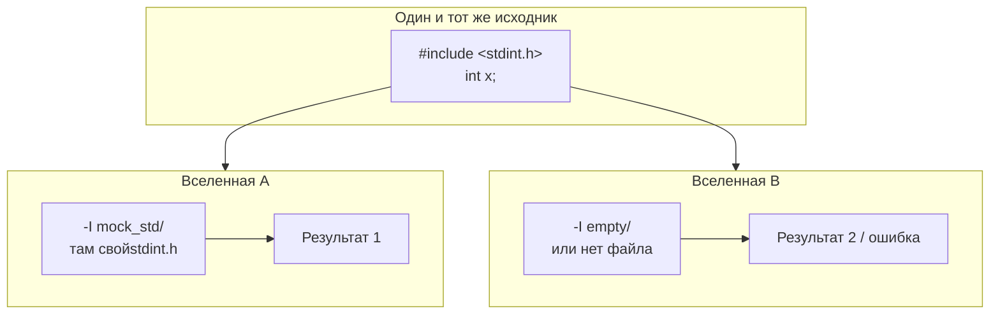
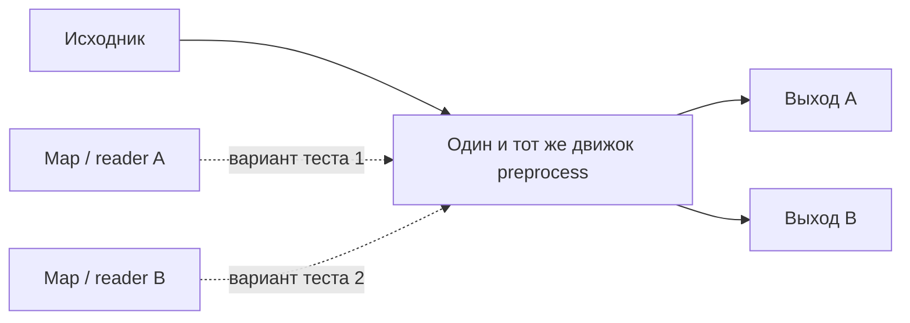
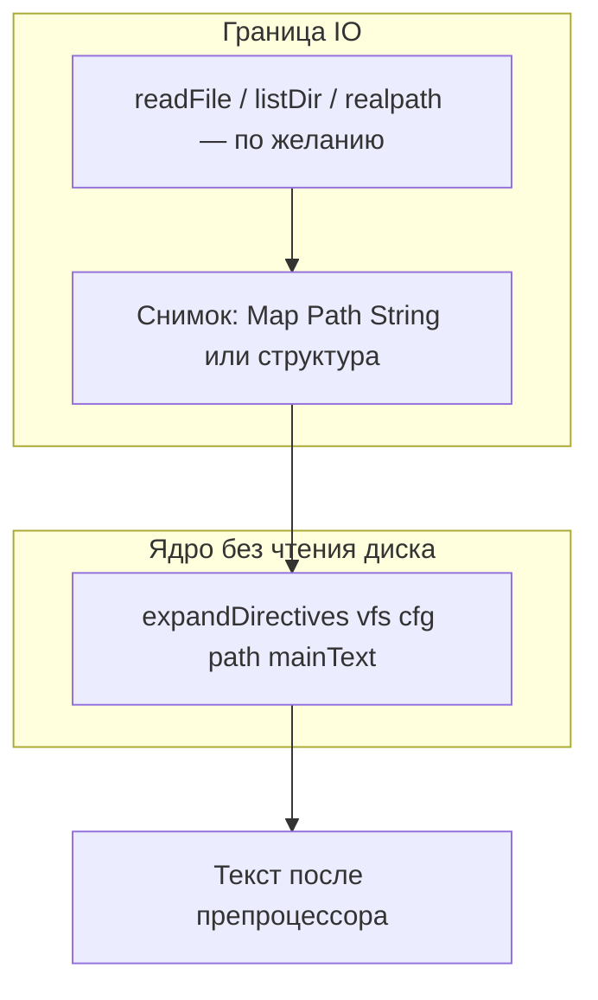

# Препроцессор и директивы
_Exported on 5/13/2026 at 13:37:52 GMT+3 from Cursor (3.1.17)_

---

**User**

препроцессор
Надо научиться обрабатывать include <>, inlcude "", header guard, define endif ifndef ifdef, простые макроподстановки

---

**Cursor**

Изучаем текущий препроцессор и точку интеграции в конвейер компилятора.


Проверяю все вызовы `preprocess` — тест о триграфах ожидает только замену `??=`, без выполнения `#define`. Реализуем полноценный препроцессор и обновим тесты.


Реализуем препроцессор: добавляем зависимости и обновляем вызовы.


Пишу полную реализацию `Preprocessor.hs`.


Исправляю ошибки: `isIdentStart`/`isIdentCont`, `candidates`, `logicalLines` и `liftIO`.


Исправляя импорты: `StateT` из `transformers`, `userError`/`ioError` из `System.IO.Error`, заменяя `modify'` на `modify`. Добавляю зависимости во все test-suite, компилирующие `Preprocessor`.


Обновляя вызовы API: `preprocess` теперь `IO`.


## Что сделано

Реализован расширенный этап в `Preprocessor.hs`:

- **Триграфы** — по-прежнему до разбора директив.
- **Логические строки** — склейка по `\` перед переводом строки, нормализация `\r\n`.
- **`#define`** — только **объектные** макросы; если сразу после имени идёт `(` — строка не попадает в таблицу (функциональные макросы пока не поддерживаются).
- **`#include "..."` / `#include <...>`** — поиск файлов по `PreprocessConfig` и каталогу «текущего» файла (см. ниже).
- **`#ifdef` / `#ifndef` / `#else` / `#endif`** — вложенность учитывается; в выключенной ветке **`#define` не выполняется** (как в стандарте).
- **Подстановка макросов** — по идентификаторам, без раскрытия внутри `"..."` и `'...'`, с запретом рекурсии для текущего макроса при одном проходе раскрытия.
- **Циклический `#include`** — обнаруживается по `canonicalizePath`; при цикле вставка **тихо пропускается** (удобно для типичных заголовков, но **ведёт себя иначе, чем GCC**).

Публичный контракт:

```haskell
preprocess :: PreprocessConfig -> Maybe FilePath -> String -> IO String
```

- **`Maybe FilePath`** — путь к «главному» файлу: из него берётся каталог для `#include "..."`. Для строки без файла — `Nothing` (тогда кавычечные include ищутся только в `pcQuoteIncludeDirs` и затем в угловых каталогах).
- **`PreprocessConfig`**: `pcAngleIncludeDirs` для `<...>`, `pcQuoteIncludeDirs` — дополнительные каталоги для `"..."` после каталога текущего файла.

Добавлены фикстуры: `tests/pp_include/` (угловой заголовок, локальный `quoted.h`, `mainstub.c`).

Зависимости библиотеки: `containers`, `directory`, `filepath`, `transformers`. Во всех тестовых таргетах, которые тянут `Preprocessor`, добавлены `containers` и `transformers`.

---

## Критика решений и альтернативы

1. **`preprocess` в `IO`**  
   Без `IO` нельзя честно делать `#include`. Альтернатива — инъекция `FilePath -> IO String` в конфиг и **чистый** `preprocess` (удобнее для property-тестов), но API тяжелее.

2. **Тихий no-op при циклическом include**  
   Проще для smoke-тестов и «охранников», но **ошибка с сообщением** (как у многих компиляторов) надёжнее. Имеет смысл позже ввести флаг в `PreprocessConfig`.

3. **Парсер fixture-файлов без препроцессора**  
   `Parser_test` по-прежнему гоняет `.c` из `tests/src_c` **без** `preprocess`. Если нужны директивы в фикстурах — придётся прогонять через `preprocess` с явными `-I` в конфиге.

4. **Нет `#if` с константными выражениями, `#undef`, `##`, variadic-макросов** — следующий слой, если понадобится ближе к реальному C89.

`cabal test` в проекте проходит; `test-preprocessor` — 7 примеров, все зелёные.

---

**User**

Критика решений и альтернативы
preprocess в IO
Без IO нельзя честно делать #include. Альтернатива — инъекция FilePath -> IO String в конфиг и чистый preprocess (удобнее для property-тестов), но API тяжелее.

Тихий no-op при циклическом include
Проще для smoke-тестов и «охранников», но ошибка с сообщением (как у многих компиляторов) надёжнее. Имеет смысл позже ввести флаг в PreprocessConfig.

Парсер fixture-файлов без препроцессора
Parser_test по-прежнему гоняет .c из tests/src_c без preprocess. Если нужны директивы в фикстурах — придётся прогонять через preprocess с явными -I в конфиге.

Нет #if с константными выражениями, #undef, ##, variadic-макросов — следующий слой, если понадобится ближе к реальному C89.

----
подробнее в критику

---

**Cursor**

Ниже — более развёрнутая критика тех же четырёх решений: что именно «ломается» в модели, какие альтернативы есть и чем они платят.

---

## 1. `preprocess` в `IO`

**Что вы выиграли.** Реальный препроцессор — это не функция `String → String`: он читает файловую систему, зависит от текущего каталога, порядка `-I`, иногда от окружения. Вынести всё в `IO` — самый прямой путь: меньше абстракций, меньше шансов «забыть» передать читатель файлов.

**В чём проблема.** Любой чистый пайплайн «текст → токены → AST» теперь **разорван**: до лексера обязательно стоит эффект. Это усложняет:

- **Детерминированные юнит-тесты без диска** — нужно либо временные файлы, либо моки.
- **Property-based тесты** (QuickCheck и т.п.) — генератор строки не хватает; нужен ещё «виртуальный FS» или инъекция.
- **Кэширование/инкрементальная компиляция** — чистая функция проще мемоизировать по входу; с `IO` кэш должен учитывать файловую подпись, время модификации и т.д.
- **Статический анализ и повторное использование** — например, хотите прогнать один и тот же исходник в двух «вселенных» include — без инъекции придётся дублировать файлы на диске.

**Альтернатива: чистое ядро + эффект на границе.**  
Разделить на:

- `preprocessPure :: PreprocessConfig' -> String -> Either Error String`, где `PreprocessConfig'` содержит не пути, а, например, `Map FilePath String` (виртуальная FS) или `FilePath -> Either Error String`;
- тонкую обёртку `preprocessIO`, которая строит эту карту/читатель из диска.

Тогда **90% логики** (директивы, условия, макросы, склейка строк) тестируется без `IO`, а `#include` остаётся «адаптером». Цена — **тяжелее API**: два уровня конфигурации, договор о том, что ключи в `Map` — нормализованные пути, как трактовать относительные include и т.д.

**Компромисс.** Оставить `IO`, но **вынести только чтение** в параметр, например `type ReadFile = FilePath -> IO (Either PreprocessError String)`, положить в `PreprocessConfig`. Тогда `preprocess` формально остаётся в `IO`, но ядро можно вызывать с `readFile` или с `const (return (Right "..."))` в тестах — без полной чистоты, но с контролируемым вводом.

**Сомнение в вашем решении.** Для учебного/раннего компилятора `IO` оправдан скоростью итерации. Если цель — **надёжная инфраструктура тестов и рефакторинг препроцессора годами**, рано или поздно «чистое ядро + read hook» окупится.

---

## 2. Тихий no-op при циклическом `#include`

**Что даёт тишина.** Классический паттерн include guard:

```c
#ifndef H
#define H
/* тело */
#endif
```

при повторном `#include "h.h"` даёт **пустую единицу трансляции** для второго захода. Если вы при цикле **молча не вставляете** тот же файл второй раз, поведение иногда совпадает с «хорошим» guard — отсюда соблазн.

**Почему это опасно семантически.**

1. **Не всякий цикл — guard.** Два файла, которые включают друг друга без guard, в GCC дают **ошибку** (или бесконечность, которую ловят). У вас же «тихо обрезали граф» — отладка превращается в «почему пропал код», без сообщения.
2. **Различие «уже включали этот файл» и «цикл».** Корректная модель стека include: **один и тот же файл может легально входиться повторно** с разных путей или в разных ветках `#if` (редко, но стандарт это допускает в рамках правил). Тихий no-op смешивает «защита от бесконечности» с «политика include_once», которая в C89 **не является** стандартной.
3. **Диагностика для пользователя.** Компилятор как инструмент обучения: явная ошибка «include cycle: A → B → A» учит быстрее, чем молчаливое исчезновение текста.
4. **Недетерминизм от canonicalizePath.** Если разрешение путей ведёт себя не так, как ожидал автор (симлинки, разный регистр на Windows), «цикл» может определиться иначе, чем в другом компиляторе — тихий no-op маскирует расхождение.

**Альтернативы.**

- **Ошибка по умолчанию**, опционально `pcOnIncludeCycle :: IncludeCyclePolicy` в конфиге: `Error | SkipOnce | ...`.
- **Явный `#pragma once` / once-семантика** как отдельная фича, не смешанная с обнаружением цикла.
- **Отдельный учёт «уже включён этот физический файл в цепочке»** только для предотвращения бесконечной рекурсии, но с **диагностикой** при обнаружении реального цикла (не guard).

**Сомнение.** Тихий no-op экономит один тест и упрощает жизнь с «плохими» заголовками, но **переносит стоимость на пользователя** в виде скрытых багов. Для компилятора, который позиционируется как «предсказуемый C89», я бы склонялся к **ошибке + флаг для legacy**.

---

## 3. Фикстуры парсера без препроцессора

**Что это значит сейчас.** В `Parser_test` файлы из `tests/src_c` идут в лексер **как есть**. Любой `#define` / `#include` в фикстуре либо **сломает парсер** (неожиданные токены), либо случайно «пройдёт», если парсер когда-нибудь начнёт понимать `#` как что-то своё.

**Почему так делают (и это не всегда плохо).**

- Фикстуры проверяют **синтаксис C после препроцессора** — это отдельная фаза; смешивание фаз в одном `.c` размывает вину: упал тест — то ли парсер, то ли препроцессор.
- Меньше зависимостей: не нужны пути include, не нужен `IO` в раннере фикстур.

**Цена несогласованности.**

- **Расхождение с реальным пайплайном** в `Main` / `AST_test`: там уже `preprocess → lexer → parse`. Один и тот же «валидный для пользователя» `.c` может вести себя по-разному в тестах.
- **Дублирование сценариев**: директивы приходится тестировать только в `Preprocessor_test`, а «сквозной» сценарий «макрос + парсинг» не покрыт.
- **Риск регрессий при усилении препроцессора**: вы начнёте раскрывать больше директив, а парсерные фикстуры останутся «сырыми» — внезапно окажется, что реальный вход никогда не совпадает с фикстурами.

**Альтернативы.**

- **Два набора фикстур**: `*.c` (после препроцессора, «чистый» C) и `*.raw.c` (с директивами) с явным шагом `preprocess` в тесте.
- **Один раннер с конфигом**: для каждого `.c` — `preprocess defaultConfig (Just path) contents`, где `path` задаёт базу для `"..."`.
- **Метаданные в манифесте** (`test-manifest.json`): флаг `usePreprocessor: true` на кейс.

**Сомнение.** Для текущего масштаба «парсер без препроцессора» — разумное разделение ответственности. Как только вы начнёте **парсить реальные проекты C51**, без сквозного пути тесты начнут **лгать о покрытии**.

---

## 4. Отсутствие `#if`, `#undef`, `##`, variadic и т.д.

Здесь критика не в «вы не сделали», а в **приоритизации и скрытых зависимостях**.

**`#if` / `#elif` / `#else` / `#endif`.**  
Сейчас у вас только `#ifdef` / `#ifndef`. Реальный код (даже старый) часто пишет:

```c
#if defined(FOO) && (BAR > 1)
```

Без этого **условная компиляция непереносима**: портирование заголовков Keil/SDCC станет болью. Реализация потребует **мини-интерпретатор константных выражений** (с `defined`, числами, `sizeof` в ограниченном виде и т.д.) — это уже не «ещё 50 строк», а отдельный подмодуль с тестами.

**`#undef`.**  
Без него модель макросов **монотонна по времени**: имя только накапливает определения в одной единице трансляции. В C макрос **переопределяется** и **снимается**; от этого зависит порядок раскрытия в сложных заголовках. Игнорирование `#undef` даёт **тихое отличие** от эталона.

**`##` и строковая склейка `#`.**  
Редко в прикладном коде, но **часто в макросах-обёртках** вокруг регистров и битов. Без них «простые макроподстановки» — обещание, которое пользователь истолкует как «как в GCC», а получит другой результат.

**Variadic макросы (C99).**  
Для C89 формально не нужны; для C51-экосистемы иногда уже ползут C99-расширения. Решение **не поддерживать** — нормально, но его надо **явно документировать**, иначе багрепорты неизбежны.

**Сомнение в порядке развития.** Логичная лестница часто такая: **корректные `#include` + диагностика** → **`#if` с константами** → **`#undef` + переопределение по правилам C** → **функциональные макросы** → **операторы `#`/`##`**. Прыгать сразу к «полным» object-макросам без `#undef` создаёт **зазор между моделью и стандартом**, который сложно потом закрыть без ломки тестов.

---

## Итог

| Решение | Главный риск | Направление смягчения |
|--------|----------------|------------------------|
| `IO` в `preprocess` | тесты и повторное использование завязаны на диск | `ReadFile` в конфиге или чистое ядро + виртуальная FS |
| Тихий цикл include | скрытые отличия от GCC и трудная отладка | политика в конфиге, по умолчанию ошибка |
| Парсер без препроцессора | пайплайн в тестах ≠ пайплайн у пользователя | флаг/отдельные фикстуры/сквозные кейсы |
| Урезанный набор директив | «почти C89», но не переносимые заголовки | явный roadmap + `#if` / `#undef` раньше экзотики |

Если нужно, могу следующим шагом предложить **конкретный** рефакторинг API (типы для `ReadFile`, политика include) под ваш `Preprocessor.hs`, без обязательства сразу всё реализовывать.

---

**User**

Детерминированные юнит-тесты без диска — нужно либо временные файлы, либо моки.
--
Не понимаю. Файл суть поток (набор) байтов. Какая разница откуда я его беру в тесте?
Нет, понятно дело файлы это по красоте, но моки?
----
Property-based тесты (QuickCheck и т.п.) — генератор строки не хватает; нужен ещё «виртуальный FS» или инъекция.
--
Еще раз и подробнее.
----
Кэширование/инкрементальная компиляция — чистая функция проще мемоизировать по входу; с IO кэш должен учитывать файловую подпись, время модификации и т.д.
--
Подожди это пока утопия. У нас простой учебно-тренировочный компилятор который проходит все стадии компилирования. Для простоты каждый раз как первый раз. Потом, очень сильно потом можно будет думать о кешировании и инкрментальной компиляции.
----
Статический анализ и повторное использование — например, хотите прогнать один и тот же исходник в двух «вселенных» include — без инъекции придётся дублировать файлы на диске.
--
Пока не понял. Нарисуй схему.
----
Альтернатива: чистое ядро + эффект на границе.
-- Тоже схему вроде понимаю что ты хочешь сказать но надо уточнить


---

**Cursor**

Ты прав в главном: **для семантики препроцессора байты — байты**, неважно, пришли они с диска, из `ByteString` в памяти или из генератора. Речь шла не о том, что «диск особенный», а о том, **как у вас сейчас зашит доступ к данным в типе `IO`**.

---

## 1. «Детерминированные тесты без диска» и «моки»

**Что имеется в виду под «моком» здесь** — не обязательно тяжёлый Mockito-style объект, а **подмена источника байтов по пути**: вместо `readFile path` тест подставляет `lookup path virtualFs`.

Сейчас цепочка такая (упрощённо):


Чтобы **не трогать диск**, тест всё равно должен ответить на вопросы препроцессора: «что лежит по пути `foo.h`?», «файл есть?». Варианты:

| Подход | Суть |
|--------|------|
| Временная папка | Байты на диске, но изолированно; диск всё равно участвует |
| «Мок» = инъекция чтения | Байты из `Map` / функции в памяти — **тот же поток**, другой **механизм доставки** |

То есть твоя формулировка **«файл = поток байтов»** совместима с тестами: **мок = другой способ подать тот же поток по запрошенному имени**, без создания файла на диске. Проблема возникает только если API **жёстко** вызывает только `readFile` и его нельзя заменить — тогда без диска (или без патчинга, что хуже) не обойтись.

---

## 2. Property-based тесты — зачем «виртуальный FS» или инъекция, подробнее

Гипотеза QuickCheck: *для любого входа X свойство P(X) выполняется*.

**Если X — одна случайная строка** (как «весь исходник целиком»):

1. С большой вероятностью строка — синтаксический мусор для вашего препроцессора → тест либо всегда падает на первом же `#include`, либо вы вынуждены **ограничить генератор** так, что он почти никогда не генерирует include — и тогда вы почти не проверяете include.

2. Как только в X есть `#include "a.h"`, **истина результата зависит не только от X**, но и от **содержимого `a.h`**. Это уже не «одна случайная строка», а **связанный набор артефактов**:  
   `main.c` + `a.h` + может `b.h` …

**«Виртуальный FS» в этом смысле** — не ОС, а **модель данных для property**:

- генератор строит **конечное отображение** `Path → Content` (и, опционально, главный «входной» путь);
- свойство: `preprocessWithVirtualFs fs mainPath mainText` удовлетворяет инвариантам (например, раскрытие макросов идемпотентно, нет утечки директив в вывод и т.д.).

Без такой структуры генератор «одной строки» **не может согласованно** породить «в `main` include на `foo`, и вот что в `foo`» — разве что встроить содержимое `foo` прямо в строку через какой-то DSL теста, что по сути снова сводится к «нескольким именованным кускам текста».

**Инъекция** — это как раз API, где чтение — параметр: property передаёт функцию `read path = lookup path fs`, и **один и тот же** чистый или почти чистый движок крутится над сгенерированным `fs`.

Итого: речь не «строки мало», а **«одномерный» случайный вход не моделирует многофайловую природу include**; нужен либо составной генератор (виртуальный каталог), либо узкий генератор без include (тогда property слабее).

---

## 3. Кэш / инкрементальная компиляция

Согласен с твоей рамкой: для учебного конвейера «каждый раз с нуля» — норма, **этот пункт можно выкинуть из аргументов против `IO`** до тех пор, пока не появится реальная потребность в скорости и артефактах сборки. Я упомянул его как **теоретическое** преимущество чистого интерфейса, не как ближайший долг проекта.

---

## 4. Две «вселенные» include — схема

Один и тот же **текст** единицы трансляции, но **разный набор** того, что видит препроцессор снаружи:



**Зачем это вообще:** regression-тест «как ведёт себя парсер с нашим fake `stdint.h`» vs «как без него». На диске это две папки или два клона дерева. С **инъекцией чтения** — две **разные** функции/карты `path → bytes` для **одного** кода препроцессора, без копирования файлов:



То есть «две вселенные» = **два разных окружения разрешения имён файлов**, не обязательно два физических дерева.

---

## 5. «Чистое ядро + эффект на границе» — схема и уточнение

Идея не в том, чтобы **запретить** `IO`, а **сузить** место, где он неизбежен:



- **Снаружи (в `IO`):** собрали виртуальную картину мира (прочитали диск, или тест передал `Map`).
- **Внутри:** функция, которой для ответа на `#include` достаточно **спросить vfs**, без `IO`.

Практически это может быть и **одна** функция `preprocessIO`, которая внутри сначала читает файлы в `Map`, потом вызывает чистое ядро — тесты тогда дергают только ядро с заранее заполненным `Map`.

**Уточнение:** «чистота» тут — инженерный приём (проще тесты, проще рассуждать о порядке include и макросов), а не религия. Ваш текущий монолит в `StateT IO` **корректен** для учебного проекта; разделение — когда начнут болеть тесты или понадобится много сценариев без диска.

---

## Краткий вывод

- **Байты = байты** — да; «мок» в этом разговоре = **подставной источник байтов по пути**, не обязательно театр с объектами.
- **Property-based:** нужен **согласованный многофайловый вход** (виртуальный каталог или инъекция), иначе `#include` либо не проверяется, либом ломает генератор.
- **Кэш** — согласен, для вашей стадии проекта не аргумент.
- **Две вселенные / чистое ядро** — про **один движок, разные таблицы файлов** и про **узкий слой `IO` у края**, остальное — данные.

Если хочешь, могу отдельно разложить, **как именно** это ложится на ваш `Preprocessor.hs` (какие три функции выделить: `resolveInclude`, `readLogicalLines`, `runPP`), без обязательства сразу рефакторить.

---

**User**

ты запутал меня еще больше. Вноси предложения, я подумаю.
Потом спрошу вопросы и уточним позиции.

---

**Cursor**

Вот **конкретные предложения** (как варианты к обсуждению), без длинной теории.

---

### 1. API чтения файлов

**Вариант A (как сейчас):** всё в `IO`, только диск — ничего не менять.

**Вариант B:** в `PreprocessConfig` добавить поле  
`pcReadFile :: FilePath -> IO (Either String String)`  
по умолчанию = `fmap Right . readFile`, в тестах = чтение из `Map` или фиксированных строк.

**Вариант C:** отдельная функция  
`preprocessVirtual :: Map FilePath String -> ... -> Either String String`  
(без `IO`), а `preprocess` = «загрузить карту с диска» + вызов `preprocessVirtual`.

*Имеет смысл выбрать один: A проще, B минимальный рефакторинг, C максимально удобно для тестов без диска.*

---

### 2. Циклический `#include`

**Вариант A:** оставить тихий пропуск (как сейчас).

**Вариант B:** по умолчанию `IOError` с текстом цепочки файлов; опция в конфиге «тихий пропуск» для особых случаев.

**Вариант C:** только предупреждение в stderr (если позже появит логгер) + пропуск.

*Для учебного компилятора я бы склонялся к B или хотя бы явному флагу в конфиге.*

---

### 3. Парсерные фикстуры и препроцессор

**Вариант A:** не трогать — `.c` в `tests/src_c` как «уже после препроцессора».

**Вариант B:** в `Parser_test` перед парсингом всегда вызывать `preprocess defaultPreprocessConfig Nothing` (или с `Just path` к файлу).

**Вариант C:** флаг в манифесте / в имени файла (`*.pp.c` = с препроцессором).

*Если директив в фикстурах не планируете — A достаточно; если хотите один пайплайн с `Main` — B.*

---

### 4. Приоритет следующих фич препроцессора

Предлагаю **порядок для обсуждения** (можно переставить):

1. `#undef`  
2. `#if` / `#elif` / `#else` / `#endif` с **константными** выражениями (без `sizeof` в первой итерации)  
3. Функциональные макросы `#define F(x) ...`  
4. `#` и `##` в макросах  

*Скажешь, что для C51 важнее — подстроим порядок.*

---

### 5. Документация «что не есть C89/GCC»

Один короткий блок (в комментарии к модулю `Preprocessor` или в README, когда решишь):  
что поддержано, что намеренно нет, как ведёт себя циклический include.

*Это не код, а снимает половину будущих вопросов.*

---

Дальше можешь просто **отметить буквы** (например: «1B, 2B, 3A, 4 порядок ок») или написать «оставляем всё как есть, кроме …» — от этого и оттолкнёмся в следующих вопросах.

---

**User**

1. В силу того, что архитектура C51 и проекты на нем очень и очень просты, то делать карту (map) файлов которые будут подставляться в момент чтения -- это крайне избыточно. Тк придется думать как в Python когда каждый вызов функции ищется по сопоставлению в таблице. И первый вызов не приравнивается ко второму (мы все равно полезем в карту сопоставления).
Это препроцессор. А у нас еще в IR и в оптимизации конь не валялся.
----
2. Про логгер я забыл, надо ввести. С одной стороны. С другой -- это очень сложный проект (или синтетически глупый) когда понадобиться цепочка циклических include
Задача скомпилироваться, а не постичь все извращения языка.
----
3.  Тесты в которых потребует препроцессор -- это либо тесты на сам препроцессор, либо тесты с явной цепочкой последовательности вызвов. Препроцессор-Лексер; Препроцессор-Лексер-Парсер и тд
----
Функциональные макросы #define F(x) ...
Не хотелось бы. Т.к. мы получаем (если заморочимся) тьюринг-полную машину и сможем перенести конмпиляцию кода на этап препроцессора. 
Проще -- лучше.

---

**Cursor**

Принял твои рамки — они согласованы с «учебно-практичный C51, без раздувания фронтенда».

**1. Карта файлов / виртуальная FS**  
Ок: для вашего масштаба **реальный диск + маленькие фикстуры в `tests/`** — нормальная цена, без слоя «подмены чтения». Та «таблица» в обсуждении была не про рантайм компилятора пользователя, а про **изоляцию юнит-тестов**; если вы сознательно не инвестируете в это сейчас — это осознанный trade-off, не ошибка.

**2. Логгер и циклические include**  
Разумно: логгер — полезен для **директив, include, “файл не найден”**, не обязательно глубокая телеметрия. Циклы include — оставить как есть (тихо или с ошибкой — как уже решено в коде) и не строить вокруг них отдельную философию; цель «скомпилировать типовой проект» этого не требует.

**3. Где живёт препроцессор в тестах**  
Твоё разделение хорошее:  
- **узкие тесты** — только `Preprocessor`;  
- **сквозные** — явно названные цепочки `preprocess → lexer`, `preprocess → lexer → parse`, без смешивания в каждом parser-fixture без надобности.

**4. Функциональные макросы**  
Формально «Тьюринг-полная машина на препроцессоре» — спорная формулировка (раскрытие макросов в C ограничено глубиной/токенами; другое дело **`#if` с выражениями**), но **суть твоя верная**: функциональные макросы резко усложняют реализацию и отладку, а выгода на простых C51-проектах невелика. **Зафиксировать в комментарии к модулю: «объектные `#define` только, `F(...)` не поддерживаем»** — чтобы через полгода не начать «добавим по чуть-чуть» без решения.

Когда будешь готов — можно отдельно набросать **минимальный контракт логгера** (тип сообщения, уровень, куда пишем), без привязки ко всему компилятору сразу.

---

**User**

а про изоляцию юнит-тестов; если вы сознательно не инвестируете в это сейчас — это осознанный trade-off, не ошибка.
Да я забадаюсь в эти юнит тесты. Если мне будет надо, я создам отдельные тесты. И только тогда, когда станет больно их поддерживать, буду думать над их изоляцией.
----
Пишем логгер. 

---

**Cursor**

Добавляем минимальный логгер и подключаем его к препроцессору. Просматриваю текущую структуру.


Добавляем модуль `Logger`, поле в `PreprocessConfig` и вызовы в препроцессоре. По умолчанию — тихий логгер, чтобы тесты не засоряли stderr; в `Main` подключим вывод на stderr.


Обновляя `Preprocessor.hs`: экспорты, `PreprocessConfig`, `ppLog`, логирование в `handleInclude` и `includeFrom`.


Убираем `deriving (Eq, Show)` у `PreprocessConfig` — поле с функцией `IO` не сравнивается и не показывается.


Кратко, что сделано.

### Модуль `src/Logger.hs`
- Уровни: `LogDebug` … `LogError` (порядок задаёт фильтрацию).
- `Logger { loggerMin, loggerEmit }` — ниже `loggerMin` сообщения отбрасываются в `logMsg`.
- `silentLogger` — ничего не пишет (по умолчанию в `defaultPreprocessConfig`).
- `stderrLogger minLevel handle` — общий случай.
- `stderrLoggerWarn` / `stderrLoggerInfo` — готовые варианты на `stderr` с порогом `LogWarn` и `LogInfo`.
- Формат строки: `[LogInfo] текст` и `hFlush` после строки.

### `Preprocessor`
- В `PreprocessConfig` добавлено поле `pcLogger :: Logger`; у `PreprocessConfig` убран `deriving (Eq, Show)` из‑за функции внутри `Logger`.
- Внутри: `ppLog` → `logMsg (pcLogger cfg)`.
- **LogDebug:** успешное открытие include (`открыт include: путь`).
- **LogWarn:** битый `#include`, файл не найден (с перечислением пробованных путей), циклический include (пропуск).
- Публичный модуль реэкспортирует `Logger`, уровни, `silentLogger`, `stderrLogger*`, `logMsg` (можно импортировать только `Preprocessor` или только `Logger`).

### `app/Main.hs`
- `defaultPreprocessConfig { pcLogger = stderrLoggerInfo }` — в демо на stderr попадут в т.ч. строки про открытые include.

### Cabal
- В библиотеку, exe и все test-suite с `Preprocessor` добавлен модуль `Logger`.

Дальше логику можно так же протащить в лексер/парсер: либо общий `Logger` в отдельном «конфиге компиляции», либо пока только `pcLogger` у препроцессора — как решишь.

---

**User**

Логгер пользуем далее везде. В лексере , парсере и тд.

---

**Cursor**

Просматриваю сигнатуры `Lexer`, `Parser` и точки вызова, чтобы протянуть логгер единообразно.


Вводим `lexerPure` / `parseTokensPure` и обёртки `lexer` / `parseTokens` с `Logger -> ... -> IO`. Обновляю все вызовы.


Добавляю в `Lexer_test` хелпер и перевожу проверки на `lexer silentLogger` (или `>>= flip shouldBe`).


Восстанавливаю вызов `preprocess` в `Lexer_test` и перевожу токенизацию на `lexerPure` плюс один тест согласованности с `lexer silentLogger`.


Обновляю `Parser_test.hs` для использования `silentLogger` с `lexer` и `parseTokens`.


Кратко, что сделано по вашему требованию «логгер везде» для лексера/парсера и тестов.

### Обновления

1. **`tests/AST_test.hs`**, **`tests/IR_test.hs`**, **`tests/ManifestRunner_test.hs`** — цепочка `preprocess` → `lexer lg` → `parseTokens lg` с **`silentLogger`**, чтобы API с `Logger` и `IO` совпадали с продакшен-пайплайном без шума в stderr.

2. **`tests/Parser_test.hs`** — общий **`lg = silentLogger`**, **`parseMainReturn`**, **`assertFixtureByPath`** и **`assertManifestCase`** принимают `Logger` и используют `lexer`/`parseTokens` в `IO`.

3. **`src/Lexer.hs`** — восстановлен **`import Data.Char (...)`** (без него сборка падала: `isSpace`, `isDigit` и т.д. не были в области видимости). Это не про логгер, но блокировало `cabal build`.

4. **`app/Main.hs`** — имя **`log`** заменено на **`pipelineLog`**, чтобы убрать предупреждение **`-Wname-shadowing`** от `Prelude.log`.

`cabal build all` и **`cabal test all`** проходят.

### Замечание по дизайну (как вы просите — сомневаться в решениях)

В тестах везде **`silentLogger`** — это просто и детерминированно, но **не проверяет**, что сообщения лексера/парсера вообще пишутся в нужный уровень. Альтернатива: тестовый **`Logger`**, который накапливает записи в `IORef`/`STRef`, и отдельные `it` на содержимое лога при `TokenLexError` / `AstUnknown`. Имеет смысл, если логирование станет частью контракта, а не только диагностикой.

Дальше по конвейеру (IR-проходы и т.д.) — как только там появятся вызовы лексера/парсера или свой лог, туда нужно прокидывать **тот же** `Logger` (или обёртку), чтобы единообразно настраивать уровень и назначение вывода из одного места (как сейчас в `Main` с `stderrLoggerInfo`).

