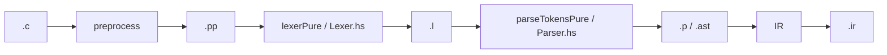

# Ручные эталоны `tests/src_c/` — workflow (keil + c_adv)

Документ фиксирует **как надо** и **чего нельзя**. Если эталон сделан иначе — его нужно перепроверить или переписать.

---

## Канон pipeline



Эталон на каждой стадии описывает **выход предыдущей**, не сырой `.c` (кроме PP-теста, который читает `.c`).

---

## Жёсткий запрет (мухлёж)

| Запрещено | Почему |
|-----------|--------|
| `parseTokens` / `parseTokensPure` → записать в `.p` | это dump парсера, не ручной эталон |
| `lexer` / `lexerPure` → записать в `.l` | dump лексера |
| `DumpFixtureOutputs.hs`, любой «.pp → .p» скрипт | то же |
| PowerShell/Python **glue** (prefix+body → tests) как часть процесса | скрытая автогенерация |
| Упавший `cabal test` → перезаписать эталон выводом раннера | эталон задаёт spec, не наоборот |
| Сокращённый inline заголовка в `.pp` | только полный `reg2051.h` / `common.h` |
| Эталоны в `artifacts/` вместо `tests/src_c/...` | corpus живёт рядом с `.c` |

**Разрешено:** читать `Lexer.hs`, `Parser.hs`, `Preprocessor.hs`, Keil `.lst`/`.i`, соседние эталоны; писать `.pp`/`.l`/`.p` **руками**; `just audit-src-c` **только** для таблицы пробелов.

**Серая зона (лучше не делать):** одноразовый Python «склеить уже написанные prefix.pp + body.pp» — формально не генератор стадий, но легко превращается в конвейер. **Предпочтительно:** copy-paste в редакторе.

---

## Общая схема каталога

```
<catalog>/
  golden-manifest.json    # relDir, stem, prefix — справочник
  _prefix/                # один раз: post-PP заголовки (inline)
  _headers/               # только c_adv: исходные .h для #include
  <relDir>/
    <stem>.c
    <stem>.body.{pp,l,p}  # опционально: черновик без prefix
    <stem>.{pp,l,p,ast,ir} # полные эталоны для cabal test
```

---

## keil/ (`tests/src_c/keil/`)

Подробности: [`tests/src_c/keil/README.md`](../tests/src_c/keil/README.md)

### Prefix

| prefix | файл | когда |
|--------|------|--------|
| `none` | — | `test1.c` без `#include` |
| `reg2051` | `_prefix/reg2051.{pp,l,p}` | `#include <reg2051.h>` |
| `reg51` | `_prefix/reg51.{pp,l,p}` | `#include <reg51.h>` |

Источник inline: `tests/src_c/c_adv/_headers/reg2051.h` (полный файл, не выдержка).

### Пошагово (один `<stem>`)

1. **Исходник** — `keil/<relDir>/<stem>.c`.
2. **Post-PP тело** — вручную по C89 + Keil `.lst`/`.i`:
   - комментарии убраны, `#include` развёрнут;
   - сохранить в `<stem>.body.pp` (удобно) или сразу в полный `<stem>.pp`.
3. **Полный `.pp`** — в редакторе:
   ```
   [содержимое _prefix/reg2051.pp]
   [содержимое body после PP]
   ```
4. **`.l`** — одна строка `[Token…,…]`:
   - prefix: `_prefix/reg2051.l` (без `[` `]`);
   - + тело из `.body.l` или ручная запись по `Lexer.hs` (hex → decimal в `TokenNumber`).
5. **`.p` / `.ast`** — одна строка `AstProgram […]`:
   - prefix: узлы из `_prefix/reg2051.p` (каждый токен → `AstDeclaration [Token…],`);
   - + тело: `AstFunctionDef …`, `AstIf …` по `Parser.hs` и образцам `test1`/`test2`.
   - `.ast` ≡ копия `.p`.
6. **`.ir`** — пока `[IrUnknown]` (кроме тривиального `return N`).
7. **Проверка** — `just audit-src-c`; `cabal test test-parser` — смотреть diff, **не** перезаписывать.

### Статус keil/ (честно)

| Что | Как сделано |
|-----|-------------|
| `test1`, `test2` | вручную, образец для остальных |
| `0_declare_0` … `0_int0_0`, часть ранних | body `.pp`/`.l`/`.p` вручную; полные файлы — **склейка prefix+body** (часть через одноразовый Python, не через редактор) |
| `0_blink_0_1`, `0_int_0`, `0_int_0_1`, `0_test_0` | body AST/токены заданы в скрипте и склеены — **перепроверить вручную** |

**10/10** по наличию файлов в audit; качество `.p` для последних 4 — под сомнением, если скрипт ошибся.

---

## c_adv/ (`tests/src_c/c_adv/`)

Подробности: [`tests/src_c/c_adv/GOLDENS.md`](../tests/src_c/c_adv/GOLDENS.md)

### Prefix (один на все 6 `.c`)

Все включают `"common.h"` → после PP:

```
reg2051.h (inline) + common.h (typedef, прототипы; макросы SET_BIT… уже развёрнуты в .c)
```

| Файл | Содержание |
|------|------------|
| `_headers/common.h`, `reg2051.h` | исходники для `#include` |
| `_prefix/common-prefix.pp` | post-PP заголовок (103 строки + typedef + прототипы) |
| `_prefix/common-prefix.l` | токены prefix |
| `_prefix/common-prefix.p` | **ещё нет** — писать вручную по `.l` + `Parser.hs` |

### Пошагово (один модуль)

1. **Исходник** — `c_adv/<relDir>/<stem>.c` (`#include "common.h"`).
2. **Post-PP тело** — макросы `SET_BIT`/`TEST_PASS` → `((P1) |= (1 << (n)))` и т.д.:
   - `<stem>.body.pp` уже есть для всех 6;
   - сверка: Keil/логика PP, не вывод `preprocess` в golden.
3. **Полный `.pp`** — `_prefix/common-prefix.pp` + body (в редакторе). Полные `.pp` **уже есть**.
4. **`.l`** — `[` + `common-prefix.l` + `,` + body.l + `]`. Body `.l` **есть**; полные `.l` **есть**.
5. **`.p` / `.ast`** — **НЕ ГОТОВЫ** (0/6):
   - prefix: дописать `_prefix/common-prefix.p` (reg2051.p + typedef + прототипы как `AstDeclaration …`);
   - body: каждый `<stem>.body.p` вручную по `.body.pp` и `Parser.hs`;
   - полный: `AstProgram [` + prefix nodes + `,` + body nodes + `]`;
   - **не** использовать `parseTokensPure` для записи файлов.
6. **`.ir`** — `[IrUnknown]` (есть).
7. **Проверка** — как у keil.

### Статус c_adv/ (честно)

| Стадия | 6/6 |
|--------|-----|
| `.pp`, `.l`, `.ir` | ✓ |
| `.body.pp`, `.body.l` | ✓ |
| `_prefix/common-prefix.p` | ✗ |
| `.p`, `.ast` | ✗ |

**Попытка агента (отклонена):** `scripts/pp_ast_nodes.hs` + `merge_c_adv_p.py` — dump парсера; скрипты **удалены**, `.p` **не созданы**.

---

## Сравнение keil vs c_adv

| | keil | c_adv |
|---|------|-------|
| Prefix | `reg2051` / `reg51` / none | один `common-prefix` |
| Исходные `.h` | angle `#include` | `_headers/` + `"common.h"` |
| Сложность body | малые Keil-примеры | макросы, C51 memory, ISR |
| `.p` | заявлено 10/10 | **0/6 — вручную** |
| Риск мухлёжа | склейка скриптом (часть) | dump парсера (попытка, стоп) |

---

## Чеклист перед «готово»

- [ ] Каждый `.pp` можно прочитать вслух как post-PP C без `#include`
- [ ] `.l` согласован с `.pp` по `Lexer.hs` (в т.ч. `TokenLeftAngle` для `<`)
- [ ] `.p` написан по `Parser.hs`, не скопирован из `cabal test`
- [ ] `.ast` = `.p`
- [ ] `just audit-src-c` без неожиданных дыр
- [ ] В git нет glue-скриптов для goldens

---

## Ссылки

- Трекер: [`src-c-manual-goldens-todo.md`](src-c-manual-goldens-todo.md)
- Раннеры / расхождения: [`src-c-fixture-think-about.md`](src-c-fixture-think-about.md)
- Handoff: [`src-c-handoff-prompt.md`](src-c-handoff-prompt.md)
