# Общая архитектура HCC C89→C51

> Статус: **draft** · Приоритет: P0  
> Схемы: A-1 … A-9 (см. [appendix/diagram-inventory.md](appendix/diagram-inventory.md))

---

## 1. Назначение

Единый обзор системы: **границы**, **компоненты**, **зависимости**, **три поперечные подсистемы** (конвейер, тестирование, логирование).

Детали конвейера → [11-konveer-kompilyacii.md](11-konveer-kompilyacii.md).  
Детали тестов → [testing/00-obzor-sistemy-testirovaniya.md](testing/00-obzor-sistemy-testirovaniya.md).  
Логирование → [infra/04-logirovanie.md](infra/04-logirovanie.md).

---

## 2. Контекст системы (Рис. A-1)

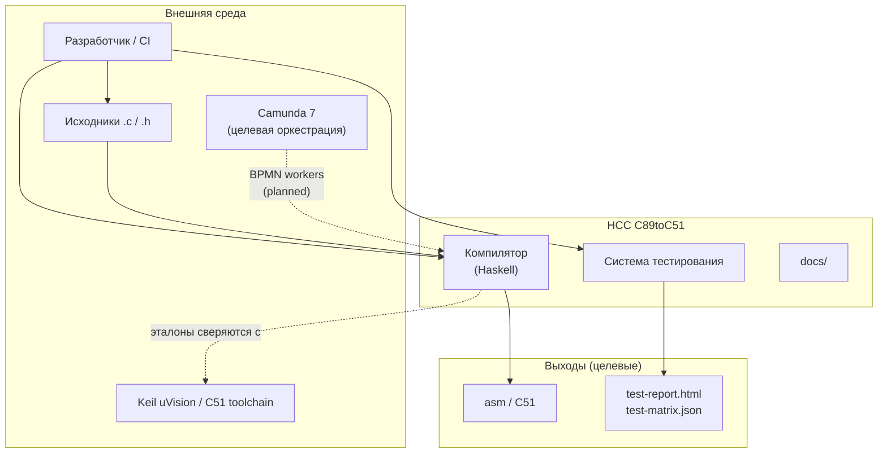

**Роль HCC:** транслятор подмножества C89 (+ C51-расширения) с поэтапной верификацией. Runtime production — Haskell + Cabal; Camunda — оркестрация сборок, не ядро компилятора.

---

## 3. Структура репозитория (Рис. A-2)

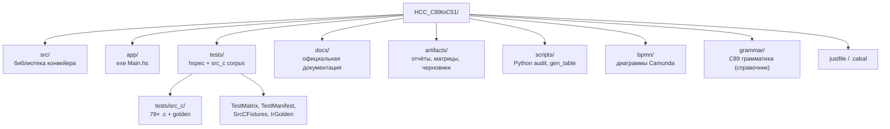

| Каталог | Назначение | Документ |
|---------|------------|----------|
| `src/` | модули стадий + `Logger` | [stages/](stages/) |
| `app/` | демо CLI (PP→Lex→Parse) | — |
| `tests/` | suite + инфраструктура | [testing/](testing/) |
| `docs/` | ЕСПД-структура | [README.md](README.md) |
| `artifacts/` | генерируемые отчёты | [testing/02-manifest](testing/02-manifest-i-matrica.md) |
| `bpmn/` | оркестрация | [infra/03-orkestraciya-bpmn.md](infra/03-orkestraciya-bpmn.md) |

---

## 4. Три поперечные подсистемы (Рис. A-3)

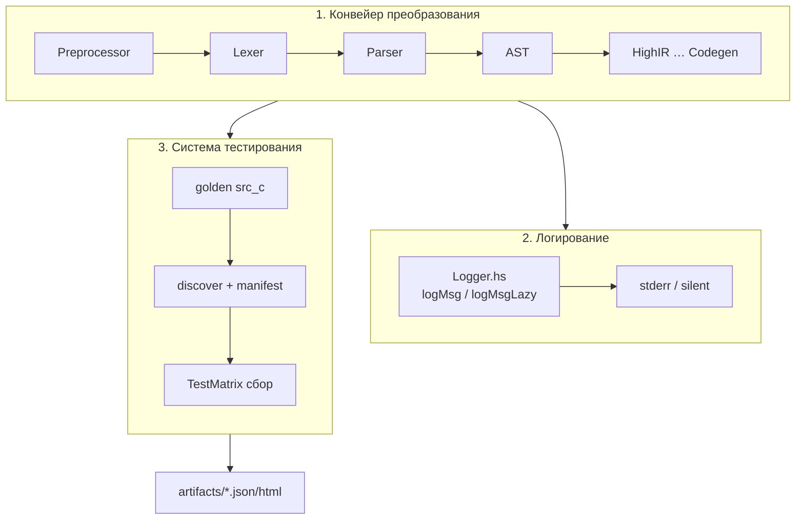

| Подсистема | Модули | Не путать с |
|------------|--------|-------------|
| Конвейер | `src/*.hs` | — |
| Логирование | `Logger.hs`, `pcLogger` | TestMatrix |
| Тестирование | `TestMatrix`, `SrcCFixtures`, `*_test.hs` | Logger output |

---

## 5. Слои архитектуры (Рис. A-4)

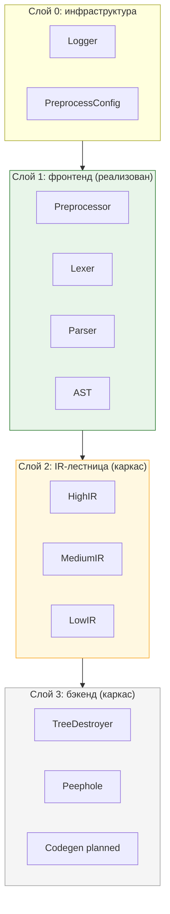

**Правило зависимостей:** слой N импортирует только слои ≤ N (и L0). Обратных ссылок нет.

---

## 6. Граф модулей `src/` (Рис. A-5)

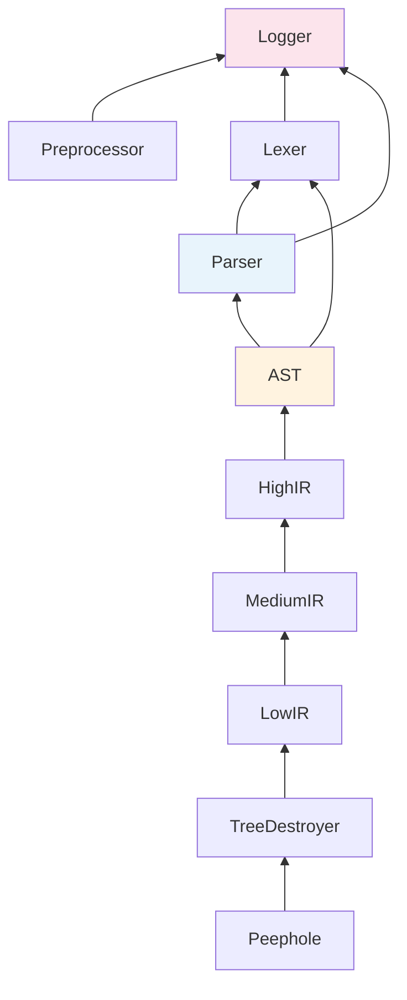

### Таблица модулей

| Модуль | Слой | Зависит от | Экспортирует |
|--------|------|------------|--------------|
| `Logger` | L0 | base | `Logger`, `logMsg`, … |
| `Preprocessor` | L1 | Logger, IO | `preprocess`, `PreprocessConfig` |
| `Lexer` | L1 | Logger | `Token`, `lexer`, `lexerPure` |
| `Parser` | L1 | Lexer, Logger | `Ast`, `parseTokens`, `parseTokensPure` |
| `AST` | L1 | Parser, Lexer | `AST`, `fromParserAst` |
| `HighIR` … `Peephole` | L2–L3 | цепочка IR | каркас API |

---

## 7. Два дерева и чистые API (Рис. A-6)

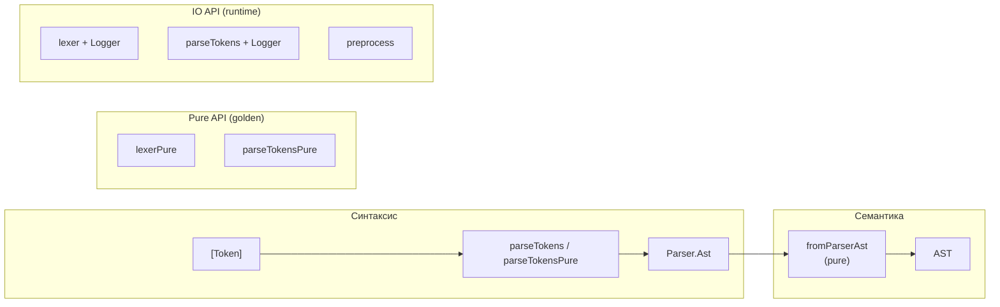

Golden-тесты и audit используют **Pure/IO-ветки** осознанно: см. [testing/06-sistema-sbora-i-podstanovok.md](testing/06-sistema-sbora-i-podstanovok.md).

---

## 8. Сборка и исполнение (Рис. A-7)

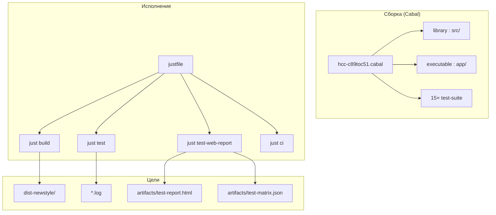

| Команда | Артеfact |
|---------|----------|
| `just build` | `lib` + `exe:hcc-c89toc51` |
| `just test` | все suite, exit code |
| `just test-web-report` | HTML + matrix + `all-tests-table.md` |
| `just docs` | Haddock |

---

## 9. Архитектура тестирования (Рис. A-8)

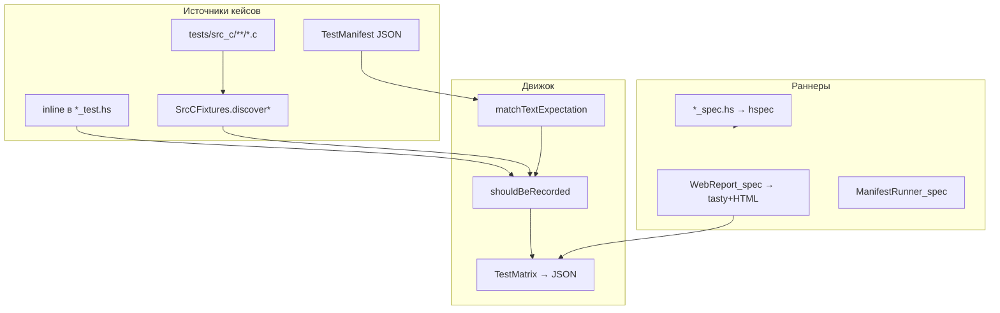

Полное описание: [testing/06-sistema-sbora-i-podstanovok.md](testing/06-sistema-sbora-i-podstanovok.md).

---

## 10. Логирование в архитектуре (Рис. A-9)

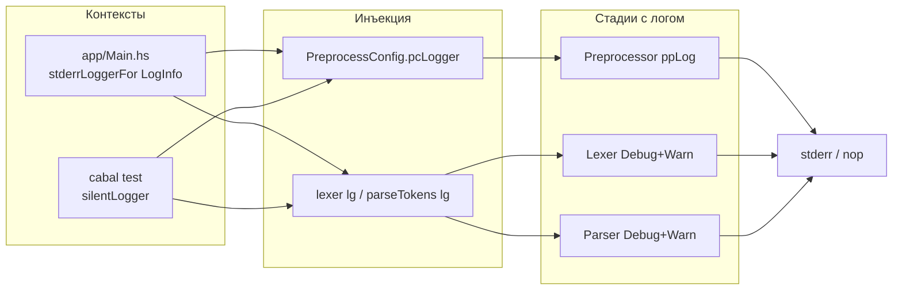

AST и `fromParserAst` — **без** логирования (pure).

---

## 11. Сквозная схема: один прогон fixture (Рис. A-10)

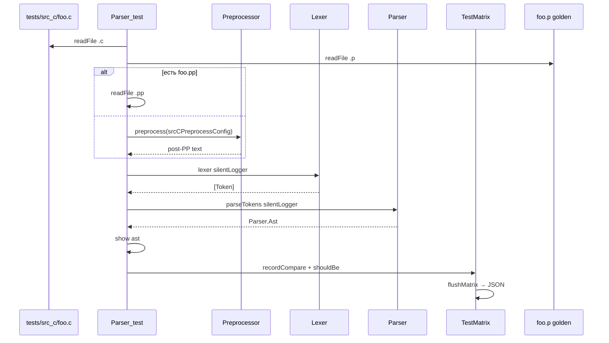

---

## 12. Целевая оркестрация (Рис. A-11)

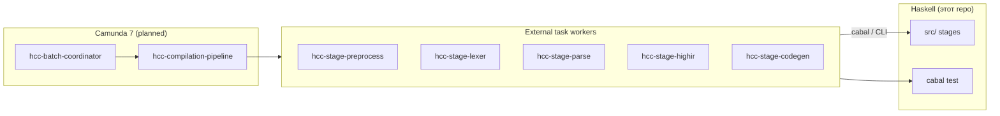

Детали: [infra/03-orkestraciya-bpmn.md](infra/03-orkestraciya-bpmn.md), `bpmn/hcc-compilation-pipeline.bpmn`.

---

## 13. Технологический стек

| Компонент | Технология |
|-----------|------------|
| Язык компилятора | Haskell2010, GHC 9.x |
| Сборка | Cabal 3.x, `cabal.project` |
| Автоматизация | `just` (PowerShell) |
| Unit/integration | Hspec 2.x |
| Web-отчёт | Tasty + tasty-hspec + tasty-html |
| Matrix JSON | Aeson 2.x |
| Аудит corpus | Python 3 (`scripts/`) |
| Диаграммы docs | Mermaid в Markdown |
| Оркестрация (цель) | BPMN 2.0 / Camunda 7 |
| Целевая платформа | C51 / 8051 (Keil) |

---

## 14. Границы зрелости (текущая итерация)

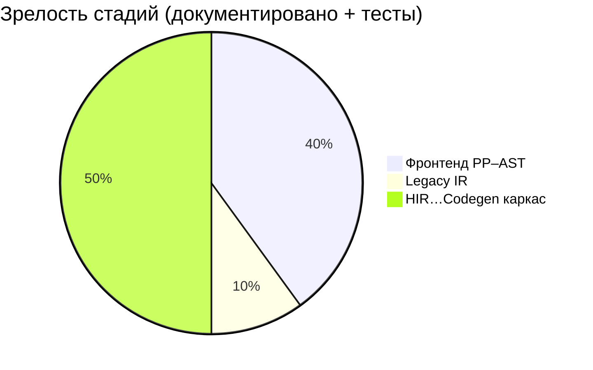

| Область | Статус |
|---------|--------|
| Фронтенд 1–4 | реализован, golden, docs draft |
| Legacy IR | минимальный `IrGolden`, golden `.ir` |
| HIR … Peephole | каркас + pending tests |
| Codegen | planned |
| AST golden | нет (inline tests) |
| c_adv `.p` | пробел 0/6 |

---

## 15. Связанные документы

| Тема | Документ |
|------|----------|
| Конвейер | [11-konveer-kompilyacii.md](11-konveer-kompilyacii.md) |
| Стадии 1–4 | [stages/01..04](stages/) |
| Тесты | [testing/00](testing/00-obzor-sistemy-testirovaniya.md) |
| Сбор/подстановки | [testing/06](testing/06-sistema-sbora-i-podstanovok.md) |
| Logger | [infra/04-logirovanie.md](infra/04-logirovanie.md) |
| CI | [infra/02-sborka-i-ci.md](infra/02-sborka-i-ci.md) |
| План docs | [00-dokumentacionnyy-plan.md](00-dokumentacionnyy-plan.md) |

---

## 16. История изменений

| Версия | Дата | Изменение |
|--------|------|-----------|
| 0.1 | 2026-06-03 | Полная архитектура, схемы A-1…A-11 |
