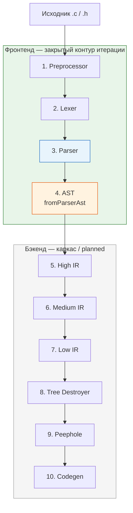
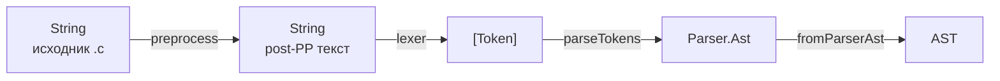
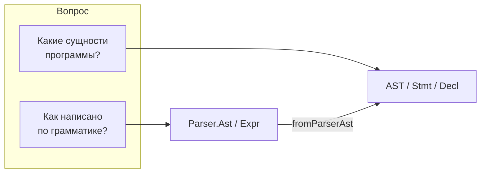
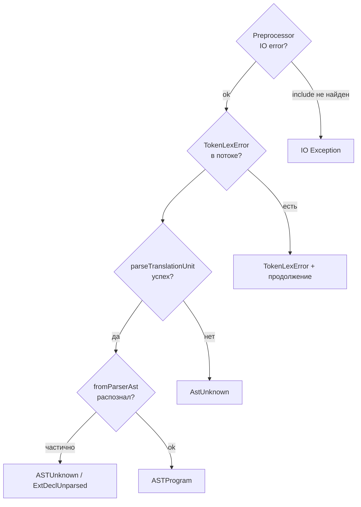

# Конвейер компиляции

> Статус: **draft** (фронтенд, стадии 1–4) · Приоритет: P0  
> Схемы: P-1, P-2, P-4, P-6

---

## 1. Назначение

Документ описывает сквозное преобразование исходного C89/C51-текста через **фронтенд компилятора** — до семантического AST включительно. Это **закрытый контур** текущей итерации проекта и документации.

Стадии после AST (High IR … Codegen) перечислены для контекста; детали — в [`stages/README.md`](stages/README.md) (каркас).

---

## 2. Полный конвейер (Рис. P-1)



**Рис. P-1.** Зелёная зона — документирована и реализована в рабочем объёме. Серая — каркас модулей, логика TODO.

---

## 3. Фронтенд: сквозной поток данных (Рис. P-6)



Каждая стрелка — **строгий контракт**: выход стадии N является единственным допустимым входом стадии N+1. Пропуск стадий не предусмотрен.

### Типовой вызов (как в `app/Main.hs` и тестах)

```haskell
preprocessed <- preprocess cfg mbSourcePath sourceCode
tokens       <- lexer pipelineLog preprocessed   -- Logger: сводка + TokenLexError
synAst       <- parseTokens pipelineLog tokens   -- Logger: AstUnknown
semAst       =  fromParserAst synAst             -- pure, без лога
```

`Logger` — см. [infra/04-logirovanie.md](infra/04-logirovanie.md). В тестах обычно `silentLogger`; golden используют `*Pure` без лога.

---

## 4. Два представления дерева (Рис. P-2)



| | `Parser.Ast` | `AST` |
|---|--------------|-------|
| Модуль | `Parser.hs` | `AST.hs` |
| Декларации | `AstDeclaration [Token]` — сырой фрагмент | `Decl`, `Declarator`, `DeclSpecifier` |
| Функция | `AstFunctionDef name specToks c51Toks body` | `FunctionDef` с разобранными spec |
| Ошибка | `AstUnknown [Token]` | `ASTUnknown [Token]` |
| Типизация C89 | нет | структурная форма, **без** полной sem-check IR |

Подробнее: [`stages/03-parser.md`](stages/03-parser.md), [`stages/04-ast.md`](stages/04-ast.md), [`lecture-syntax-vs-semantic-ast.md`](lecture-syntax-vs-semantic-ast.md).

---

## 5. Контракты стадий фронтенда (Рис. P-4)

| № | Стадия | Вход | Выход | API | Документ |
|---|--------|------|-------|-----|----------|
| 1 | Preprocessor | `String`, `PreprocessConfig`, `Maybe FilePath` | `IO String` | `preprocess` | [stages/01-preprocessor.md](stages/01-preprocessor.md) |
| 2 | Lexer | `String` | `IO [Token]` | `lexer`, `lexerPure` | [stages/02-lexer.md](stages/02-lexer.md) |
| 3 | Parser | `[Token]` | `IO Parser.Ast` | `parseTokens`, `parseTokensPure` | [stages/03-parser.md](stages/03-parser.md) |
| 4 | AST | `Parser.Ast` | `AST` | `fromParserAst` | [stages/04-ast.md](stages/04-ast.md) |

### Инварианты между стадиями

1. **Preprocessor → Lexer:** директив `#…` в выходе отсутствуют; текст — логические строки C без обработки PP.
2. **Lexer → Parser:** последовательность заканчивается разбором всей translation unit; «хвост» токенов = `AstUnknown`.
3. **Parser → AST:** `fromParserAst` не читает исходный текст и не вызывает лексер; только структурный подъём.

---

## 6. Обработка ошибок на фронтенде



| Стадия | Стратегия | Маркер |
|--------|-----------|--------|
| Preprocessor | fail-fast на битый `#include` | `IO Error` |
| Lexer | ошибка как токен | `TokenLexError String` |
| Parser | мягкий fallback | `AstUnknown [Token]` |
| AST | частичный подъём | `ASTUnknown`, `ExtDeclUnparsed`, `SDeclUnparsed` |

Полная типизация и диагностика диапазонов — **не** на AST; задача IR (стадия 5+).

---

## 7. За горизонтом AST (стадии 5–10, каркас)

| № | Стадия | Вход → выход | Зрелость |
|---|--------|--------------|----------|
| 5 | High IR | `AST` → `HighIR` | каркас (`HighIRTodo`) |
| 6 | Medium IR | `HighIR` → `MediumIR` | каркас |
| 7 | Low IR | `MediumIR` → `LowIR` | каркас |
| 8 | Tree Destroyer | `LowIR` → `TDResult` | каркас |
| 9 | Peephole | `TDResult` → `PeepholeResult` | каркас |
| 10 | **Codegen** | `PeepholeResult` → asm/C51 | **planned** (отдельная стадия) |

Legacy-suite `test-ir` и будущий `test-high-ir` **пока раздельны**; слияние запланировано (см. [glossary](appendix/glossary.md)).

---

## 8. Связанные документы

| Документ | Содержание |
|----------|------------|
| [10-obshchaya-arhitektura.md](10-obshchaya-arhitektura.md) | **общая архитектура**, 11 схем |
| [stages/01-preprocessor.md](stages/01-preprocessor.md) | директивы PP, include, макросы |
| [stages/02-lexer.md](stages/02-lexer.md) | токены, C51-ключевые слова |
| [stages/03-parser.md](stages/03-parser.md) | грамматика, приоритеты |
| [stages/04-ast.md](stages/04-ast.md) | семантический подъём |
| [00-dokumentacionnyy-plan.md](00-dokumentacionnyy-plan.md) | план, фазы |
| [testing/](../testing/) | *следующий блок документации* |

---

## 10. История изменений

| Версия | Дата | Изменение |
|--------|------|-----------|
| 0.1 | 2026-06-03 | Каркас P-1, таблица контрактов |
| 0.2 | 2026-06-03 | Фронтенд до AST: P-2, P-6, ошибки, граница итерации |
