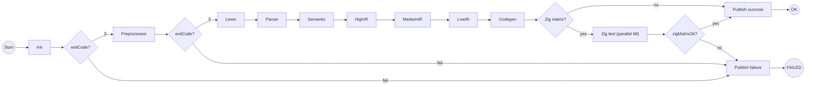
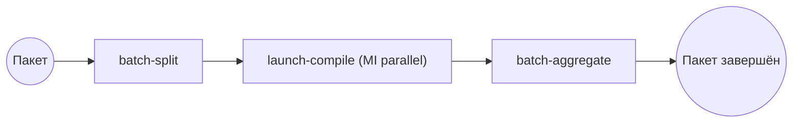

# BPMN: конвейер компиляции HCC (Camunda 7)

Файл для Modeler: [`bpmn/hcc-compilation-pipeline.bpmn`](../bpmn/hcc-compilation-pipeline.bpmn)

Два процесса в одном deployment:

| Process ID | Назначение |
|------------|------------|
| `hcc-compilation-pipeline` | Одна сборка одного `.c`, fail-fast |
| `hcc-batch-coordinator` | Пакет файлов: N параллельных запусков pipeline |

---

## 1. Одна сборка (fail-fast + опциональный Zig)



**«Одна упала — другая идёт»:** это **разные process instance** с разным `businessKey` (например `buildId = sha256(file)`). Instance A на Lexer → `End FAILED`; instance B продолжает Preprocessor → … независимо.

Внутри **одного** instance при `exitCode != 0` срабатывает default-путь XOR-gateway → `Task_Publish_Failure` → дальнейшие стадии **не** создаются.

---

## 2. Пакет файлов (параллельные сборки)



`Task_Launch_Compile` — **multi-instance parallel** по `${sourceFiles}`. Worker для каждого элемента вызывает REST API Camunda:

`POST /process-definition/key/hcc-compilation-pipeline/start`

с variables: `sourcePath`, `buildId`, …

Падение `file_a.c` не отменяет instance для `file_b.c`.

---

## 3. Zig: параллельная матрица таргетов

После успешного Codegen:

- `enableZigMatrixTest == false` → сразу `Publish Success`
- `enableZigMatrixTest == true` → `Task_Zig_Test` с

```xml
camunda:collection="${zigTargets}"
camunda:elementVariable="zigTarget"
```

Пример старта процесса (REST):

```json
{
  "variables": {
    "sourcePath": { "value": "tests/src_c/100_ast/test1.c", "type": "String" },
    "buildId": { "value": "test1-20260519", "type": "String" },
    "enableZigMatrixTest": { "value": true, "type": "Boolean" },
    "zigTargets": { "value": "[\"thumb2-freestanding\",\"riscv32-freestanding\",\"x86_64-linux\"]", "type": "Json" }
  },
  "businessKey": "test1-20260519"
}
```

Worker `hcc-zig-test` получает `zigTarget`, гоняет `zig build test -Dtarget=...` (или ваш wrapper), на **каждом** complete пишет `exitCode` для этой ветки.

После завершения **всех** MI Camunda переходит к `Gw_After_Zig`. Последний worker (или отдельный шаг в complete последнего instance) должен выставить **`zigMatrixOk`**: `true`, только если все ветки успешны.

> Альтернатива: три отдельные Service Task + Parallel Gateway fork/join вместо MI — удобнее рисовать в Modeler, хуже масштабируется по числу таргетов.

---

## 4. External Task topics (контракт worker)

| Topic | Действие (пример) |
|-------|-------------------|
| `hcc-init` | workDir, пути артефактов |
| `hcc-stage-preprocess` | `cabal`/stage preprocess |
| `hcc-stage-lexer` | … |
| `hcc-stage-parse` | … |
| `hcc-stage-semantic` | … |
| `hcc-stage-highir` | `cabal test test-high-ir` или stage CLI |
| `hcc-stage-mediumir` | … |
| `hcc-stage-lowir` | … |
| `hcc-stage-codegen` | … |
| `hcc-zig-test` | Zig для `${zigTarget}` |
| `hcc-publish-failure` | лог, Cockpit variables |
| `hcc-publish-success` | отчёт, пути .asm/.c51 |
| `hcc-batch-split` | `sourceFiles` из каталога |
| `hcc-launch-compile` | старт дочернего pipeline |
| `hcc-batch-aggregate` | `{okCount, failCount, reports[]}` |

Общий контракт complete:

```json
{ "exitCode": 0, "stageName": "lexer", "logTail": "..." }
```

Для Zig MI дополнительно при закрытии матрицы: `{ "zigMatrixOk": true }`.

---

## 5. Deploy

1. Camunda Modeler → Open `bpmn/hcc-compilation-pipeline.bpmn` (в файле полный `BPMNDiagram` со всеми стрелками)
2. Deploy → ваш Camunda 7
3. Cockpit → оба definition: `hcc-compilation-pipeline`, `hcc-batch-coordinator`
4. Поднять external task client с подпиской на topics выше

---

## 6. Замечания по дизайну

- **Не User Task** — весь конвейер автоматический; человек только смотрит Cockpit/отчёт.
- Локальный Haskell-pipeline остаётся в worker; BPMN только оркестрирует.
- Для «упал lexer — не гонять parser» достаточно XOR; отдельный Error Boundary на каждой задаче — избыточен, пока worker не бросает BPMN Error.
- Если нужен **parallel fork** Zig без MI (ровно 3 ветки на диаграмме) — скажите, добавлю второй вариант `.bpmn` с `Parallel Gateway` + `Join`.
