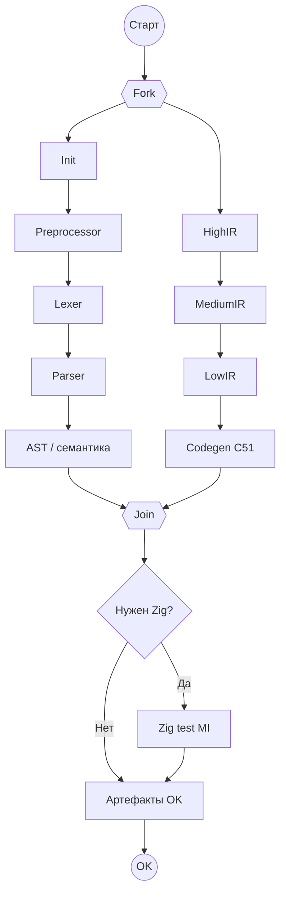

# BPMN v2: инциденты Camunda (без стрелок ошибок)

Файл: [`bpmn/hcc-compilation-pipeline-v2-incidents.bpmn`](../bpmn/hcc-compilation-pipeline-v2-incidents.bpmn)  
Process ID: **`hcc-compilation-v2`**

Вариант 1 (XOR + Publish Failure): [`bpmn/hcc-compilation-pipeline.bpmn`](../bpmn/hcc-compilation-pipeline.bpmn)

---

## Идея

| v1 | v2 |
|----|-----|
| После каждой стадии XOR `exitCode` | Только happy-path стрелки |
| Явная ветка → «Записать сбой» | `handleFailure` / exception → **incident** |
| End FAILED | Процесс **замирает** на сломанной activity (красная в Cockpit) |

На **каждой** Service Task: **`Asynchronous Before`** (`camunda:asyncBefore="true"`).

---

## Топология (как на вашей схеме)



**Нет** стрелок на End FAILED.

---

## Параллельные колонки

После **Parallel Gateway (Fork)**:

- **Слева:** Init → Preprocessor → Lexer → Parser → Semantic  
- **Справа:** HighIR → MediumIR → LowIR → Codegen  

**Join** ждёт обе ветки.

### Важно для worker (семантика данных)

Правая ветка стартует **одновременно** с левой. Worker `hcc-stage-highir` должен:

- либо **poll** `semanticArtifactPath` / флаг `semanticReady` в variables;
- либо **retry** с backoff, пока левая ветка не завершит Semantic;
- либо не начинать реальную работу до появления артефакта.

Иначе HighIR может стартовать раньше AST — это ограничение оркестрации, не BPMN. Альтернатива: убрать Fork и поставить HighIR после Semantic (линейно) — тогда теряется «две колонки», но проще данные.

---

## Сбой → incident

Пример (external task client, Java/JS):

```javascript
// успех
await client.complete(task, { exitCode: 0, stageName: 'lexer' });

// системный сбой — incident, процесс стоит на Lexer
await client.handleFailure(task, {
  errorMessage: 'OOM in lexer',
  errorDetails: stack,
  retries: 0,
  retryTimeout: 60000
});
```

В **Cockpit / Admin**:

- Process instance: активная activity подсвечена;
- **Incidents** → сообщение, stack, retry/delete incident вручную.

Другой файл / `buildId` = **новый** process instance — не блокируется.

---

## Zig

`Gw_Zig`: `${enableZigMatrixTest == true}` → `Task_Zig_Test` (parallel MI по `zigTargets`).  
При сбое одной ветки MI — incident на **Zig test**, без отдельной стрелки fail.

---

## Deploy

1. Modeler → Open `hcc-compilation-pipeline-v2-incidents.bpmn`
2. Проверить в свойствах задач: **Asynchronous Before** = true (в XML уже стоит)
3. Deploy (можно рядом с v1 — другой process key)
4. Старт: `POST .../key/hcc-compilation-v2/start`

---

## Когда v2 лучше v1

- Падения = **инфраструктура** (OOM, timeout, worker down), не бизнес-ветка `exitCode`
- Нужна **операторская** картина: красный блок + incident + retry
- Чистая диаграмма без «леса» fail-стрелок

Когда нужен **явный** End FAILED и ветвление по `exitCode` без incident — оставайтесь на v1.
