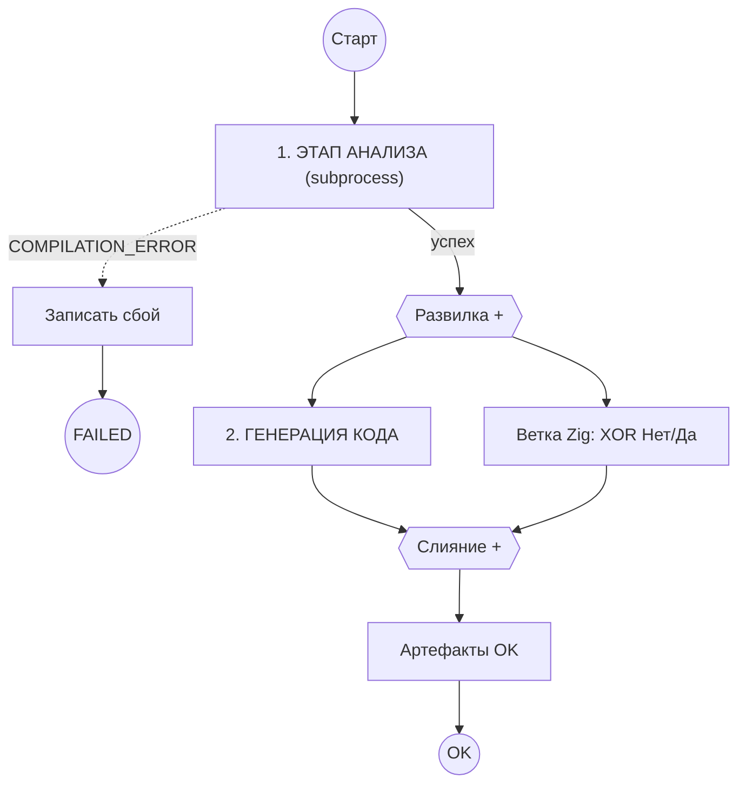

# BPMN v3: subprocess + boundary error

Файл: [`bpmn/hcc-compilation-pipeline-v3-subprocess.bpmn`](../bpmn/hcc-compilation-pipeline-v3-subprocess.bpmn)  
Process key: **`hcc-compilation-v3`**

---

## Схема



---

## Этап анализа

Вложенный subprocess: **Init → Preprocessor → Lexer → Parser → AST**.

**Ошибка компиляции** (не OOM): worker бросает `BpmnError`:

```java
throw new BpmnError("COMPILATION_ERROR", "lexer: unexpected token");
```

→ **Boundary Error Event** (молния) на границе subprocess → **Записать сбой** → **FAILED**.

Системные сбои (память, worker down) по-прежнему можно вести через **incident** (`handleFailure`) на любой задаче — отдельные стрелки не нужны.

---

## После успеха

**Parallel fork:**

| Ветка | Содержимое |
|-------|------------|
| 1 | Subprocess **HighIR → MedIR → LowIR → Codegen C51** |
| 2 | XOR **Нужен Zig?** → Да: Zig MI / Нет: сразу в Join |

**Контур Zig** — `Group_Zig` (пунктир, без логики) + `Gw_Zig` + `Task_Zig_Test` (как Lexer/Parser, без subprocess).

**Слияние [+]** — `parallelGateway` с **2** входами: codegen + `Flow_Zig_Merged`. «Нет» и Zig test сходятся в `Gw_Zig_Merge` (без подписи), затем одна стрелка в Join. Не в «Артефакты OK».

→ **Артефакты OK** → **OK**.

---

## Variables при старте

```json
{
  "sourcePath": "tests/src_c/100_ast/test1.c",
  "buildId": "test1-v3",
  "enableZigMatrixTest": false,
  "zigTargets": ["thumb2-freestanding", "x86_64-linux"]
}
```

---

## Сравнение версий

| | v1 | v2 | v3 |
|--|----|----|-----|
| Fail XOR после каждого шага | да | нет | нет (только анализ) |
| Subprocess | нет | нет | да |
| Ошибка компиляции | exitCode | incident | **BpmnError + boundary** |
| Параллель codegen + Zig | частично | fork с начала | **после анализа** |

---

## Deploy

Modeler → Open v3 → Deploy рядом с v1/v2 (разные process key).
