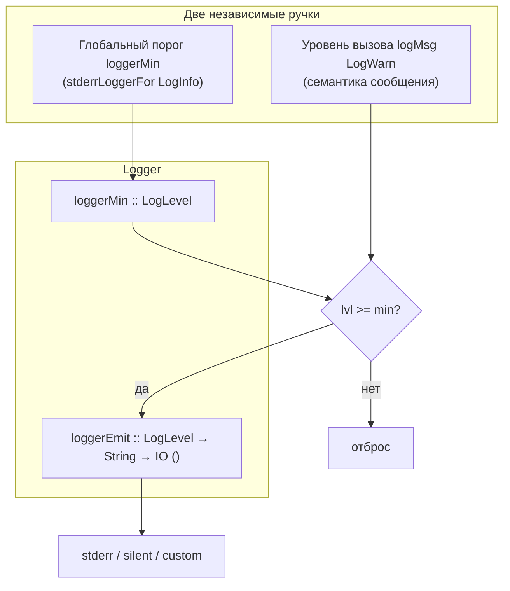
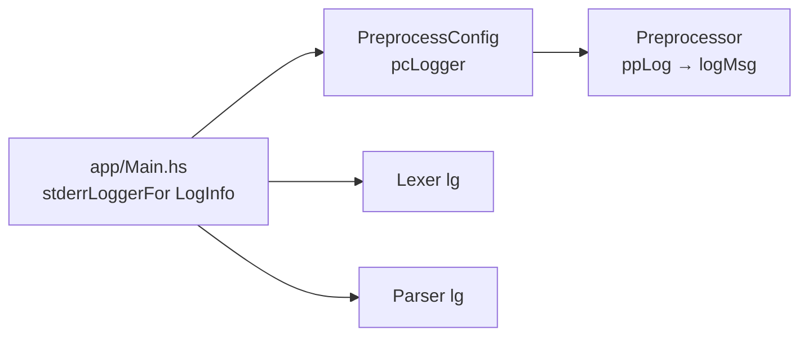

# Система логирования

> Статус: **draft** · Модуль: `src/Logger.hs` · Схемы: L-1, L-2

---

## 1. Назначение

Единый **уровневый логгер** для всех стадий фронтенда. Не путать с системой сбора тестов ([testing/06-sistema-sbora-i-podstanovok.md](../testing/06-sistema-sbora-i-podstanovok.md)) — logger пишет диагностику в stderr (или никуда), TestMatrix пишет факты сравнений в JSON.

---

## 2. Модель (Рис. L-1)



**Правило:** сообщение печатается только если `уровень_вызова >= loggerMin`.

Пример: порог `LogWarn` пропускает `LogDebug` и `LogInfo`, но `logMsg lg LogWarn "…"` всё равно выводится.

---

## 3. Уровни (`LogLevel`)

| Уровень | Ord | Типичное использование |
|---------|-----|------------------------|
| `LogDebug` | низший | сводки: число токенов, открытый include |
| `LogInfo` | | общая информация (резерв) |
| `LogWarn` | | `TokenLexError`, `AstUnknown`, битый include (до IO error) |
| `LogError` | высший | критические сбои (резерв) |

Порядок конструкторов задаёт `Ord` — **не менять** без пересмотра всех порогов.

---

## 4. Фабрики логгера

| Функция | Порог | Куда | Когда |
|---------|-------|------|-------|
| `silentLogger` | `LogError` | nop | **`cabal test`**, `defaultPreprocessConfig` |
| `stderrLoggerWarn` | `LogWarn` | stderr | CLI по умолчанию |
| `stderrLoggerInfo` | `LogInfo` | stderr | CLI verbose |
| `stderrLoggerFor lvl` | `lvl` | stderr | из конфига / флага CLI |
| `loggerWithMin lvl lg` | новый min | тот же emit | локально ослабить порог |

Формат строки: `[LogWarn] Preprocessor: include не найден: …`

---

## 5. API

```haskell
logMsg     :: Logger -> LogLevel -> String -> IO ()
logMsgLazy :: Logger -> LogLevel -> (() -> String) -> IO ()
```

`logMsgLazy` — строка собирается **только** если уровень прошёл порог (важно для `show` больших структур в Debug).

---

## 6. Передача Logger по конвейеру (Рис. L-2)



| Стадия | Как получает Logger |
|--------|---------------------|
| Preprocessor | `PreprocessConfig.pcLogger` (поле конфига) |
| Lexer | аргумент `lexer lg` |
| Parser | аргумент `parseTokens lg` |
| AST | **не** логирует (`fromParserAst` — pure) |

### Тесты vs CLI

| Контекст | Logger |
|----------|--------|
| `cabal test` | `silentLogger` (типично) |
| `app/Main.hs` | `stderrLoggerFor LogInfo` |
| src_c fixtures | `silentLogger` в раннерах |

**Чистые варианты без лога:** `lexerPure`, `parseTokensPure` — golden сравнивают их, не `lexer`/`parseTokens`.

---

## 7. Что логирует каждая стадия

### Preprocessor (`ppLog`)

| Уровень | Событие |
|---------|---------|
| `LogWarn` | некорректный `#include`, файл не найден (перед IO error), циклический include (пропуск) |
| `LogDebug` | успешно открыт include: путь |

### Lexer

| Уровень | Событие |
|---------|---------|
| `LogDebug` | `Lexer: токенов: N` (lazy) |
| `LogWarn` | каждый `TokenLexError` в потоке |

### Parser

| Уровень | Событие |
|---------|---------|
| `LogDebug` | число токенов на входе (lazy) |
| `LogWarn` | `AstUnknown` — первые 200 символов `show tokens` |

---

## 8. Связь с тестовой системой

| Аспект | Logger | TestMatrix |
|--------|--------|------------|
| Назначение | диагностика разработчику | audit trail прогона |
| Выход | stderr / nop | JSON |
| Влияет на pass/fail | **нет** (кроме PP IO error) | да |
| В golden | не участвует | `show` actual vs expected |

`TokenLexError` попадает **и** в log (Warn), **и** в поток токенов, **и** в matrix через `show`.

---

## 9. Расширение (альтернативы)

| Задача | Подход |
|--------|--------|
| Лог в файл | свой `loggerEmit` → `writeFile` append |
| Лог в тест | `Logger LogDebug (\ _ msg -> modifyIORef …)` |
| CLI `-v` | `stderrLoggerFor LogDebug` |
| Меньше шума в PP | `loggerWithMin LogWarn` на один вызов |

---

## 10. Связанные документы

- [11-konveer-kompilyacii.md](../11-konveer-kompilyacii.md) — место в pipeline
- [stages/01-preprocessor.md](../stages/01-preprocessor.md) — `pcLogger`
- [testing/06-sistema-sbora-i-podstanovok.md](../testing/06-sistema-sbora-i-podstanovok.md) — сбор тестов
- Haddock: `just docs` → `Logger`

---

## 11. История изменений

| Версия | Дата | Изменение |
|--------|------|-----------|
| 0.1 | 2026-06-03 | Полное описание Logger |
