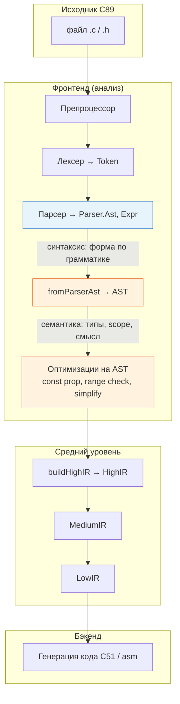
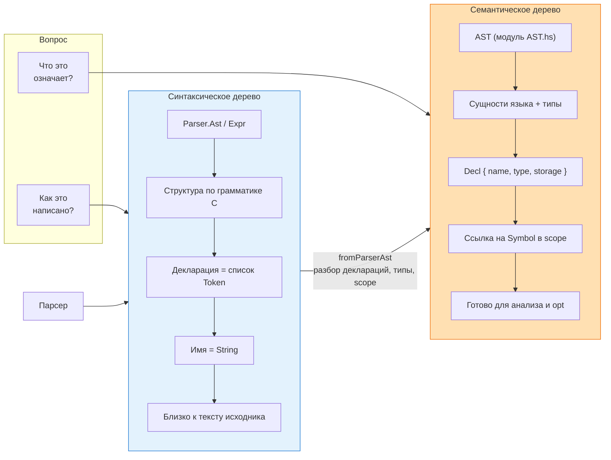
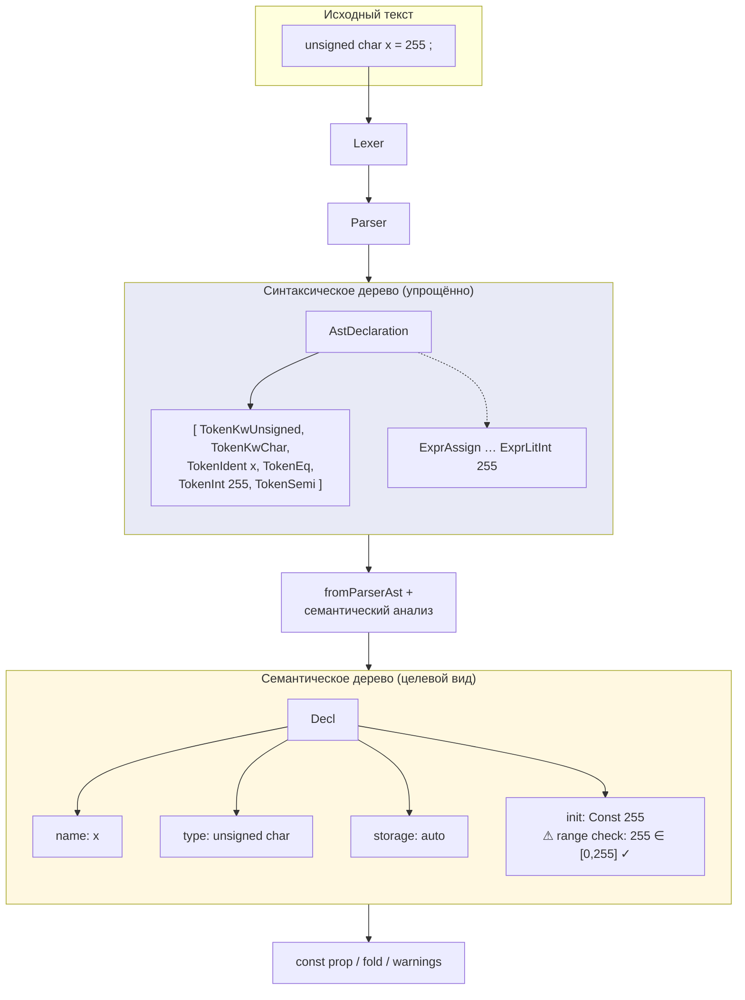
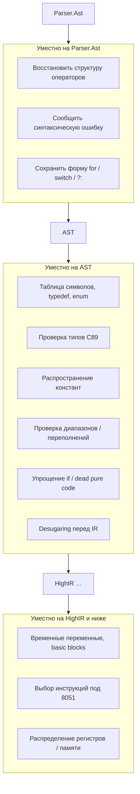
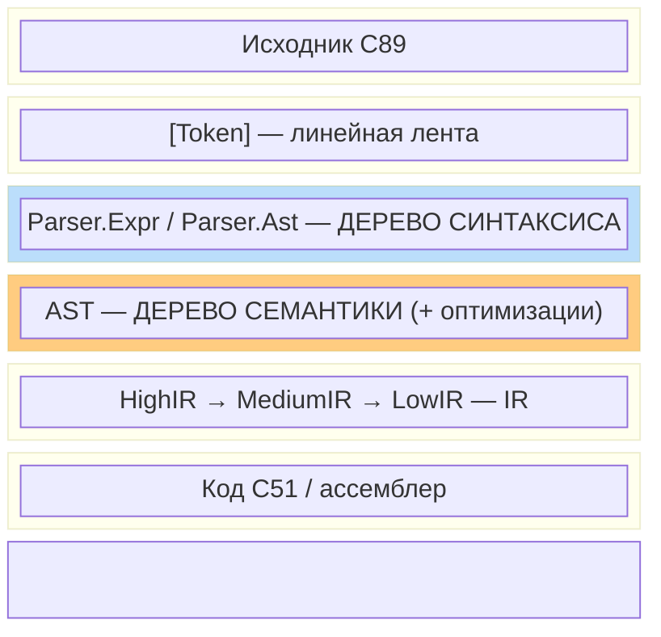

# Синтаксическое vs семантическое дерево (лекционная схема)

Материал для курса по компиляторам на примере **HCC_C89toC51**  
(`Parser.Ast` / `Expr` — синтаксис, модуль `AST` — семантика).

---

## Рис. 1. Общий конвейер компиляции



**Легенда:** голубой блок — ответ на вопрос *«как написано?»*; оранжевый — *«что это значит и можно ли оптимизировать?»*

---

## Рис. 2. Два дерева: один исходник — два представления



---

## Рис. 3. Пример: одна строка исходника

Исходник:

```c
unsigned char x = 255;
```



**Для лекции:** на синтаксическом уровне мы видим *последовательность токенов*; на семантическом — *тип, переменную и проверяемое значение*.

---

## Рис. 4. Что где делать (чтобы не путать слои)



---

## Рис. 5. Слои данных (стек представлений)



---

## Краткая шпаргалка (один слайд)

| | **Синтаксис** (`Parser`) | **Семантика** (`AST`) |
|---|--------------------------|------------------------|
| **Вопрос** | Как записано? | Что означает? |
| **Строится** | Сразу после парсера | После `fromParserAst` + анализ |
| **Декларация** | `[Token]` | `Decl` + `Type` |
| **Идентификатор** | `String` | `Symbol` в scope |
| **Ошибки** | «Не ожидали `;`» | «Тип не согласован», «255 не влезает» |
| **Оптимизации** | Нет | const prop, range, simplify |
| **Дальше** | → `AST` | → `HighIR` |

---

## Экспорт в слайды

- **Mermaid Live Editor:** https://mermaid.live — вставить блок ` ```mermaid ` из этого файла.
- **VS Code / Cursor:** предпросмотр Markdown с поддержкой Mermaid.
- **Reveal.js / Marp:** подключить `mermaid` plugin для лекций из этого `.md`.

Файл в репозитории: `docs/lecture-syntax-vs-semantic-ast.md`
