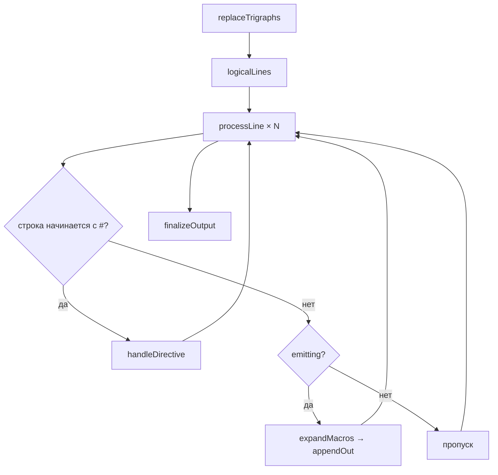

# Стадия 1: Препроцессор

> Статус: **draft** · Модуль: `src/Preprocessor.hs` · Suite: `test-preprocessor` · Golden: `.pp`

---

## 1. Назначение

Преобразование **исходного текста** с директивами препроцессора C89 в **чистый C-текст**, пригодный для лексера. Стадия выполняется до любой токенизации.

Ответ на вопрос: *«что останется от `.c` после `#include`, `#define`, условной компиляции?»*

---

## 2. Место в конвейере (Рис. S-01-1)


Фрагмент [P-6](../11-konveer-kompilyacii.md): первая стрелка `preprocess`.

---

## 3. Входные данные

| Параметр | Тип | Описание |
|----------|-----|----------|
| `cfg` | `PreprocessConfig` | каталоги include, logger |
| `mbSourcePath` | `Maybe FilePath` | путь к «виртуальному» файлу для `#include "..."` |
| `src` | `String` | исходный текст |

### `PreprocessConfig`

```haskell
data PreprocessConfig = PreprocessConfig
  { pcAngleIncludeDirs :: [FilePath]   -- #include <...>
  , pcQuoteIncludeDirs :: [FilePath]   -- доп. для #include "..."
  , pcLogger           :: !Logger
  }
```

Для фикстур `tests/src_c/` используется `SrcCFixtures.srcCPreprocessConfig` (каталоги `c_base`, `c_adv/_headers`, …).

---

## 4. Выходные данные

| | |
|---|---|
| Тип | `IO String` |
| Формат | логические строки C, разделённые `\n` |
| Инвариант | строки, начинающиеся с `#`, **отсутствуют** (обработаны или отброшены) |
| Побочный эффект | чтение включаемых файлов; лог через `pcLogger` |

---

## 5. Алгоритм (Рис. S-01-2)



### Поддерживаемые директивы

| Директива | Поведение |
|-----------|-----------|
| `#define ИМЯ тело` | объектный макрос; `F(...)` **не** поддерживается |
| `#include "path"` | относительно каталога текущего файла + `pcQuoteIncludeDirs` |
| `#include <path>` | `pcAngleIncludeDirs` |
| `#ifdef` / `#ifndef` | условная компиляция по факту определения макроса |
| `#else` / `#endif` | вложенные условия (стек `Frame`) |
| `#if` с выражениями | **игнорируется** (вне scope) |
| `#undef`, `#pragma`, `##`, stringize | **не** реализованы |

### Дополнительно

- **Trigraphs** C89: `??=` → `#`, `??(` → `[`, … (`replaceTrigraphs`).
- **Подстановка макросов** не затрагивает строковые и символьные литералы.
- **Include guard:** повторный `#ifndef H` с уже определённым `H` — тело не эмитируется.
- **Защита от рекурсии:** стек `stIncludeStack`.

---

## 6. Модуль и публичный API

| Экспорт | Назначение |
|---------|------------|
| `preprocess` | основная точка входа |
| `defaultPreprocessConfig` | конфиг по умолчанию (`silentLogger`) |
| `replaceTrigraphs` | отдельно (тестируемо) |

Haddock: `just docs` → `Preprocessor`.

---

## 7. Ограничения и отличия от C89

| C89 | HCC |
|-----|-----|
| Функциональные макросы | нет |
| `#if` / `#elif` / `defined` | нет |
| `##`, `#` stringize | нет |
| `_Pragma` / C99 | нет |
| Линия `@` директив внутри макроса | упрощённая модель |

Ошибка «файл include не найден» → **IO exception** (fail-fast), не «тихий» пропуск.

---

## 8. Связанные тесты

| Вид | Где |
|-----|-----|
| Unit | `tests/Preprocessor_test.hs` — `shouldBeTextRecorded` (IO + matrix) |
| Golden | `discoverPreprocessorFixtures` → compare `.pp` |
| Suite | `just test-preprocessor` |

Сбор: [testing/06-sistema-sbora-i-podstanovok.md](../testing/06-sistema-sbora-i-podstanovok.md).  
Лог PP: [infra/04-logirovanie.md](../infra/04-logirovanie.md) (`pcLogger`, `ppLog`).

---

## 9. Связанные документы

- [11-konveer-kompilyacii.md](../11-konveer-kompilyacii.md) — контракт PP→Lex
- [02-lexer.md](02-lexer.md) — следующая стадия
- [Logger](../src/Logger.hs) — уровни логирования PP

---

## 10. История изменений

| Версия | Дата | Изменение |
|--------|------|-----------|
| 0.1 | 2026-06-03 | Полное описание стадии 1 |
