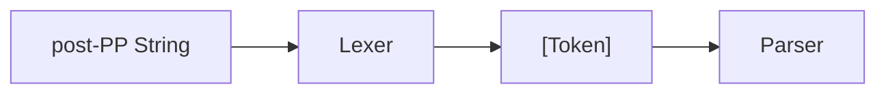
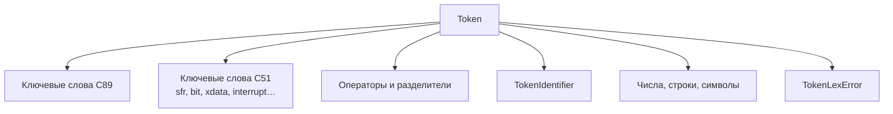

# Стадия 2: Лексер

> Статус: **draft** · Модуль: `src/Lexer.hs` · Suite: `test-lexer` · Golden: `.l`

---

## 1. Назначение

Преобразование **post-PP текста** в последовательность **токенов** — атомарных единиц для синтаксического анализа.

Ответ на вопрос: *«из каких лексем состоит программа после препроцессора?»*

---

## 2. Место в конвейере (Рис. S-02-1)



---

## 3. Входные данные

| | |
|---|---|
| Тип | `String` — текст **после** препроцессора |
| Инвариант | без директив `#define` / `#include`; комментарии `//` и `/* */` допустимы (лексер их пропускает) |
| Logger | `Logger` — для `lexer`; `lexerPure` без лога |

---

## 4. Выходные данные

| | |
|---|---|
| Тип | `[Token]` |
| Порядок | слева направо, как в исходном тексте |
| Ошибки | `TokenLexError String` — токен ошибки, разбор **продолжается** |

### Классы токенов (Рис. S-02-2)



### Целочисленные суффиксы

```haskell
data IntSuffix = SufU | SufL | SufUL
-- TokenNumberWithSuffix Int IntSuffix
```

---

## 5. Алгоритм

Рекурсивный однопроходный сканер (`lexerPure`):

1. Пропуск whitespace.
2. Распознавание многосимвольных операторов (`==`, `<<=`, `||`, …) — **maximal munch**.
3. Строковые `"..."` и символьные `'...'` литералы с escape.
4. Числа: decimal, `0`-prefixed octal, `0x` hex + опциональный suffix.
5. Идентификаторы → lookup в `keywordToToken`; иначе `TokenIdentifier`.
6. Неизвестный символ → `TokenLexError`.

### C51-расширения лексики

Помимо C89, распознаются ключевые слова Keil C51:

`sfr`, `sfr16`, `sbit`, `sft`, `bit`, `data`, `idata`, `bdata`, `pdata`, `xdata`, `code`, `interrupt`, `using`, `reentrant`, `_at_`.

Служебные `one`, `of` — зарезервированы под Frontend (исторически).

---

## 6. Модуль и публичный API

| Экспорт | Назначение |
|---------|------------|
| `lexer` | `Logger -> String -> IO [Token]` |
| `lexerPure` | `String -> [Token]` — для golden-сравнений |
| `Token`, `IntSuffix` | ADT токенов |

---

## 7. Ограничения

| Тема | Статус |
|------|--------|
| Universal character names `\u` | не реализованы |
| Широкие строки L"..." | нет |
| Float/double литералы | ключевые слова есть; float-лексика ограничена |
| Директивы `#` | **не** на входе (обязанность PP) |

---

## 8. Связанные тесты

| Вид | Где |
|-----|-----|
| Unit + golden | `Lexer_test.hs` — `lexShouldBe`, `shouldBeRecorded` |
| Golden | `discoverLexerFixtures`; вход: `.pp` или preprocess |
| Suite | `just test-lexer` |

Golden сравнивает **`lexerPure`**. Unit проверяет `lexer silentLogger ≡ lexerPure`.

---

## 9. Связанные документы

- [01-preprocessor.md](01-preprocessor.md) — вход
- [03-parser.md](03-parser.md) — потребитель `[Token]`
- [infra/04-logirovanie.md](../infra/04-logirovanie.md) — `LogDebug`/`LogWarn` в `lexer`

---

## 10. История изменений

| Версия | Дата | Изменение |
|--------|------|-----------|
| 0.1 | 2026-06-03 | Полное описание стадии 2 |
