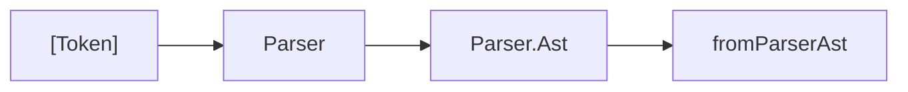

# Стадия 3: Парсер (синтаксическое дерево)

> Статус: **draft** · Модуль: `src/Parser.hs` · Suite: `test-parser` · Golden: `.p`, `.ast`

---

## 1. Назначение

Построение **синтаксического дерева** `Parser.Ast` из потока токенов. Отражает **форму** программы по грамматике C89/C51, без семантической нормализации деклараций.

Ответ на вопрос: *«как записана программа?»* (не *«что она означает?»*).

---

## 2. Место в конвейере (Рис. S-03-1)



Следующая стадия — [04-ast.md](04-ast.md); парсер **не** вызывает `AST`.

---

## 3. Входные данные

| | |
|---|---|
| Тип | `[Token]` от лексера |
| Инвариант | post-PP текст уже токенизирован |
| API | `parseTokens :: Logger -> [Token] -> IO Ast` |
| Чистый вариант | `parseTokensPure :: [Token] -> Ast` |

---

## 4. Выходные данные

### Корневой тип `Ast`

```haskell
data Ast
  = AstProgram [Ast]
  | AstFunctionDef String [Token] [Token] Ast   -- имя, spec-токены, C51-attr, тело
  | AstFunction String
  | AstDeclaration [Token]                       -- сырой фрагмент декларации
  | AstCompound [Ast]
  | AstReturn (Maybe Expr)
  | AstExprStmt (Maybe Expr)
  | AstIf Expr Ast
  | AstWhile Expr Ast
  | AstFor (Maybe Expr) (Maybe Expr) (Maybe Expr) Ast
  | AstSwitch Expr Ast
  | AstCase Expr Ast
  | AstDefault Ast
  | AstDoWhile Ast Expr
  | AstBreak
  | AstUnknown [Token]                           -- fallback
```

### Успех и неудача

| Результат | Условие |
|-----------|---------|
| `AstProgram nodes` | `parseTranslationUnit` поглотил **все** токены |
| `AstUnknown tokens` | остаток токенов или ошибка разбора |

---

## 5. Алгоритм

### 5.1. Translation unit

Рекурсивный descent: `parseExternalDeclaration` × N до исчерпания потока.

Внешние декларации: функции, объявления (как `[Token]`), прототипы.

### 5.2. Выражения — таблица приоритетов (Рис. S-03-2)

От **слабого** к **сильному** связыванию:

| Уровень | Операторы | Функция | Ассоциативность |
|--------:|-----------|---------|-----------------|
| 1 | `,` | `parseComma` | левая |
| 2 | `=`, `+=`, … | `parseAssign` | **правая** |
| 3 | `? :` | `parseConditional` | **правая** |
| 4 | `\|\|` | `parseLogicalOr` | левая |
| 5 | `&&` | `parseLogicalAnd` | левая |
| 6–8 | `\|`, `^`, `&` | bitwise | левая |
| 9 | `==`, `!=` | `parseEquality` | левая |
| 10 | `<`, `>`, `<<`, `>>`, … | `parseRelational` | левая |
| 11 | `+`, `-` | `parseAdditive` | левая |
| 12 | `*`, `/`, `%` | `parseMultiplicative` | левая |
| 13 | унарные | `parseUnary` | — |
| 14 | постфикс, primary | `parsePostfix`, `parsePrimary` | — |

Нормативная грамматика — C89 (ANSI X3.159-1989). Карта «функция → операторы» — инженерная, см. комментарии в `Parser.hs`.

### 5.3. Точки входа выражений

| Функция | Когда |
|---------|-------|
| `parseExprTokens` | полное выражение с запятой |
| `parseConditionalExprTokens` | без запятой (тело `case`, середина `?:`) |

### 5.4. Операторы и управление

Поддержаны: `if/else`, `while`, `for`, `do/while`, `switch/case/default`, `break`, `return`, составные блоки `{ … }`.

---

## 6. Модуль и публичный API

| Экспорт | Назначение |
|---------|------------|
| `parseTokens`, `parseTokensPure` | разбор translation unit |
| `Ast`, `Expr`, `BinOp`, … | синтаксические ADT |
| `parseExprTokensRest` | разбор выражения из хвоста токенов |

---

## 7. Ограничения (не полный C89)

| Конструкция | Статус |
|-------------|--------|
| Cast `(type)expr` | нет / заглушка |
| `sizeof(type-name)` | упрощённо |
| Составные литералы | нет |
| Полный разбор struct/enum | декларации часто как `[Token]` |
| `float`/`double` операции | синтаксис без sem-check |

---

## 8. Связанные тесты

| Вид | Где |
|-----|-----|
| Unit + приоритеты | `Parser_test.hs` — `checkParseMainReturn`, `shouldBeRecorded` |
| Golden | `discoverParserFixtures`; `show` Ast vs `.p`/`.ast` |
| Suite | `just test-parser` |

`parseTokensPure` — канон golden; `parseTokens` + Logger — runtime с `AstUnknown` → LogWarn.

---

## 9. Связанные документы

- [04-ast.md](04-ast.md) — семантический подъём
- [lecture-syntax-vs-semantic-ast.md](../lecture-syntax-vs-semantic-ast.md) — P-2
- [02-lexer.md](02-lexer.md)

---

## 10. История изменений

| Версия | Дата | Изменение |
|--------|------|-----------|
| 0.1 | 2026-06-03 | Полное описание стадии 3 |
