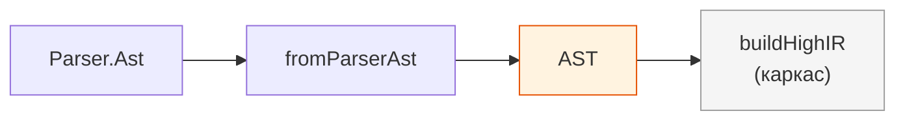
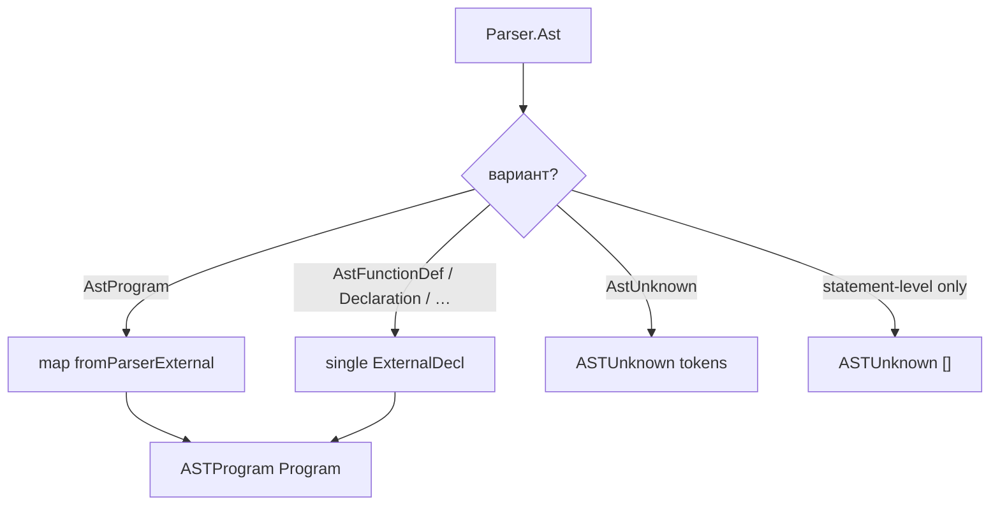

# Стадия 4: Семантическое AST

> Статус: **draft** · Модуль: `src/AST.hs` · Suite: `test-ast`

---

## 1. Назначение

**Подъём и нормализация** синтаксического дерева `Parser.Ast` в семантическое представление `AST`: именованные декларации, структурированные операторы, классы памяти C51.

Ответ на вопрос: *«какие сущности есть в программе?»* (имена, декларации, scope-форма операторов).

**Граница текущей итерации проекта:** выход `AST` — последний полностью документируемый и реализуемый этап фронтенда. Дальше — IR (каркас).

---

## 2. Место в конвейере (Рис. S-04-1)



---

## 3. Входные данные

| | |
|---|---|
| Тип | `Parser.Ast` |
| Источник | только результат `parseTokens` / `parseTokensPure` |
| Инвариант | **не** читает исходный текст, **не** вызывает лексер/парсер повторно |

---

## 4. Выходные данные

### Корень

```haskell
data AST
  = ASTProgram Program
  | ASTUnknown [Token]

newtype Program = Program { programDecls :: [ExternalDecl] }
```

### Внешние декларации

```haskell
data ExternalDecl
  = ExtFunction FunctionDef
  | ExtFunctionProto String
  | ExtDecl Decl
  | ExtDeclUnparsed [Token]    -- struct, сложный declarator, …
```

### Функция

```haskell
data FunctionDef = FunctionDef
  { fnName          :: String
  , fnDeclSpecs     :: [DeclSpecifier]   -- разобранные spec (не [Token])
  , fnC51AttrTokens :: [Token]           -- interrupt, using, reentrant, …
  , fnBody          :: Stmt
  }
```

### Декларации и C51

```haskell
data DeclSpecifier
  = SpecStorage StorageClass
  | SpecTypeQual TypeQual
  | SpecType TypeSpec
  | SpecC51Memory C51MemoryClass   -- data, xdata, code, …

data C51MemoryClass = MemData | MemIdata | MemBdata | MemPdata | MemXdata | MemCode
```

### Операторы `Stmt`

Зеркало синтаксиса, но на типах `AST.Expr`: `SCompound`, `SIf`, `SWhile`, `SFor`, `SSwitch`, `SDecl`, `SDeclUnparsed`, …

---

## 5. Алгоритм: `fromParserAst` (Рис. S-04-2)



### Что делает подъём

1. **Декларации:** `parseDeclFromTokens` / `parseDeclSpecsOnly` — токены spec → `[DeclSpecifier]`, declarator → `Declarator` + `[DeclSuffix]`.
2. **Выражения:** структурное копирование `Parser.Expr` → `AST.Expr` (`fromParserExpr`).
3. **Операторы:** `fromParserStmt` — `AstIf` → `SIf` с опциональным `else`, и т.д.
4. **C51:** атрибуты функции остаются как `[Token]` до IR; классы памяти — `SpecC51Memory`.

### Что **не** делает AST (архитектурный инвариант)

| Задача | Стадия |
|--------|--------|
| Полная типизация C89 | High IR |
| Usual arithmetic conversions | High IR |
| Проверка диапазонов под 8051 | High IR |
| Const propagation на уровне C | частично здесь; полная — IR |
| Пропуск AST → сразу High IR | **запрещено** проектом |

Дублирование типов `Parser.Expr` и `AST.Expr` — **осознанное**: разные вопросы, разные инварианты.

---

## 6. Модуль и публичный API

| Экспорт | Назначение |
|---------|------------|
| `fromParserAst` | главный мост Parser → AST |
| `parseDeclFromTokens` | разбор декларации из `[Token]` |
| `AST`, `Program`, `Decl`, `Stmt`, `Expr`, … | семантические ADT |

---

## 7. Ограничения

- `ExtDeclUnparsed` / `SDeclUnparsed` — частичный разбор (struct, скобочные declarator).
- Нет symbol table с разрешением typedef → type.
- `float`/`double` в `TypeSpec` — без операционной семантики.

---

## 8. Связанные тесты

| Вид | Где |
|-----|-----|
| Pipeline | `tests/AST_test.hs` — `parseSemanticAst`, декларации, main/return |
| Suite | `just test-ast` |
| Golden | косвенно через `.p`/`.ast` на стадии Parser |

Пример сквозного вызова в тестах:

```haskell
parseSemanticAst src = do
  normalized <- preprocess defaultPreprocessConfig Nothing src
  toks         <- lexer silentLogger normalized
  syn          <- parseTokens silentLogger toks
  pure (fromParserAst syn)
```

---

## 9. Связанные документы

- [03-parser.md](03-parser.md) — вход
- [05-high-ir.md](05-high-ir.md) — следующая стадия (каркас)
- [lecture-syntax-vs-semantic-ast.md](../lecture-syntax-vs-semantic-ast.md)
- [11-konveer-kompilyacii.md](../11-konveer-kompilyacii.md) — граница итерации

---

## 10. История изменений

| Версия | Дата | Изменение |
|--------|------|-----------|
| 0.1 | 2026-06-03 | Полное описание стадии 4; граница фронтенда |
