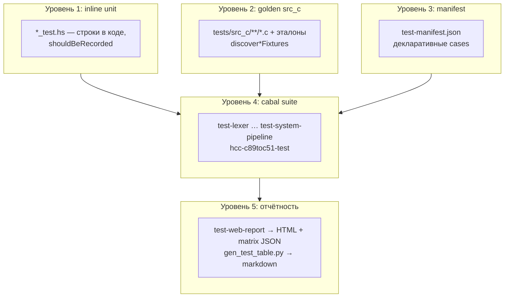
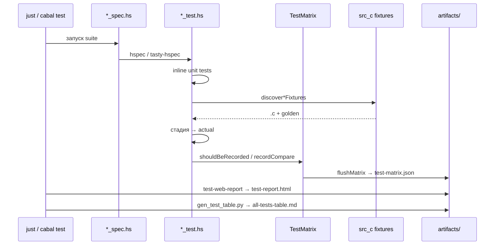

# Обзор системы тестирования

> Статус: **draft** (фаза 1b) · Схемы: T-1, T-3, T-4

---

## 1. Назначение

Описание многоуровневой системы проверки корректности компилятора HCC. Тесты привязаны к **стадиям конвейера** (см. [11-konveer-kompilyacii.md](../11-konveer-kompilyacii.md)).

**Граница текущей итерации:** полное покрытие тестами фронтенда (PP → Lex → Parse → AST) + legacy IR; High IR и ниже — каркас с `pending`.

---

## 2. Уровни тестирования (Рис. T-1)



| Уровень | Что проверяет | Пример |
|--------:|---------------|--------|
| 1 | Одна функция, один сценарий | `Preprocessor_test`: trigraph + `#define` |
| 2 | Файл `.c` + ручной эталон | `Lexer_test`: `test1.c` vs `test1.l` |
| 3 | Явная запись в JSON | manifest: `shouldContain` для Lexer |
| 4 | Изолированный прогон стадии | `just test-lexer` |
| 5 | Сводка всех suite | `just test-web-report` |

---

## 3. Поток прогона (Рис. T-3)



### Ключевые модули инфраструктуры

| Модуль | Роль |
|--------|------|
| `TestMatrix.hs` | запись pass/fail/pending в JSON |
| `TestManifest.hs` | декодирование manifest, `matchTextExpectation` |
| `SrcCFixtures.hs` | обход `tests/src_c`, discover по расширению |
| `IrGolden.hs` | минимальный IR для legacy `.ir` |

**Сбор и подстановки** (отдельный документ): [06-sistema-sbora-i-podstanovok.md](06-sistema-sbora-i-podstanovok.md) — `shouldBeRecorded`, discover, expectation, подстановка входа `.pp`/`.c`.

**Логирование** (не путать со сбором): [../infra/04-logirovanie.md](../infra/04-logirovanie.md).

---

## 4. Связь стадия ↔ test-suite (фронтенд)

| Стадия | cabal suite | `*_test.hs` | `*_spec.hs` | Golden | src_c wired |
|--------|-------------|-------------|--------------|--------|-------------|
| 1 Preprocessor | `test-preprocessor` | `Preprocessor_test` | `Preprocessor_spec` | `.pp` | да |
| 2 Lexer | `test-lexer` | `Lexer_test` | `Lexer_spec` | `.l` | да |
| 3 Parser | `test-parser` | `Parser_test` | `Parser_spec` | `.p`, `.ast` | да |
| 4 AST | `test-ast` | `AST_test` | `AST_spec` | — | inline only |
| Legacy IR | `test-ir` | `IR_test` | `IR_spec` | `.ir` | да |
| High IR | `test-high-ir` | `HighIR_test` | `HighIR_spec` | `.hir` | pending |
| E2E pipeline | `test-pipeline` | — | `Pipeline_spec` | — | PP+Lex+Par+AST |
| System | `test-system-pipeline` | `SystemPipeline_test` | `SystemPipeline_spec` | — | pending |
| Aggregate | `hcc-c89toc51-test` | все `*_test` | `Spec.hs` | — | все |
| Web report | `test-web-report` | все + manifest | `WebReport_spec` | — | все + HTML |

Подробнее: [01-struktura-testov.md](01-struktura-testov.md).

---

## 5. Вход раннера vs эталон (критично)

Эталон на стадии N описывает **выход стадии N**, но **вход раннера** может отличаться:

| Suite | Вход раннера | Эталон | Примечание |
|-------|--------------|--------|------------|
| Preprocessor | `.c` → `preprocess` | `.pp` | эталон = post-PP |
| Lexer | `.pp` если есть, иначе `preprocess(.c)` | `.l` | post-PP текст |
| Parser | `.pp` → lex → parse | `.p`/`.ast` | post-PP AST |
| IR (legacy) | `preprocess(.c)` → lex → parse | `.ir` | **не** читает `.pp` напрямую |
| AST | inline `String` в тесте | — | golden для семантического AST **нет** |

Это осознанное расхождение IR-раннера; при слиянии с High IR нужно унифицировать.

---

## 6. Команды

```powershell
just test                    # cabal test all
just test-toolchain          # PP, Lex, Parse, AST, IR, HIR…Peephole, System
just test-lexer              # одна стадия
just test-web-report         # HTML + matrix + all-tests-table.md
just audit-src-c             # матрица gaps без прогона Haskell
just open-report             # открыть test-report.html
```

---

## 7. Критерии результата

| Статус | MatrixStatus | Hspec | В web-report |
|--------|--------------|-------|--------------|
| Успех | `pass` | green | OK |
| Провал | `fail` | red | FAIL |
| Каркас | `pending` | pending (success в web-report*) | PENDING |

\* `WebReport_spec` использует `TreatPendingAsSuccess` — каркасные TODO не роняют CI-отчёт.

---

## 8. Дочерние документы

- [01-struktura-testov.md](01-struktura-testov.md) — именование, cabal
- [02-manifest-i-matrica.md](02-manifest-i-matrica.md) — JSON, HTML, таблицы
- [03-fixtures-src-c.md](03-fixtures-src-c.md) — корpus, каталоги
- [04-etalony-golden.md](04-etalony-golden.md) — правила ручных эталонов
- [05-pmi-programma-metodika-ispytaniy.md](05-pmi-programma-metodika-ispytaniy.md) — ПМИ
- [06-sistema-sbora-i-podstanovok.md](06-sistema-sbora-i-podstanovok.md) — сбор matrix, подстановки входа/expected

---

## 10. История изменений

| Версия | Дата | Изменение |
|--------|------|-----------|
| 0.1 | 2026-06-03 | Каркас T-1 |
| 0.2 | 2026-06-03 | Фаза 1b: полный обзор, T-3, таблица стадий |
