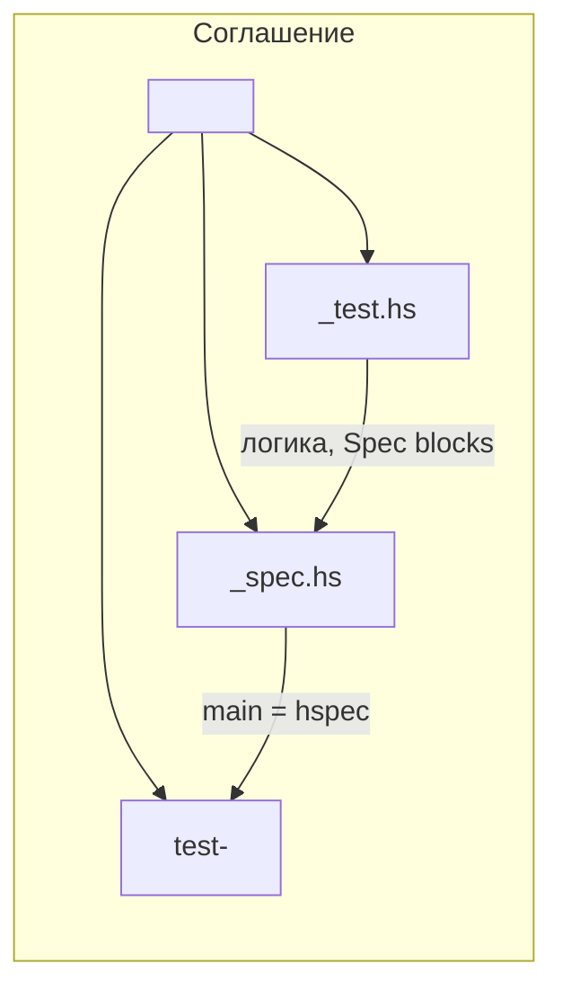
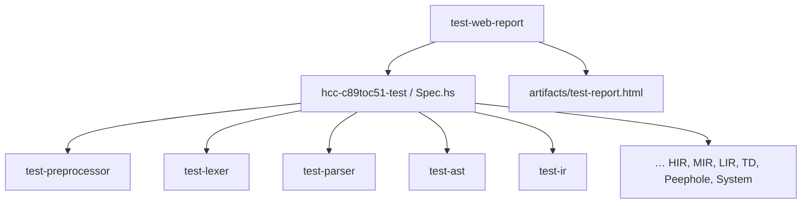

# Структура тестов

> Статус: **draft** · Схема: T-2

---

## 1. Назначение

Единые соглашения об **именах файлов**, **cabal test-suite** и **композиции** прогонов.

---

## 2. Именование (Рис. T-2)



| Артефакт | Шаблон | Пример |
|----------|--------|--------|
| Тест-модуль | `<Stage>_test.hs` | `Lexer_test.hs` |
| Entry point | `<Stage>_spec.hs` | `Lexer_spec.hs` |
| cabal suite | `test-<stage>` | `test-lexer` |
| Aggregate | `Spec.hs` | `hcc-c89toc51-test` |
| Web + HTML | `WebReport_spec.hs` | `test-web-report` |

**Правило:** имя блока toolchain **первым**, суффикс `_test` / `_spec` — вторым.

---

## 3. Содержимое `*_test.hs`

Экспортирует один или несколько `Spec`:

```haskell
module Lexer_test (lexerMinimalSpec, lexerFixtureSpec, …) where

lexerMinimalSpec :: Spec    -- inline unit
lexerFixtureSpec :: Spec    -- discover*Fixtures из src_c
```

Типичные группы внутри `describe`:

| Группа | Назначение |
|--------|------------|
| `"Preprocessor.preprocess"` | unit без файлов |
| `"Lexer fixtures (.l)"` | golden src_c |
| `"manifest: …"` | cases из manifest |
| `"Pipeline -> AST"` | сквозной фронтенд |

---

## 4. Содержимое `*_spec.hs`

Минимальный `main`:

```haskell
module Main (main) where
import Lexer_test (lexerMinimalSpec, …)
import Test.Hspec (hspec)

main = hspec $ do
  lexerMinimalSpec
  …
```

`WebReport_spec.hs` — исключение: **Tasty** + `tasty-hspec` + `htmlRunner`.

---

## 5. Полный список cabal test-suite

| Suite | Spec | Основные `*_test` |
|-------|------|-------------------|
| `test-preprocessor` | `Preprocessor_spec` | `Preprocessor_test` |
| `test-lexer` | `Lexer_spec` | `Lexer_test` |
| `test-parser` | `Parser_spec` | `Parser_test` |
| `test-ast` | `AST_spec` | `AST_test` |
| `test-ir` | `IR_spec` | `IR_test`, `IrGolden` |
| `test-high-ir` | `HighIR_spec` | `HighIR_test` |
| `test-medium-ir` | `MediumIR_spec` | `MediumIR_test` |
| `test-low-ir` | `LowIR_spec` | `LowIR_test` |
| `test-tree-destroyer` | `TreeDestroyer_spec` | `TreeDestroyer_test` |
| `test-peephole` | `Peephole_spec` | `Peephole_test` |
| `test-pipeline` | `Pipeline_spec` | PP+Lex+Par+AST |
| `test-system-pipeline` | `SystemPipeline_spec` | e2e pending |
| `test-manifest-runner` | `ManifestRunner_spec` | manifest only |
| `test-web-report` | `WebReport_spec` | **все** suite + HTML |
| `hcc-c89toc51-test` | `Spec.hs` | aggregate hspec |

---

## 6. Aggregate vs focused



- **`just test`** — все suite через cabal (включая pending-каркасы).
- **`just test-toolchain`** — стадии конвейера по порядку без aggregate/web.
- **`just test-component parser`** — одна suite.

---

## 7. Запись результатов

Все прогоны с `shouldBeRecorded` / `recordCompare` пишут в `TestMatrix` (см. [02-manifest-i-matrica.md](02-manifest-i-matrica.md)).

Полная запись matrix гарантирована при `test-web-report` (`initMatrix` в `WebReport_spec`).

---

## 8. Связанные документы

- [00-obzor-sistemy-testirovaniya.md](00-obzor-sistemy-testirovaniya.md)
- [`hcc-c89toc51.cabal`](../../hcc-c89toc51.cabal)
- [`justfile`](../../justfile)

---

## 10. История изменений

| Версия | Дата | Изменение |
|--------|------|-----------|
| 0.1 | 2026-06-03 | Полная структура suite и именования |
