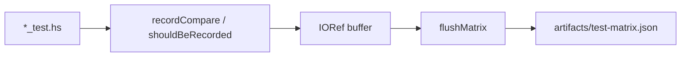
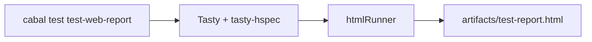

# Manifest и матрица тестов

> Статус: **draft** · Схемы: T-6, T-7, T-8

---

## 1. Назначение

Два артефакта **отчётности** и **движок сбора** ([06-sistema-sbora-i-podstanovok.md](06-sistema-sbora-i-podstanovok.md)):

1. **`test-manifest.json`** — декларативные test cases (что гонять явно).
2. **`test-matrix.json`** — фактический результат прогона (точка правды).

Из matrix генерируются HTML-отчёт и markdown-таблица.

---

## 2. Manifest (Рис. T-6)

**Файл:** `tests/test-manifest.json` (переопределяется `TEST_MANIFEST`).

```json
{
  "reportPath": "artifacts/test-report.html",
  "matrixPath": "artifacts/test-matrix.json",
  "cases": [
    {
      "name": "lexer fixture from manifest",
      "package": "Lexer",
      "inputFile": "tests/src_c/100_ast/test1.c",
      "outputFile": "tests/src_c/100_ast/test1.l",
      "expectation": "shouldContain"
    }
  ]
}
```

### Поля

| Поле | Описание |
|------|----------|
| `reportPath` | путь HTML-отчёта (tasty-html) |
| `matrixPath` | путь JSON матрицы |
| `cases[].name` | человекочитаемое имя |
| `cases[].package` | `"Lexer"` \| `"Parser"` (раннер в `ManifestRunner_test`) |
| `cases[].inputFile` | входной файл |
| `cases[].outputFile` | эталон |
| `cases[].expectation` | тип сравнения (см. ниже) |

### Expectation (`TestManifest.hs`)

| JSON | Haskell | Семантика |
|------|---------|-----------|
| `shouldBe` | `ShouldBe` | точное равенство строк |
| `shouldContain` | `ShouldContain` | подстрока |
| `shouldStartWith` | `ShouldStartWith` | префикс |
| `shouldEndWith` | `ShouldEndWith` | суффикс |
| `shouldMatchList` | `ShouldMatchList` | построчное множество |
| `shouldNotBe` | `ShouldNotBe` | не равно |
| … | … | полный список в `TestManifest.hs` |

### Где выполняется

| Место | Как |
|-------|-----|
| `ManifestRunner_test` | отдельный suite `test-manifest-runner` |
| `Lexer_test` / `Parser_test` | `loadCasesByPackage … "Lexer"` |
| `WebReport_spec` | включает manifest runner |

---

## 3. TestMatrix (точка правды)

**Модуль:** `tests/TestMatrix.hs`



### Запись

```haskell
shouldBeRecorded suite name input expected actual
-- 1) recordCompare → JSON entry
-- 2) actual `shouldBe` expected
```

### Структура JSON

```json
{
  "matrixPath": "artifacts/test-matrix.json",
  "manifestPath": "tests/test-manifest.json",
  "generatedAt": "…",
  "entries": [
    {
      "suite": "Lexer",
      "name": "токенизирует базовую функцию main",
      "input": "int main() { return 0; }",
      "expected": "[TokenInt,…]",
      "actual": "[TokenInt,…]",
      "status": "pass",
      "note": ""
    }
  ]
}
```

### Переменные окружения

| Переменная | Эффект |
|------------|--------|
| `TEST_MANIFEST` | путь к manifest |
| `TEST_MATRIX` | путь к matrix JSON |
| `TEST_MATRIX_TIMESTAMP` | поле `generatedAt` |
| `SOURCE_DATE_EPOCH` | альтернатива timestamp (reproducible builds) |

---

## 4. HTML-отчёт (Рис. T-7)



**Особенности `WebReport_spec`:**

- UTF-8 принудительно (Windows CP1251 fix).
- `TreatPendingAsSuccess` — pending не красит весь отчёт.
- `initMatrix` в начале — matrix заполняется всеми suite.

```powershell
just test-web-report
just open-report
```

---

## 5. Markdown-таблицы

| Скрипт | Вход | Выход |
|--------|------|-------|
| `scripts/gen_test_table.py` | `test-matrix.json` | `artifacts/all-tests-table.md` |
| `scripts/audit_src_c_tests.py` | `tests/src_c/**/*.c` | `artifacts/src-c-matrix.md`, `src-c-gaps.json` |

`just test-web-report` вызывает `gen_test_table.py` автоматически.

### Матрица src_c (Рис. T-8)

**Файл:** [`artifacts/src-c-matrix.md`](../../artifacts/src-c-matrix.md) — **79** файлов `.c`.

| Символ | Значение |
|--------|----------|
| ✓ | эталон есть |
| — | эталона нет |
| **▶** | cabal test гоняет пару |

Обновление:

```powershell
just audit-src-c
```

Не требует прогона Haskell — только обход файловой системы.

---

## 6. Связь manifest ↔ discover

| Механизм | Когда |
|----------|-------|
| `discoverLexerFixtures` | автоматически: `.c` + `.l` рядом |
| `loadCasesByPackage` | явно в manifest |
| `ManifestRunner_test` | только manifest cases |

Discover и manifest **дополняют** друг друга; дублирование одного case допустимо, но избыточно.

---

## 7. Связанные документы

- [06-sistema-sbora-i-podstanovok.md](06-sistema-sbora-i-podstanovok.md)
- [00-obzor-sistemy-testirovaniya.md](00-obzor-sistemy-testirovaniya.md)
- [03-fixtures-src-c.md](03-fixtures-src-c.md)
- [`artifacts/src-c-gaps.md`](../../artifacts/src-c-gaps.md)

---

## 10. История изменений

| Версия | Дата | Изменение |
|--------|------|-----------|
| 0.1 | 2026-06-03 | Manifest, matrix, HTML, audit |
