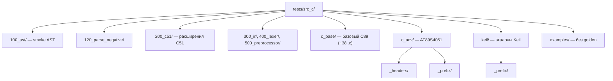

# Фикстуры tests/src_c

> Статус: **draft** · Схема: T-4

---

## 1. Назначение

**Corpus** исходников C и golden-эталонов для регрессионного тестирования стадий конвейера. Корень: `tests/src_c/` (константа `SrcCFixtures.srcCRoot`).

---

## 2. Дерево каталогов (Рис. T-4)



---

## 3. Каталоги по назначению

| Каталог | `.c` | Назначение | Golden PP/L/P/IR |
|---------|-----:|------------|------------------|
| `100_ast/` | 8 | smoke AST pipeline | полный набор |
| `120_parse_negative/` | 5 | switch/do-while edge cases | полный |
| `200_c51/` | 7 | sfr, bit, interrupt, reentrant | полный |
| `300_ir/` | 1 | smoke IR | полный |
| `400_lexer/` | 1 | smoke lexer | полный |
| `500_preprocessor/` | 1 | smoke PP | полный |
| `c_base/` | 38 | учебный C89 corpus | ~37/38 |
| `c_adv/` | 6 | продвинутый C51 (см. README) | `.pp`/`.l`/`.ir` ✓; `.p` ✗ |
| `keil/` | 10 | примеры Keil uVision | полный |
| `examples/` | 2 | без эталонов | — |

**Итого:** 79 `.c` (см. [`artifacts/src-c-matrix.md`](../../artifacts/src-c-matrix.md)).

---

## 4. Соглашение об именах файлов

Для каждого `<stem>.c` рядом могут лежать:

| Расширение | Стадия | Модуль discover |
|------------|--------|-----------------|
| `.pp` | Preprocessor | `discoverPreprocessorFixtures` |
| `.l` | Lexer | `discoverLexerFixtures` |
| `.p` | Parser (приоритет) | `discoverParserFixtures` |
| `.ast` | Parser (legacy) | `discoverParserFixtures` |
| `.ir` | Legacy IR | `discoverIrFixtures` |
| `.hir` | High IR | `discoverHirFixtures` (pending) |
| `.mir` | Medium IR | pending |
| `.lir` | Low IR | pending |

### Опциональные черновики (keil, c_adv)

```
<stem>.body.pp    # post-PP только тело, без prefix
<stem>.body.l
<stem>.body.p
```

---

## 5. Discover-механизм (`SrcCFixtures.hs`)

```haskell
discoverWithGolden ext = do
  cFiles <- findCFiles                    -- все **/*.c под src_c
  filterM (\c -> doesFileExist (replaceExtension c ext)) cFiles
```

**Правило:** тест создаётся **только** если есть пара `.c` + golden. Нет `.l` — файл не попадает в `test-lexer`.

### Include paths для PP

```haskell
srcCPreprocessConfig =
  defaultPreprocessConfig
    { pcAngleIncludeDirs = [ srcCRoot </> "c_base"
                           , srcCRoot </> "c_adv" </> "_headers"
                           , … ]
    , pcQuoteIncludeDirs = [ srcCRoot </> "c_adv" </> "_headers" ]
    }
```

---

## 6. Логика раннера по стадиям

### Preprocessor

```
read .c → preprocess(srcCPreprocessConfig, Just cFile) → compare .pp
```

### Lexer

```
read .c
if exists .pp → read .pp
else → preprocess(.c)
lexerPure → compare .l
```

### Parser

```
read .c
if exists .pp → read .pp else preprocess(.c)
lexer → parseTokens → show → compare .p (или .ast)
```

### Legacy IR

```
read .c → preprocess(.c) → lexer → parseTokens → toIr → compare .ir
```

**Замечание:** IR-раннер **не** использует готовый `.pp` — расхождение с Lex/Parser; учитывать при написании эталонов.

### AST (`AST_test`)

Golden-файлов **нет**. Тесты — inline строки + `parseSemanticAst`. Семантический AST проверяется программно, не через `show` vs файл.

---

## 7. Специальные каталоги

### keil/

- [`tests/src_c/keil/README.md`](../../tests/src_c/keil/README.md)
- `golden-manifest.json` — prefix: `none` | `reg2051` | `reg51`
- `_prefix/reg2051.{pp,l,p}` — общие фрагменты заголовков

### c_adv/

- [`tests/src_c/c_adv/README.md`](../../tests/src_c/c_adv/README.md)
- [`tests/src_c/c_adv/GOLDENS.md`](../../tests/src_c/c_adv/GOLDENS.md)
- `_headers/common.h`, `reg2051.h`
- `_prefix/common-prefix.{pp,l}` — общий prefix для 6 модулей
- **Пробел:** `.p`/`.ast` — 0/6 (ручная работа)

---

## 8. Numbered suites

Каталоги `100_ast`, `120_parse_negative`, `200_c51`, … — **нумерованные smoke-наборы** с полным golden-контуром. Используются в manifest (`test1.c` из `100_ast/`).

---

## 9. Связанные документы

- [04-etalony-golden.md](04-etalony-golden.md) — как писать эталоны
- [02-manifest-i-matrica.md](02-manifest-i-matrica.md) — audit, matrix
- [00-obzor-sistemy-testirovaniya.md](00-obzor-sistemy-testirovaniya.md)

---

## 10. История изменений

| Версия | Дата | Изменение |
|--------|------|-----------|
| 0.1 | 2026-06-03 | Corpus, discover, раннеры |
