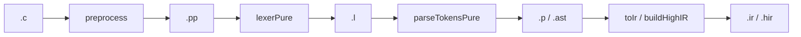

# Эталоны (golden files)

> Статус: **draft** · Схема: T-5  
> Рабочий черновик в artifacts сохранён: [`artifacts/src-c-golden-workflow.md`](../../artifacts/src-c-golden-workflow.md)

---

## 1. Назначение

Правила создания и проверки **ручных эталонов** — файлов ожидаемого выхода каждой стадии рядом с `.c`.

**Принцип:** эталон задаёт **spec**, а не наоборот. Упавший тест → исправляем код или эталон после рецензии, **не** `cabal test > golden`.

---

## 2. Канон pipeline (Рис. T-5)



**Эталон стадии N** описывает выход стадии N при корректном входе N−1:

| Эталон | Содержимое |
|--------|------------|
| `.pp` | post-PP текст (как видит лексер) |
| `.l` | `show [Token]` post-PP текста |
| `.p` | `show Parser.Ast` post-PP |
| `.ast` | legacy-копия `.p` |
| `.ir` | legacy IR (`IrGolden`) |

---

## 3. Жёсткий запрет

| Запрещено | Почему |
|-----------|--------|
| `parseTokensPure` → записать в `.p` | dump парсера, не spec |
| `lexerPure` → записать в `.l` | dump лексера |
| `DumpFixtureOutputs.hs`, glue-скрипты PP→P | скрытая автогенерация |
| Упавший test → перезаписать golden | эталон первичен |
| Сокращённый inline заголовка в `.pp` | только полный `reg2051.h` / `common.h` |
| Эталоны в `artifacts/` | corpus живёт в `tests/src_c/` |

### Разрешено

- Читать `Lexer.hs`, `Parser.hs`, Keil `.lst`/`.i`
- Писать `.pp`/`.l`/`.p` **вручную** в редакторе
- `just audit-src-c` — только таблица пробелов
- Copy-paste prefix + body в редакторе

### Серая зона

Одноразовый Python «склеить prefix.pp + body.pp» — формально не генератор стадий, но легко превращается в конвейер. **Предпочтительно:** ручная склейка.

---

## 4. Общая схема каталога

```
<catalog>/
  golden-manifest.json       # keil: relDir, stem, prefix
  _prefix/                   # post-PP заголовки (inline)
  _headers/                  # c_adv: исходные .h
  <relDir>/
    <stem>.c
    <stem>.body.{pp,l,p}     # опционально: черновик без prefix
    <stem>.{pp,l,p,ast,ir}   # полные эталоны для cabal test
```

---

## 5. keil/ — workflow

Prefix (`golden-manifest.json`):

| prefix | файл | когда |
|--------|------|--------|
| `none` | — | без `#include` |
| `reg2051` | `_prefix/reg2051.{pp,l,p}` | `#include <reg2051.h>` |
| `reg51` | `_prefix/reg51.{pp,l,p}` | `#include <reg51.h>` |

### Пошагово

1. Исходник `keil/<dir>/<stem>.c`.
2. Post-PP тело → `<stem>.body.pp` (по Keil `.lst`/`.i`).
3. Полный `.pp` = prefix + body (в редакторе).
4. `.l` = `[Token…]` — prefix tokens + body tokens.
5. `.p` = `AstProgram […]` — prefix nodes + body (по `Parser.hs`).
6. `.ast` ≡ копия `.p`.
7. `.ir` — пока `[IrUnknown]` (кроме trivial `return N`).
8. `cabal test test-parser` — смотреть diff, **не** перезаписывать.

Подробности: [`tests/src_c/keil/README.md`](../../tests/src_c/keil/README.md).

---

## 6. c_adv/ — workflow

Общий prefix: `common-prefix.{pp,l}` (reg2051 + common.h после PP).

| Стадия | 6/6 статус |
|--------|------------|
| `.pp`, `.l`, `.ir`, `.body.*` | ✓ |
| `_prefix/common-prefix.p` | ✗ |
| `.p`, `.ast` | ✗ — **писать вручную** |

Подробности: [`tests/src_c/c_adv/GOLDENS.md`](../../tests/src_c/c_adv/GOLDENS.md).

---

## 7. Чеклист «готово»

- [ ] Каждый `.pp` читается как post-PP C без `#include`
- [ ] `.l` согласован с `.pp` по `Lexer.hs`
- [ ] `.p` написан по `Parser.hs`, не скопирован из test output
- [ ] `.ast` = `.p`
- [ ] `just audit-src-c` без неожиданных дыр
- [ ] В git нет glue-скриптов для goldens

---

## 8. Фронтенд vs IR

| Стадия | Golden | Статус corpus |
|--------|--------|---------------|
| PP, Lex, Parse | `.pp`, `.l`, `.p` | 76/79, 76/79, 70/79 |
| AST (семантика) | — | **нет golden**; `AST_test` inline |
| Legacy IR | `.ir` | 76/79; `IrGolden` минимален |
| High IR | `.hir` | discover есть; раннер pending |

---

## 9. Трекеры и артеfactы

| Файл | Назначение |
|------|------------|
| [`artifacts/src-c-manual-goldens-todo.md`](../../artifacts/src-c-manual-goldens-todo.md) | прогресс ручных эталонов |
| [`artifacts/src-c-gaps.md`](../../artifacts/src-c-gaps.md) | пробелы по файлам |
| [`artifacts/src-c-fixture-think-about.md`](../../artifacts/src-c-fixture-think-about.md) | расхождения раннеров |

---

## 10. История изменений

| Версия | Дата | Изменение |
|--------|------|-----------|
| 0.1 | 2026-06-03 | Перенос правил из artifacts; T-5 |
