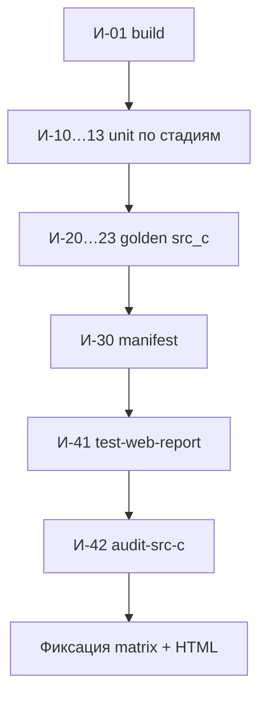

# Программа и методика испытаний (ПМИ)

> Статус: **draft** · ГОСТ 19.301 (адаптировано)

---

## 1. Объект испытаний

Программный комплекс **HCC C89toC51** — конвейер преобразования C89/C51 и система регрессионных тестов.

**Область текущей ПМИ:** фронтенд (стадии 1–4) + legacy IR + инфраструктура отчётности.

---

## 2. Цель испытаний

1. Подтвердить корректность стадий Preprocessor → Lexer → Parser → AST.
2. Подтвердить согласованность golden-эталонов `tests/src_c/`.
3. Зафиксировать результаты в machine-readable matrix и HTML-отчёте.

---

## 3. Требования (ссылка на конвейер)

| ID | Требование | Документ |
|----|------------|----------|
| R-PP | post-PP текст соответствует `.pp` | [stages/01-preprocessor.md](../stages/01-preprocessor.md) |
| R-LX | `[Token]` соответствует `.l` | [stages/02-lexer.md](../stages/02-lexer.md) |
| R-PR | `Parser.Ast` соответствует `.p` | [stages/03-parser.md](../stages/03-parser.md) |
| R-AST | `fromParserAst` на эталонных программах | [stages/04-ast.md](../stages/04-ast.md) |
| R-IR | legacy `[Ir]` соответствует `.ir` | `IrGolden.hs` |

---

## 4. Состав испытаний

### 4.1. Сборка

| № | Действие | Команда | Критерий |
|---|----------|---------|----------|
| И-01 | Компиляция | `just build` | exit code 0 |

### 4.2. Модульные (inline)

| № | Suite | Команда | Критерий |
|---|-------|---------|----------|
| И-10 | Preprocessor unit | `just test-preprocessor` | все `it` pass |
| И-11 | Lexer unit | `just test-lexer` | все `it` pass |
| И-12 | Parser unit + приоритеты | `just test-parser` | все `it` pass |
| И-13 | AST pipeline | `just test-ast` | все `it` pass |

### 4.3. Golden src_c

| № | Suite | Критерий |
|---|-------|----------|
| И-20 | PP fixtures | `actual == trim(.pp)` для каждой пары |
| И-21 | Lex fixtures | `show(lexerPure input) == trim(.l)` |
| И-22 | Parse fixtures | `show(parseTokens…) == trim(.p\|.ast)` |
| И-23 | IR fixtures | `renderIrGolden == trim(.ir)` |

### 4.4. Manifest

| № | Действие | Команда | Критерий |
|---|----------|---------|----------|
| И-30 | Manifest runner | `just test-manifest` | cases pass |

### 4.5. Сводный прогон и отчёт

| № | Действие | Команда | Критерий |
|---|----------|---------|----------|
| И-40 | Все suite | `just test` | exit 0* |
| И-41 | Web report | `just test-web-report` | HTML + matrix созданы |
| И-42 | Аудит corpus | `just audit-src-c` | gaps документированы |

\* Pending-каркасы (High IR, System pipeline) — `TreatPendingAsSuccess` в web-report; в чистом hspec — pending.

### 4.6. CI-контур

| № | Действие | Команда |
|---|----------|---------|
| И-50 | CI | `just ci` (= build + test + haddock) |

---

## 5. Порядок проведения (рекомендуемый)

При локальной отладке одной стадии достаточно `just test-<stage>`.

---

## 6. Фиксация результатов

| Артеfact | Содержание |
|----------|------------|
| `artifacts/test-matrix.json` | все entries с status |
| `artifacts/test-report.html` | tasty-html, UTF-8 |
| `artifacts/all-tests-table.md` | markdown из matrix |
| `artifacts/src-c-matrix.md` | покрытие corpus |
| cabal log | `dist-newstyle/.../*.log` |

---

## 7. Критерии приёмки итерации (фронтенд)

- [ ] `just test-toolchain` для PP, Lex, Parse, AST — без fail
- [ ] Golden src_c для numbered suites (`100_ast`, …) — pass
- [ ] Документированы известные пробелы (`c_adv/.p`, IR vs `.pp` вход)
- [ ] `test-web-report` генерирует отчёт

---

## 8. Известные ограничения

| # | Ограничение |
|---|-------------|
| 1 | Нет golden для семантического AST |
| 2 | `c_adv/`: 0/6 `.p` |
| 3 | IR-раннер читает `.c`, не `.pp` |
| 4 | High IR / System pipeline — pending |
| 5 | `float`/`double` — синтаксис без sem-check |

---

## 9. Связанные документы

- [00-obzor-sistemy-testirovaniya.md](00-obzor-sistemy-testirovaniya.md)
- [01-struktura-testov.md](01-struktura-testov.md)
- [02-manifest-i-matrica.md](02-manifest-i-matrica.md)
- [03-fixtures-src-c.md](03-fixtures-src-c.md)
- [04-etalony-golden.md](04-etalony-golden.md)
- [11-konveer-kompilyacii.md](../11-konveer-kompilyacii.md)

---

## 10. История изменений

| Версия | Дата | Изменение |
|--------|------|-----------|
| 0.1 | 2026-06-03 | ПМИ фронтенда и golden |
