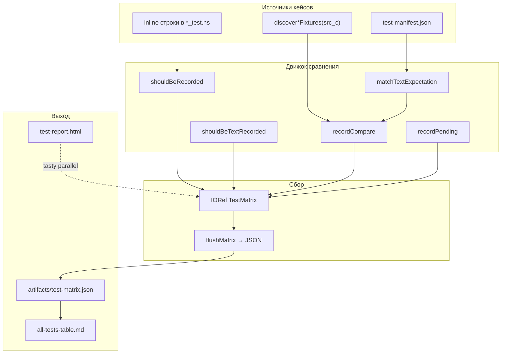
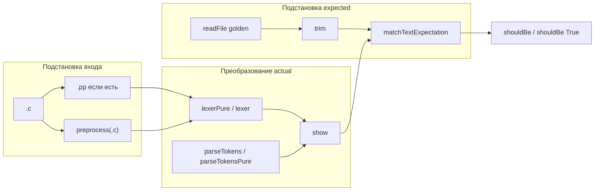

# Система сбора и подстановок тестов

> Статус: **draft** · Схемы: T-9, T-10  
> Модули: `TestMatrix.hs`, `TestManifest.hs`, `SrcCFixtures.hs`

---

## 1. Назначение

Помимо «голого» hspec (`it … shouldBe`), в проекте есть **отдельная инфраструктура**, которая:

1. **Собирает** факты каждого сравнения в JSON-матрицу (audit trail прогона).
2. **Подставляет** ожидания через типизированные expectation и обёртки над `shouldBe`.
3. **Обнаруживает** тест-кейсы из файловой системы (`discover`) и manifest.

Без этой системы HTML-отчёт и `all-tests-table.md` **не существуют** — они читают только matrix.

---

## 2. Архитектура (Рис. T-9)



---

## 3. Сбор результатов (`TestMatrix.hs`)

### 3.1. Глобальный буфер

```haskell
matrixRef :: IORef (Maybe FilePath, [MatrixEntry])
```

- Один буфер на процесс (NOINLINE + `unsafePerformIO`).
- `initMatrix` — в `WebReport_spec` перед прогоном; задаёт путь JSON.
- **Каждая** запись вызывает `flushMatrix` — matrix актуален даже при `exitWith` после fail.

### 3.2. Запись `MatrixEntry`

| Поле | Содержание |
|------|------------|
| `suite` | имя блока: `"Lexer"`, `"Parser fixture"`, `"Manifest [Lexer]"` |
| `name` | имя `it` или путь fixture |
| `input` | исходник / путь / фрагмент |
| `expected` | `show` ожидания или текст эталона |
| `actual` | фактический результат |
| `status` | `pass` \| `fail` \| `pending` |
| `note` | для pending — пояснение TODO |

### 3.3. API сбора

| Функция | Поведение |
|---------|-----------|
| `recordCompare` | только запись, без assert |
| `shouldBeRecorded` | `recordCompare` + `actual shouldBe expected` |
| `shouldBeTextRecorded` | для `IO String` (preprocess) |
| `recordPending` | status=pending, expected=`"TODO"` |

**Паттерн:** сначала **зафиксировать факт** в matrix, потом упасть через hspec — отчёт сохраняет и провалы.

---

## 4. Подстановки и сравнения (Рис. T-10)



### 4.1. Подстановка входа (раннер)

| Suite | Правило | Код |
|-------|---------|-----|
| Lexer fixture | `.pp` если есть, иначе `preprocess(.c)` | `Lexer_test` |
| Parser fixture | то же → lex → parse | `Parser_test` |
| IR fixture | **всегда** `preprocess(.c)` | `IR_test` |
| Preprocessor | **всегда** `.c` → preprocess | `Preprocessor_test` |
| Manifest Lexer | `readFile inputFile` как текст | без PP* |

\* Manifest cases для Lexer сейчас читают `.c` напрямую — отдельный контракт manifest, не discover.

### 4.2. Подстановка expected (expectation)

`TestManifest.matchTextExpectation`:

| Expectation | Сравнение |
|-------------|-----------|
| `ShouldBe` | `actual == expected` |
| `ShouldContain` | `expected` ⊆ `actual` |
| `ShouldStartWith` / `ShouldEndWith` | префикс / суффикс |
| `ShouldMatchList` | множество строк (sort, filter empty) |
| `ShouldNotBe` / `ShouldNotContain` | инверсия |

Discover-fixtures используют **только** точное равенство после `trim`.

### 4.3. Нормализация

| Функция | Где | Зачем |
|---------|-----|-------|
| `SrcCFixtures.trim` | golden `.l`, `.p`, `.pp` | убрать trailing whitespace |
| `TestManifest.normalizeLines` | `ShouldMatchList` | построчное сравнение без порядка |
| `show` | Token, Ast, [Ir] | текстовое представление для diff |

---

## 5. Автообнаружение (`SrcCFixtures.hs`)

```haskell
discoverWithGolden ext =
  findCFiles                           -- все tests/src_c/**/*.c
  >>= filterM (\c -> doesFileExist (replaceExtension c ext))
```

| Функция | Расширение | Особенность |
|---------|------------|-------------|
| `discoverPreprocessorFixtures` | `.pp` | |
| `discoverLexerFixtures` | `.l` | |
| `discoverParserFixtures` | `.p` **или** `.ast` | приоритет `.p` |
| `discoverIrFixtures` | `.ir` | |
| `discoverHirFixtures` | `.hir` | pending в раннере |

**Подстановка конфига PP** для src_c:

```haskell
srcCPreprocessConfig  -- pcAngleIncludeDirs, pcQuoteIncludeDirs
```

---

## 6. Manifest как второй канал подстановки

Manifest **не заменяет** discover — дополняет явными cases:

```json
{
  "package": "Lexer",
  "inputFile": "tests/src_c/100_ast/test1.c",
  "outputFile": "tests/src_c/100_ast/test1.l",
  "expectation": "shouldContain"
}
```

- `package` → выбор раннера (`Lexer` \| `Parser`).
- `expectation` → функция сравнения из §4.2.
- Подключается в `Lexer_test`, `Parser_test`, `ManifestRunner_test`, `WebReport_spec`.

Переменная `TEST_MANIFEST` подставляет путь к альтернативному manifest.

---

## 7. Pending как подстановка статуса

Каркасные стадии (High IR, System pipeline):

```haskell
recordPending "HighIR" "buildHighIR" "—" "TODO: AST -> HighIR"
pendingWith "TODO: …"
```

В matrix: `status: pending`, `expected: "TODO"`.  
В web-report: `TreatPendingAsSuccess` — не красит CI.

---

## 8. Связь с отчётами

| Шаг | Кто пишет matrix | Кто читает |
|-----|------------------|------------|
| `cabal test test-lexer` | только если `recordCompare` в тестах | — |
| `just test-web-report` | `initMatrix` + все suite | tasty-html |
| после web-report | flush на каждый entry | `gen_test_table.py` |
| `just audit-src-c` | **не** пишет matrix | gaps/matrix md |

---

## 9. Переменные окружения (сбор)

| Переменная | Эффект |
|------------|--------|
| `TEST_MATRIX` | путь JSON |
| `TEST_MANIFEST` | manifest + matrixPath из него |
| `TEST_MATRIX_TIMESTAMP` | поле `generatedAt` |
| `SOURCE_DATE_EPOCH` | reproducible timestamp |

---

## 10. Связанные документы

- [02-manifest-i-matrica.md](02-manifest-i-matrica.md) — JSON-схемы
- [03-fixtures-src-c.md](03-fixtures-src-c.md) — corpus
- [00-obzor-sistemy-testirovaniya.md](00-obzor-sistemy-testirovaniya.md)
- [../infra/04-logirovanie.md](../infra/04-logirovanie.md) — логирование (отдельная система)

---

## 11. История изменений

| Версия | Дата | Изменение |
|--------|------|-----------|
| 0.1 | 2026-06-03 | Сбор, подстановки, discover, manifest |
